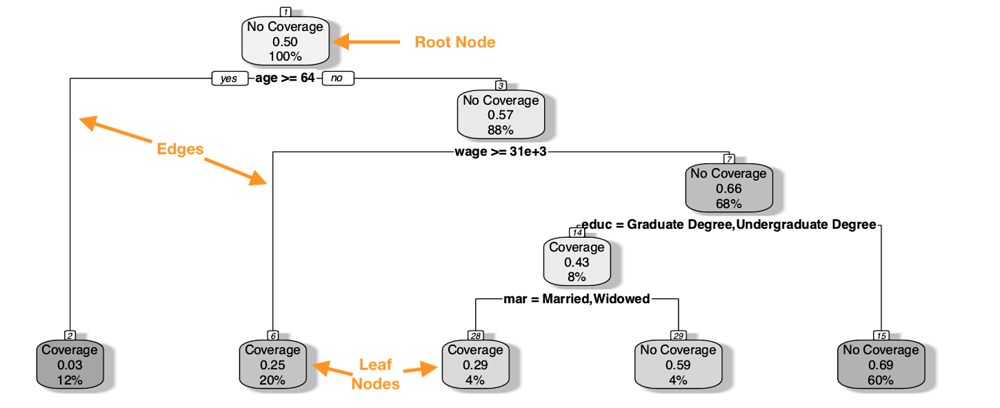

--- 
header-includes: \usepackage{rotating, graphicx}
output: 
  pdf_document:
    number_sections: true
description: Introduction
documentclass: book
link-citations: yes
bibliography:
- citations_p10.bib
site: bookdown::bookdown_site
biblio-style: apalike
---

# Predictive Strategies

## Map Data as Guestimates

On an early September day in 2013, the staff of Fairbanks International Airport had an unusual encounter: TSA agents intercepted a motorist headed for the airport. This was not just any routine traffic stop — it was on the tarmac of an airfield. A motorist unwittingly drove passed marked signs and lights, venturing down a taxiway and eventually across an active runway on the way to the airport car park (@fairbanks1, @fairbanks2). Later that same month, yet another motorist made the same mistake. What is the connection? Both incidents were the result of faulty driving directions from an iPhone app. Needless to say, the airport blocked the entrance to the tarmac and filed complaints with Apple. 
Incidents like these are not uncommon. In fact, competing apps like Waze have led drivers into danger, whether its impassable snow covered roads (@snow) or into the path of a wildfire (@fire). Part of the problem lies in the maintaining an up-to-date record of the built environment. Imagine that the address of every building, condition and speed limits of every road, status of traffic, among other real-time conditions need to be available for any user to use at a moment's. It is a massive challenge that has led companies to acquire other companies to improve data quality (@appleacquisition). Sometimes, companies will even use sensitive user data to fill data gaps (@applyrebuild). Keeping up-to-date data is a problem of scale -- it is simply too hard for humans to manually curate and keep information up to date for literally all of existence. 

Machine learning can help. 

Everyday, we already rely on high frequency and high resolution data to make even the smallest of decisions, yet we do so often without realizing that much of the data are filled with approximations produced by predictive models. This is the new paradigm of artificial intelligence that has taken the tech sector by storm and its predictive power has been increasingly seen in the service of social and public good. In recent memory, Microsoft illustrated that machine learning algorithms can perform a mapping task that would normally require years for a team of humans to perform.  Computer scientists trained a pair of algorithms to identify building footprints. One set of neural network algorithms were trained on five million satellite imagery tiles to identify pixels that belong to buildings, then an additional filter converted pixels into building polygons. (@buildings) In other words, one model examines images that contain buildings and non-buildings and predicts which pixels are likely be part of a building. Since there may be some rogue pixels making the building footprint jagged, a second algorithm converts pixels into polygons that resemble realistic building footprints. The methodology achieved a precision of 99.3% and recall of 93.5% — it is quite accurate and scalable. The algorithm was then set loose on satellite imagery for the entirety of the United States, depositing its findings into the first comprehensive national building database containing  125,192,184 building footprints (@buildings2).  A complete inventory of the  state of the built environment has never been available at this level of resolution and coverage, and could one day support real-time decision making. When faced with a hurricane, emergency services could have access to a more up-to-date  inventory of all structures in the path of destruction, enabling more accurate damage estimates and more informed mitigation strategies. Local governments can make better zoning decisions so cities can evolve intelligently. And perhaps such a database could support address canvasing for the US census.

What if algorithm can provide help distill a mass of data into a simple, more useful form. The economy, for example, is comprised of an extraordinarily large number of variables. Some are related, others are not. When faced with thousands of economic variables, a human analyst may be biased towards what they are familiar or their world perspective. A machine learning algorithm, in contrast, will seek out variables that have the greatest signal for predicting a measure of interest. This is what the U.S. Bureau of Economic Analysis (BEA) has experimented with in recent memory. The agency, which is responsible for estimating the Gross Domestic Product (GDP), is faced with a constant scheduling tango with their data sources -- some data are available in time for their advance estimate of GDP and others are not. When data are not available in time, economically-motivated projections carry the estimates forward until when there is an opportunity to incorporate the "gold copy" data. The risk of projection is the chance that it does not reflect the gold copy when it is available, leading to revisions in economic estimates -- a source of anxiety for economists and financial analysts. To reduce revisions to service sector estimates, BEA has developed an experimental approach that relies on *ensembles* of machine learning algorithms, such as *Random Forests* and *Regularized Regression*, to sift through thousands of alternative economic variables and predict economic growth before data is available.  This strategy has been shown that predictions can reduce revisions to economic estimates by billions of dollars (@beaforecast), which in turn can mitigate unnecessary market responses to revisions. Similar prediction strategies have been applied by tech companies to optimize their resources. Uber, for example, trained a Long-Short Term Memory (LSTM) algorithm to forecast ridership when faced with extreme events such as sports events and holidays. By improving their short-range forecasts across their platform, they can better optimize resource allocation to meet customer demand and manage budgets more efficiently (@uberlstm).

The pursuit of prediction has driven computer scientists and statisticians to constantly develop new strategies that maximize predictive accuracy at scale. [Machine learning algorithms sit within a data science pipeline]

[Image]

In fact, each type of machine learning algorithm excels under different conditions.  Let's revisit the case of classification. Below, we plot three distinct scenarios for a two-class classification problem: simple linear boundary, non-linear, and discontinuous. A *logistic regression* is a natural fit for a linear boundary given its root in linear regression. While it is the champion of parameter estimation, logistic regression is ill-fit for more complex relationships. Non-parametric techniques are far more flexible and can mold the decision boundary to the counters of the data. This gain in accuracy comes at the cost of interpretability. For example, *K-nearest neighbors* (kNN) performs classification by looking at neighborhoods of observations. Given a training sample, each record in the test sample is predicted using the most common label for the $k$ closest known records. In essence, kNN is driven by a majority or plurality vote from neighboring records.  Alternatively, *decision tree learning* such as *Classification and Regression Trees* (CART) and *Random Forest* algorithms assorb the patterns that it has learned by encoding as binary rules that split a sample into finer, more homogeneous partitions. Each algorithm has its strengths and weaknesses rooted in how it deals with and assimilates information. The ch

\vspace{12pt} 

```{r, echo = FALSE, warning = FALSE, message = FALSE, fig.cap = "Types of classification problems", fig.height = 2}
################
#Prep diagrams#
###############
  
  #Base data
  set.seed(234)
  n <- 2000
  examp <- data.frame(x1 = runif(n), x2 = runif(n))
  examp$linear <- (examp$x1 < examp$x2) * 1
  examp$nonlinear <- examp$x1 < ( examp$x2 * 4 - 8*examp$x2^2 + 2*examp$x2^3) -0.1
  part1 <- examp$x1 < ( examp$x2 * 4 - 8*examp$x2^2 + 2*examp$x2^3) +0.2
  part2 <- examp$x2 >  1.2- ( examp$x1*0.6)
  part3 <- examp$x2 >  0.2+ ( examp$x1*1.4)
  examp$discont <- (part1 == TRUE | part2 == TRUE )*1
  examp$varied <- (part1 == TRUE | part2 == TRUE | part3 == TRUE)*1
  
  #Create grid
  grid <- expand.grid(x1= seq(0.005, 1, 0.005), x2 = seq(0.005, 1, 0.005))
  

##########
## CALIBRATE MODELS#
##########
  
#Logistic
  loglin <- glm(linear ~ x1 + x2, data = examp, family = binomial())
  logvaried <- glm(varied ~ x1 + x2, data = examp, family = binomial())
  logdiscont <- glm(discont ~ x1 + x2, data = examp, family = binomial())
  prob.grid.lin1 <- predict(loglin, grid, type = "response") 
  prob.grid.lin2 <- predict(logvaried, grid, type = "response") 
  prob.grid.lin3 <- predict(logdiscont, grid, type = "response") 
  
#RPART
  library(rpart)
  dectree <- rpart(linear ~ x1 + x2, data = examp, cp = 0)
  decvaried <- rpart(varied ~ x1 + x2, data = examp, cp = 0)
  decdiscont <- rpart(discont ~ x1 + x2, data = examp, cp = 0)
  prob.grid.rpart1 <- predict(dectree, grid)
  prob.grid.rpart2 <- predict(decvaried, grid)
  prob.grid.rpart3 <- predict(decdiscont, grid)
  
#Random Forest 
  library(ranger)
  examp1 <- examp
  examp1$linear <- as.factor(examp1$linear)
  examp1$varied <- as.factor(examp1$varied)
   examp1$discont <- as.factor(examp1$discont)
   
   adatree <- ranger((linear) ~ x1 + x2, data = examp1)
   adavaried <- ranger((varied) ~ x1 + x2, data = examp1)
   adadiscont <- ranger((discont) ~ x1 + x2, data = examp1)
   prob.grid.gbm1 <- predict(adatree, grid)$predictions
   prob.grid.gbm2 <- predict(adavaried, grid)$predictions
   prob.grid.gbm3 <- predict(adadiscont, grid)$predictions
   
#KNN
   library(kknn)
   gammod1 <- kknn(linear ~ (x1) + (x2), train = examp, test = grid, distance = 1, k = 1)
   gammod2 <- kknn(varied ~ (x1) + (x2), train = examp, test = grid, distance = 1, k = 1)
   gammod3 <- kknn(discont ~ (x1) + (x2), train = examp, test = grid, distance = 1, k = 1)
   prob.grid.gam1 <- fitted(gammod1, grid)
   prob.grid.gam2 <- fitted(gammod2, grid)
   prob.grid.gam3 <- fitted(gammod3, grid)

   
  
```


```{r, echo = FALSE, fig.cap = "Linear, Non-Linear and Discontinuous Classification Problems.", fig.height = 4}

############   
## plot the boundary#
###########
   
  par(mfrow = c(3,4), mar = c(0, 1.2, 0.9, 0))
   
  #Linear example
  plot(examp[,c("x1", "x2")], col= "lightblue", ylab = "", xlab ="",
       font.main = 1,  pch = 16, cex = 0.8, 
       xaxt = "n", yaxt = "n", asp = 1,bty="n")
  points(examp[examp$linear == 1, c("x1", "x2")], col= "purple", pch = 16, cex = 0.7)
  points(examp[examp$linear == 0, c("x1", "x2")], col= "lightblue", pch = 16, cex = 0.7)
  contour(x=seq(0.005, 1, 0.005), y = seq(0.005, 1, 0.005), 
          z=matrix(prob.grid.lin1, nrow=200), levels=0.5,
          col="black", drawlabels=FALSE, lwd=1.5, add=T)
  title(main="Logistic Regression", line= 0, cex.main=1.2, font.main = 1)
  title(ylab="Linear", line= -0.2, cex.lab=1.3, font=3)

  
  plot(examp[,c("x1", "x2")], col= "lightblue", ylab = "", xlab ="",
       font.main = 1,  pch = 16, cex = 0.8, 
       xaxt = "n", yaxt = "n", asp = 1,bty="n")
  points(examp[examp$linear == 1, c("x1", "x2")], col= "purple", pch = 16, cex = 0.7)
  points(examp[examp$linear == 0, c("x1", "x2")], col= "lightblue", pch = 16, cex = 0.7)
  contour(x=seq(0.005, 1, 0.005), y = seq(0.005, 1, 0.005), 
          z=matrix(prob.grid.gam1, nrow=200), levels=0.5,
          col="black", drawlabels=FALSE, lwd=1.5, add=T)
  title(main="kNN", line= 0, cex.main=1.2, font.main = 1)
  
  
  plot(examp[,c("x1", "x2")], col= "lightblue", 
       font.main = 1, cex.main = 0.9, pch = 16, cex = 0.8,  
       xlab = "", ylab = "",
       xaxt = "n", yaxt = "n", asp = 1,bty="n")
  points(examp[examp$linear == 1, c("x1", "x2")], col= "purple", pch = 16, cex = 0.7)
  points(examp[examp$linear == 0, c("x1", "x2")], col= "lightblue", pch = 16, cex = 0.7)
  contour(x=seq(0.005, 1, 0.005), y = seq(0.005, 1, 0.005), 
          z=matrix(prob.grid.rpart1, nrow=200), levels=0.5,
          col="black", drawlabels=FALSE, lwd=1.5, add=T)
  title(main="Decision Tree", line= 0, cex.main=1.2, font.main = 1)
  
  plot(examp[,c("x1", "x2")], col= "lightblue", 
       font.main = 1, cex.main = 0.9, pch = 16, cex = 0.8, xlab = "", ylab = "",
       xaxt = "n", yaxt = "n", asp = 1,bty="n")
  points(examp[examp$linear == 1, c("x1", "x2")], col= "purple", pch = 16, cex = 0.7)
  points(examp[examp$linear == 0, c("x1", "x2")], col= "lightblue", pch = 16, cex = 0.7)
  contour(x=seq(0.005, 1, 0.005), y = seq(0.005, 1, 0.005), 
          z=matrix(prob.grid.gbm1, nrow=200), levels=0.5,
          col="black", drawlabels=FALSE, lwd=1.5, add=T)
  title(main="Random Forest", line= 0, cex.main=1.2, font.main = 1)
  
  
  #Non-linear
  plot(examp[,c("x1", "x2")], col= "lightblue", ylab = "", xlab ="",
       font.main = 1,  pch = 16, cex = 0.8, 
       xaxt = "n", yaxt = "n", asp = 1,bty="n")
  points(examp[examp$varied == 1, c("x1", "x2")], col= "purple", pch = 16, cex = 0.7)
  points(examp[examp$varied == 0, c("x1", "x2")], col= "lightblue", pch = 16, cex = 0.7)
  contour(x=seq(0.005, 1, 0.005), y = seq(0.005, 1, 0.005), 
          z=matrix(prob.grid.lin2, nrow=200), levels=0.5,
          col="black", drawlabels=FALSE, lwd=1.5, add=T)
  title(ylab="Non-Linear", line= -0.2, cex.lab=1.3, font=3)
  
  plot(examp[,c("x1", "x2")], col= "lightblue", ylab = "", xlab ="",
       font.main = 1,  pch = 16, cex = 0.8, 
       xaxt = "n", yaxt = "n", asp = 1,bty="n")
  points(examp[examp$varied == 1, c("x1", "x2")], col= "purple", pch = 16, cex = 0.7)
  points(examp[examp$varied == 0, c("x1", "x2")], col= "lightblue", pch = 16, cex = 0.7)
  contour(x=seq(0.005, 1, 0.005), y = seq(0.005, 1, 0.005), 
          z=matrix(prob.grid.gam2, nrow=200), levels=0.5,
          col="black", drawlabels=FALSE, lwd=1.5, add=T)
  
  
  plot(examp[,c("x1", "x2")], col= "lightblue", 
       font.main = 1, cex.main = 0.9, pch = 16, cex = 0.8,  
       xlab = "", ylab = "",
       xaxt = "n", yaxt = "n", asp = 1,bty="n")
  points(examp[examp$varied == 1, c("x1", "x2")], col= "purple", pch = 16, cex = 0.7)
  points(examp[examp$varied == 0, c("x1", "x2")], col= "lightblue", pch = 16, cex = 0.7)
  contour(x=seq(0.005, 1, 0.005), y = seq(0.005, 1, 0.005), 
          z=matrix(prob.grid.rpart2, nrow=200), levels=0.5,
          col="black", drawlabels=FALSE, lwd=1.5, add=T)
  
  plot(examp[,c("x1", "x2")], col= "lightblue", 
       font.main = 1, cex.main = 0.9, pch = 16, cex = 0.8, xlab = "", ylab = "",
       xaxt = "n", yaxt = "n", asp = 1,bty="n")
  points(examp[examp$varied == 1, c("x1", "x2")], col= "purple", pch = 16, cex = 0.7)
  points(examp[examp$varied == 0, c("x1", "x2")], col= "lightblue", pch = 16, cex = 0.7)
  contour(x=seq(0.005, 1, 0.005), y = seq(0.005, 1, 0.005), 
          z=matrix(prob.grid.gbm2, nrow=200), levels=0.5,
          col="black", drawlabels=FALSE, lwd=1.5, add=T)
  
  #Discontinuous
  plot(examp[,c("x1", "x2")], col= "lightblue", ylab = "", xlab ="",
       font.main = 1,  pch = 16, cex = 0.8, 
       xaxt = "n", yaxt = "n", asp = 1,bty="n")
  points(examp[examp$discont == 1, c("x1", "x2")], col= "purple", pch = 16, cex = 0.7)
  points(examp[examp$discont == 0, c("x1", "x2")], col= "lightblue", pch = 16, cex = 0.7)
  contour(x=seq(0.005, 1, 0.005), y = seq(0.005, 1, 0.005), 
          z=matrix(prob.grid.lin3, nrow=200), levels=0.5,
          col="black", drawlabels=FALSE, lwd=1.5, add=T)
  title(ylab="Discontinuous", line= -0.2, cex.lab=1.3, font=3)
  
  
  plot(examp[,c("x1", "x2")], col= "lightblue", ylab = "", xlab ="",
       font.main = 1,  pch = 16, cex = 0.8, 
       xaxt = "n", yaxt = "n", asp = 1,bty="n")
  points(examp[examp$discont == 1, c("x1", "x2")], col= "purple", pch = 16, cex = 0.7)
  points(examp[examp$discont == 0, c("x1", "x2")], col= "lightblue", pch = 16, cex = 0.7)
  contour(x=seq(0.005, 1, 0.005), y = seq(0.005, 1, 0.005), 
          z=matrix(prob.grid.gam3, nrow=200), levels=0.5,
          col="black", drawlabels=FALSE, lwd=1.5, add=T)
  
  plot(examp[,c("x1", "x2")], col= "lightblue", 
       font.main = 1, cex.main = 0.9, pch = 16, cex = 0.8,  
       xlab = "", ylab = "",
       xaxt = "n", yaxt = "n", asp = 1,bty="n")
  points(examp[examp$discont == 1, c("x1", "x2")], col= "purple", pch = 16, cex = 0.7)
  points(examp[examp$discont == 0, c("x1", "x2")], col= "lightblue", pch = 16, cex = 0.7)
  contour(x=seq(0.005, 1, 0.005), y = seq(0.005, 1, 0.005), 
          z=matrix(prob.grid.rpart3, nrow=200), levels=0.5,
          col="black", drawlabels=FALSE, lwd=1.5, add=T)

  plot(examp[,c("x1", "x2")], col= "lightblue", 
       font.main = 1, cex.main = 0.9, pch = 16, cex = 0.8, xlab = "", ylab = "",
       xaxt = "n", yaxt = "n", asp = 1,bty="n")
  points(examp[examp$discont == 1, c("x1", "x2")], col= "purple", pch = 16, cex = 0.7)
  points(examp[examp$discont == 0, c("x1", "x2")], col= "lightblue", pch = 16, cex = 0.7)
  contour(x=seq(0.005, 1, 0.005), y = seq(0.005, 1, 0.005), 
          z=matrix(prob.grid.gbm3, nrow=200), levels=0.5,
          col="black", drawlabels=FALSE, lwd=1.5, add=T)
```

\vspace{12pt} 

You will no doubt have noticed that the algorithms mentioned sound quite exotic when compared with the plain vanilla regressions in Chapters 8 and 9. There are hundreds of machine learning algorithms that are commonplace in the modern data science workbench, many of which are well-suited for both classification and regression problems. In this chapter, we explore a number of these methods, illustrating their basic properties and their potential role in helping public and social missions.

\vspace{12pt} 

```{r, echo = FALSE, message = FALSE, warning = FALSE, eval = FALSE}
  usescases <- read.csv("data/use_case_table_v2.csv")
  colnames(usescases) <- c("Method", "Common Uses",  "Example Data")
  pander::pander(usescases, split.cell = 80, split.table = Inf, caption = "Overview of classifiers", 
                 justify = "left")

```

## K-Nearest Neighbors (KNN)

K-nearest neighbors (KNN) is a non-parametric algorithm built on a simple idea: *observations that are closer together are likely to be similar*.  Thus, promixity of points matters as each prediction of $y_i$ is inferred from its surrounding records. These neighbors are identified by treating each input variables $x_k$ as coordinate, which in turn allows distance to be calculated between all points in the data set. In many ways, KNN is like spackle -- it can fill holes while retaining the shape of the surface to which it is applied. Thus, the algorithm can impute missing values in a realistic, organic fashion.

### Under the hood

When KNN produces predictions, it first locates where each new point falls within the training data space, then constructs a prediction from neighboring points. Each prediction $\hat{y}_i$ relies on the training targets and inputs $\{(x_n, y_n) \}^N_{n=1}$ as sets of landmarks that help the algorithm get its bearings -- a sort of base map. If the base map [or training data] is reliable and densely populated, then mapping new points to the space can deliver promising results. 

```{r, echo = FALSE, message = FALSE, warning=FALSE, fig.cap = "KNN algorithm process.", fig.height = 2}
#Illustration of kNN

require(ggplot2)
  n <- 200
  k <- 4
  
  #Create training data
    set.seed(100)
    x <- runif(n)
    
    set.seed(44)
    y <- runif(n)
  
    z <- ifelse(y > x*1.2 , 1, 0)
    z1 <- ifelse(y < 0.8, 1,0)
    z <- z*z1
    
    df <- data.frame(x, y, z)
    
  #Create test
    df_test <- data.frame(id = 1:3,
                          x = c(0.33, 0.63, 0.6),
                          y = c(0.6, 0.7, 0.5))
  
    
  #Create segments  
    segs <- data.frame()
    segs_all <- data.frame()
    for(i in 1:nrow(df_test)){
      d <- sqrt((df_test$x[i] - df$x)^2 + (df_test$y[i] - df$y)^2)
      segs <- rbind(segs,
                data.frame(id = i, 
                           x0 = df_test$x[i], 
                           y0 = df_test$y[i],
                           df[rank(d, ties.method = "random") <=k,]))
      segs_all <- rbind(segs_all,
                    data.frame(id = i, 
                               x0 = df_test$x[i], 
                               y0 = df_test$y[i],
                               df))
    }
    
  #Plot
    
  par(mfrow = c(1,3), mar = rep(3,4))
  #First plot
    plot(df$x, df$y, col = rgb(df$z, 0.8, 1- df$z, 0.4),
         pch = 20, cex = 2, xlab = "", ylab = "", 
         yaxt = "n", xaxt = "n",
         xlim = c(0.2, 0.7), ylim = c(0.3, 0.8), asp = 1)
    points(df_test$x, df_test$y, col = "black", 
           cex = 3, pch = 18)
    title(ylab="X1", xlab = "X2", line=1, cex.lab=1.2)
    title(main = "(1) Set up", line=1, cex.lab=1.2)
    
  #Second plot
    plot(df$x, df$y, col = rgb(df$z, 0.8, 1- df$z, 0.4),
         pch = 20, cex = 2, xlab = "", ylab = "", 
         yaxt = "n", xaxt = "n",
         xlim = c(0.2, 0.7), ylim = c(0.3, 0.8), asp = 1)
    segments(x0 = segs_all$x0,
             y0 = segs_all$y0,
             x1 = segs_all$x,
             y1 = segs_all$y, 
             col = rgb(segs_all$z, 0.8, 1 - segs_all$z, 0.1), 
             lwd = 1)
    points(df_test$x, df_test$y, col = "black", 
           cex = 3, pch = 18)

    title(ylab="X1", xlab = "X2", line = 1, cex.lab = 1.2)
    title(main = "(2) Calculate distance", line = 1, cex.lab = 1.2)
    
    
    #Third plot
      scored <- c(1, 0, 0)
      plot(df$x, df$y, col = rgb(df$z, 0.8, 1- df$z, 0.4),
           pch = 20, cex = 2, xlab = "", ylab = "", 
           xlim = c(0.2, 0.7), ylim = c(0.3, 0.8), asp = 1,
           yaxt = "n", xaxt = "n")
      segments(x0 = segs$x0,
               y0 = segs$y0,
               x1 = segs$x,
               y1 = segs$y, 
               col = rgb(segs$z, 0.8, 1 - segs$z, 1), 
               lwd = 2)
      points(df_test$x, df_test$y, col = rgb(scored, 0.8, 1- scored, 1), 
             cex = 3, pch = 18)
       title(ylab="X1", xlab = "X2", line = 1, cex.lab = 1.2)
      title(main = "(3) Vote using k-neighbors", line=1, cex.lab=1.2)
```

The algorithm is quite simple: 

_1. Set k_. Prior to starting the algorithm, we first set a value of $k$, which determines the number of surrounding points around a record $i$ that will be used to produce a prediction for $y_i$. The true value of $k$ is not known -- this will require some systematic trial and error. 

For the subsequent steps, do for each record $i$: 

_2. Calculate distance_. The collection of input variables $X$ serve as coordinates. To identify the neighborhood around each $i$ in the test sample, calculate the distance $d_{ij}$ from $i$ to each point $j$ in the training sample.  Distance most commonly takes the form of Euclidean distance, which is appropriate with continuous values. For cases where the underlying data are boolean or binary, Manhattan distance is more appropriate. 

\vspace{12pt} 

| Distance | Formula | Description|
|-----------------+------------------------------------+-----------------------------------------|
| Euclidean | $\sqrt{\sum_{i=1}^n(x_{i} - x_{0})^{2} }$ | A distance measure useful for continuous values|
| Manhattan |$\sqrt{\sum_{i=1}^n|x_{i} - x_{0}| }$| Named for the street blocks of Manhattan in New York City, Manhattan distances are useful for binary and discrete problems. |

Table: Types of distance

\vspace{12pt} 


_3. Vote!_. The prediction $\hat{y}_i$ is calculated from a vote of the $k$ nearest points to point $i$. In classification problems, the proportion $p_c$ of points that are in each class $c$ in $Y$.  The proportion $p_c$ is converted into a predicted class through *majority voting* -- assign an observation to the class that is most represented in the neighborhood. In regression contexts, $\hat{y}_i$ is simply the average of $y_i$ for the $k$-nearest neighors.

There are various flavors of voting. The procedure illustrated give all $k$ neighbors equal weight, but if its believed that closer points should be given more weight, then a variety of *kernels* such as inverse distance and biweights discount the importance of points that are farther away even if they are part of $k$. 

\vspace{12pt} 

| Voting Type | Formula | Interpretation|
|-----------------+------------------------------------+-----------------------------------------|
| Rectangular | $Pr(Y = j) = \frac{1}{k}\sum_{i=1}^k I(y^i = j)$ | Calculate the proportion of $j$ based on $k$ nearest neighbors. This is the same of simple arithmetic mean.|
| Inverse |$Pr(Y = j) = \sum_{i =1}^k w(d)(y^i = j)$  where $w(d) = \frac{1}{d_i\sum_{i=1}^k(\frac{1}{d_i})}$|Calculate the weighted proportion of $j$ based on the inverse distance to $k$ nearest neighbors.|
| Biweight | | |
| Gaussian | | |

Table: Types of voting kernels

\vspace{12pt} 


_4. Tune k_. When $k = 10$ with a rectangular kernel, the conditional probability for $y_i$ reflects the 10-nearest neighbors. When $k = n$, the probability is equivalent to the sample mean. These two extremes illustrate that KNN is sensitive to the value of $k$ and the kernel, yet we do not truly know which is right. Tuning is a necessity to test different scenarios in order to optimize accuracy. 

\vspace{12pt} 

### In Practice

*__Tuning__*. Like many other algorithms, KNNs require systematic trial and error in order to optimize the *hyperparameters*.  We do not know what is the true value of $k$ or the absolute best kernel to use, thus tuning of the hyperparameters is a necessity, typically relying on a grid search. The idea is to develop a ballpark sense of what works, then hone in on the best value of $k$. One search strategy could test all values from $k=1$ to $k=\sqrt{n}$ in multiples of one's choosing, keeping track of how each $k$ performs in terms of a loss function (e.g. TPR, FPR, F1-statistic). 

To illustrate the tuning process, we have assembled a sample of USDA CropScape landcover data (@cropscape) for farmland that grows corn (yellow) and soybeans (green). More often than not, data will having missing values and capture only a fraction of the full picture. Suppose we had only 10% of all land cover data available, but need to see the remaining 90%.  KNNs can impute the likely landcover using available data, tuning the value of $k$.  *Exactly how important is the choice of $k$?* In the imputations below, we compare values of $k$ at 1, 5, 10, and 100. It is apparent that as the value of $k$ increases, the corn fields increasingly creep into areas where soy would be expected. Not only is this loss in accuracy reflected visually, but statistically as well. 


\vspace{12pt} 

```{r, fig.height=4, echo=FALSE, warning=FALSE, message = FALSE, fig.cap = "Comparison of prediction accuracies for various values of k."}

#LOAD LIB
  pacman::p_load(raster, sp, rgdal, kknn)
  
#LOAD DATA
  crops <- raster("data/cropscape.png")

#SET UP DATA
  vec <- as.data.frame(crops, xy = TRUE)
  
  set.seed(123)
  kg <- kmeans(vec$cropscape, 3)
  cll <- kg$cluster
  labs <- rep("corn", length(cll))
  labs[cll == 2] <- "soybeans"
  
  color <- rep("#ffff00", length(cll))
  color[cll == 2] <- rgb(0,1,0)
  color[cll == 1] <- "#95b1cc"
  
  
  vec <- cbind(vec, color, labs, cll)

 
## plot BASE example
  par(mfrow = c(2,3), mar = c(0, 1.2, 0.9, 0))
  
  plot(vec$x, vec$y, pch = 16, cex = 0.3, col = as.character(vec$color),
       axes = FALSE, legend = FALSE, asp = 1,  xlab = "", ylab = "")
  title(main="Farmland (Actual)", line= 0, cex.main=0.9, font.main = 1)
  
  #Randomize pulls and train for various k
  set.seed(123)
  train <- vec[runif(nrow(vec)) <= 0.1,]
   plot(train$x, train$y, pch = 16, cex = 1, col = as.character(train$color),
       axes = FALSE, legend = FALSE, asp = 1,  xlab = "", ylab = "")
  title(main="Farmland (5% sample)", line= 0, cex.main=0.9, font.main = 1)
  
   logger <- data.frame()
  
  for(i in c(1,5,10,100)){
  library(kknn)
  k1 <- kknn(color ~ x + y, 
              train = train, 
              test = vec,
              k = i,
              kernel = "rectangular")
  
  est <- table(vec$labs == "corn", k1$fitted.values == "#ffff00" )
  tpr <- round(100*est[2,2]/sum(vec$labs == "corn"),2)
  fpr <- round(100*est[1,2]/sum(vec$labs != "corn"),2)
  
  plot(vec$x, vec$y, pch = 16, cex = 0.3, col = as.character(k1$fitted.values),
       axes = FALSE, legend = FALSE, asp = 1, xlab = "", ylab = "")
      title(main=paste0("k = ", i, ": TPR = ", tpr, ", FPR = ", fpr), line= 0, cex.main=0.9, font.main = 1)
      
      logger <- rbind(logger,
                      data.frame( k = i,
                                  tpr = tpr,
                                  fpr = fpr))
  
  }

```


_Normalization_. Treating variables as coordinates implies that they all should have equal importance -- no single variable should weigh on the distance calculation more than any other. Therefore, the scale of each variable should be normalized, at least for continuous variables. For example, if an input variable $x_1$ has a scale from 1 to 10,000 and $x_2$ ranges from 0.1 to 0.3, a KNN will lean more heavily on the latter variable. Normalization can be as simple as calculating the z-score for each $x_k$: 

$$ scaled = \frac{x_k - \mu_{x_k}}{\sigma_{x_k}}$$ 

where the transformed variable is mean centered with unit variance. 
    
- _Grids_. Similar to the scale issue, KNNs are particularly effective in data that are distributed on a grid -- measurements along a continuous scale at equal incremenets, but may be a poor choice when the data are mixed data formats such as integers and binary.

- _Symmetry_. It's key to remember that neighbors around each point will not likely be uniformly distributed. While kNN does not have any probabilistic assumptions, the position and distance of neighboring points may have a skewing effect. 


__Usage__. KNNs are great in some cases; Not so much in others. 

KNNs are commonly associated with imputation of missing values and scenarios where proximity of observations has some bearing on the predictive accuracy. But setting up the KNNs requires some care.

As scale matters, data sets with mixed data types (discrete, continuous) need to be transformed into the same units. Discrete variables can be converted into a dummy variable matrix. Continuous variables can be binned into discrete levels, then converted into a dummy variable matrix as well. This effectively means that all variables are in terms of 0/1 and a Minkowski distance may be more appropriate to relate distances than Euclidean. 

KNNs are best used when data sets are relatively smaller with fewer variables as each distance calculation is computationally taxing. Furthermore, as more variables are added, the importance of any one variable is diluted -- it may be worth trying another algorithm to sift through the data.

Lastly, KNNs are not interpretable as it is a nonparametric approach. It should be instead be viewed as a processing method to fill in the gaps. 


```{r, echo = FALSE, message = FALSE, warning = FALSE}
  usescases <- read.csv("data/knn_sw.csv")
  colnames(usescases) <- c("Useful Properties", "Challenges")
  pander::pander(usescases, split.cell = 80, split.table = Inf, caption = "The good and ugly of KNNs.", 
                 justify = "left")

```


### DIY: Anticipating the extent of damage from a storm


As hurricanes become more intense, city governments will need to be able to more efficiently triage requests for help. Hurricane Sandy, for example, had a tremendous effect on New York City. One of the main services offered by cities is maintenance of street trees. A downed tree can cause property damage, bodily harm and traffic disruptions. Due to the high wind and lush foliage during Sandy, many trees fell.

In NYC, the Department of Parks and Recreation is responsible for tree removal. When a resident makes a call to the city's services hotline 311, a work order is created and a tree removal team is dispatched. This may be a transactional process: one call for tree removal, one tree is then removed. As it takes time for crews to move and set up, a first-in/first-out queuing process can be inefficient. Imagine if 20 of 100 blocks in a neighborhood were flagged for tree removal. It would make sense to use call data to identify other blocks that may also have downed trees.

We would expect that downed trees are more likely to occur in *pockets* and proximity is the best indicator of activity. As the city knows where residents call for tree- and non-tree-related issues, we can use the location of the calls to triangulate on likely problem areas as well as anticipate pockets of yet-to-be-reported downed trees, or at least serve that is a reasonable working theory. For this task of predicting based on proximity, KNNs can help. Suppose the location of all calls for non-emergency help from the day of Hurricane Sandy are captured in NYC's 311 system, yet there are still neighborhoods that likely have downed trees but have not reported it. *From what we know, can we guess the disposition of other parts of the city to have a fuller picture?*

__Prepare the data__. During and after a storm, one would imagine that residents of a neighborhood would call to report downed trees. If such a call were made, then we could flag that neighborhood as one that experienced a tree troubles. Alternatively, if a neighborhood's complaints are devoid of tree-related problems during a storm, we can assume that the area was unaffected. These are the assumptions that were applied to NYC create a data set of $n=7513$ records, each of which is a $1000ft \times 1000 ft$ area in New York City. 

\vspace{12pt} 

```{r, message = FALSE, warning = FALSE, fig.height = 3}
#Load data
  nyc <- read.csv("data/sandy_trees.csv")
```

\vspace{12pt} 

For simplicity, we will focus on the two largest and geographically connected boroughs (`boro`), Brooklyn (BK) and Queens (QN). The remaining boroughs of the city are separated by rivers, which may have been impacted quite differently.

\vspace{12pt} 

```{r, message = FALSE, warning = FALSE}

#Extract Queens and Brooklyn
  pacman::p_load(dplyr)
  nyc <- filter(nyc, boro %in% c("BK", "QN"))

```

```{r, message = FALSE, warning = FALSE, fig.cap = "Plot of X-Y coordinates for Brooklyn and Queens.", echo = FALSE}
  
  plot(x = nyc$xcoord, y = nyc$ycoord, 
       cex = 0.3, pch = 15, asp = 1, col = "grey",
       xlab = "X-Coordinate", ylab = "Y-Coordinate")
```
\vspace{12pt} 


__Train__. While this is a retrospective analysis, we simulate the process of producing the complete map as if we had partial information. The `nyc` data frame is split into a `train` set, keeping only locations where the target variable `tree.sandy` are available. A quick tabulation shows that the $n=1550$ of the $n=1946$ training set observations have at least one downed tree reported.  The outcome variable in the test sample `tree.next7` shows which zones reported trees over the seven days following the hurricane. 

\vspace{12pt}

```{r}
#Extract the training and test samples
  train <- subset(nyc, !is.na(tree.sandy), 
                  select = c("ycoord", "xcoord", "tree.sandy"))
  test <- subset(nyc, 
                 select = c("ycoord", "xcoord", "tree.next7"))
  
#Split out
  table(train$tree.sandy)
```


With the data ready for modeling, we load the `kknn` library, which has improvements over the standard R libraries:

\vspace{12pt} 

```{r}
  pacman::p_load(kknn)
```
\vspace{12pt} 

Within the library, the `train.kknn` function builds in cross validation for the tuning process, greatly simplifying the search for optimal prediction parameters. Prediction of new data is handled using the `kknn` function. While both functions can be fairly easily written from scratch (and we encourage new analysts to write their own to intimately understand the assumptions), we plow forth with this library.

To begin the search for $k$, the `train.kknn()` function expects the following inputs:

`train.kknn(formula, data, kmax, kernel, distance, kcv)`

- `formula` is a formula object (e.g. "`no.coverage ~ .`").
- `data` is a matrix or data frame of training data.
- `kmax` is the maximum number of neighbors to be tested
- `kernel` is a string vector indicating the type of distance weighting (e.g. "rectangular" is unweighted, "biweight" places more weight towards closer observations, "gaussian" imposes a normal distribution on distance, "inv" is inverse distance).
- `distance` is a numerical value indicating the type of Minkowski distance. (e.g. 2 = euclidean, 1 = binary).
- `kcv` is the number of partitions to be used for cross validation.

We conduct 20-folds cross validation, searching between $k=1$ and $k = 100$ neighbors in combination with two kernels (rectangular and inverse). This simple command does much of the hard work by running the KNN algorithm 2000 times (20 cross-validation models for each $k$ and *kernel* combination), then surfaces the best parameters. We store the results in `fit.cv`.

\vspace{12pt} 

```{r, message = FALSE, warning = FALSE, results = 'hide', echo = TRUE}

#Set seed to ensure cross validation is replicable
  set.seed(100)

#Run with 20-folds cross validation
  fit.cv <- train.kknn(factor(tree.sandy) ~ ycoord + xcoord , 
                      data = train, 
                      kcv = 20, 
                      distance = 1, kmax = 100, 
                      kernel = c("rectangular", "inv", "triweight", "epanechnikov"))

```

\vspace{12pt} 

Within `fit.cv` is a `best.parameters` element that KNNs perform the best when $k = $ `r fit.cv$best.parameters$k` using a rectangular kernel.

\vspace{12pt} 

```{r, message=FALSE, warning = FALSE, fig.height = 4, fig.cap = "20-fold cross validated errors for k = 1 to k = 100"}

   plot(fit.cv)
   
```

\vspace{12pt}

With the optimal parameters tuned, the `kknn` function scores the test sample, piecing together a picture of the full extent of damage. The syntax is quite similar to the training function with some modifications: 

`kknn(formula, train, test, k, kernel, distance)`

- `formula` is a formula object (e.g. "`no.coverage ~ .`").
- `train` is a matrix or data frame of training data.
- `test` is a matrix or data frame of test data.
- `k` is the number of neighbors.
- `kernel` is the type of weighting of distance (e.g. "rectangular" is unweighted, "biweight" places more weight towards closer observations).
- `distance` is a numerical value indicating the type of Minkowski distance. (e.g.  1 = binary, 2 = euclidean,).

Notice that both train and test are required by `kknn`. This is a consequence of KNN's instance-based learning -- it does not store relationships and re-applies them, thus the test sample needs to be scored on the fly.  This is a marked difference compared with other algorithms covered in this chapter.

\vspace{12pt}
```{r, message=FALSE, warning = FALSE}

#Retrieve best parameters
   best <- fit.cv$best.parameters

#Apply tune KNN parameters
   fit <- kknn(tree.sandy ~ ycoord + xcoord, 
               train = train, 
               test = test,
               k = best$k,
               kernel = best$kernel)

#Produce 
    test$prob <- fit$fitted.values
    test$tree.next7[is.na(test$tree.next7)] <-0
```
\vspace{12pt}

__Evaluate performance__. With all the pieces computed, we can examine how closely the predictions based on tree downing patterns on the day of Hurricane Sandy compare with where trees were reported to have fallen over the 7 days that followed. During the storm, approximately `r paste0(round(100*sum(!is.na(nyc$tree.sandy))/nrow(nyc)), "%")` percent of the focus area made a call, of which `r paste0(round(100*sum(nyc$tree.sandy, na.rm=T)/sum(!is.na(nyc$tree.sandy))),"%")` reported a downed tree. This appears as a cloud of points capturing the gist of the downed tree pattern. 

\vspace{12pt}
```{r, message=FALSE, warning = FALSE, echo = FALSE, fig.height = 3, fig.width = 8, fig.cap = "Comparison of actual and predicted areas with reported downed trees. Red indicates at least one tree was reported in a given 0.359 square-mile area"}

  
 par(mfrow = c(1,3))

  plot(train[,2:1], main = "(1) Calls during storm",
       col = rgb(train$tree.sandy , 0, 1- train$tree.sandy, 1), 
       cex = 0.4, pch = 16, asp = 1)
  
  plot(test[,2:1], main =  "(2) Predicted probabilities",
       col = rgb(test$prob, 0, 1 - test$prob, 1), 
       cex = 0.4, pch = 16, asp = 1)
  
  plot(test[,2:1], main =  "(3) Actual next 7 days",
       col = rgb(test$tree.next7, 0, 1 - test$tree.next7, 1), 
       cex = 0.4, pch = 16, asp = 1)
    
```
\vspace{12pt}

The test model accuracy can also be calculated by taking the Area Under the Curve (AUC) of the Receiving-Operating Characteristic. The ROC calculates the TPR and FPR at many thresholds, that produces a curve that indicates the general robustness of a model. The AUC is literally the area under that curve, which is a measure between 0.5 and 1 where the former indicates no predictive power and 1.0 indicates a perfect model. 

In order to visualize the ROC, we will rely on the `plotROC` library, which is an extension of `ggplot2`. We will create a new data frame `input` that is comprised of the labels for the test set `ytest` and the predicted probabilities `test.prob`. 

```{r, warning=FALSE, message=FALSE,}
#Load libraries
  library(ggplot2)
  library(plotROC)

#Set up test data frame
  input <- data.frame(ytest = test$tree.next7, 
                      prob = test$prob)
```

We then will first create a ggplot object named `base` that will contain the labels (`d = `) and probabilities (`m = `), then create the ROC plot using  `geom_roc()` and `style_roc()`. A ROC curve for a well-performing model should sit well-above the the 45 degree diagonal line, which is the reference for an AUC of 0.5 (the minimum expected for a positive predictor). However, as the curve is below the 45 degree line, we may have a seriously deficient model. 

```{r, message = FALSE, warning=FALSE, fig.height = 3, fig.cap = "ROC curve out of sample"}
#Base object
  roc <- ggplot(input, aes(d = ytest, m = prob)) + 
         geom_roc() + style_roc()
  
#Show result
  roc
```


As estimated using `calc_auc()`, the out-of-sample AUC is `r round(calc_auc(roc)$AUC, 3)`, which is not a bad start. While we are able to fill impute the status of downed trees in other parts of the city, it is helpful to remember that the output of the KNN needs to match the intended use. If a limited number of field crews are deployed, then it may more sense to use the probabilities to prioritize neighborhoods. Otherwise, if additional resources could be hired, then knowing the total number of likely affected areas could inform how much to budget for the downed trees effort.

```{r, message=FALSE, warning = FALSE, fig.height = 2}
  calc_auc(roc)$AUC
```

Despite the promising result, we should be cognizant that KNNs generally are not the algorithm of choice of modelers unless there is relatively little data. We should thus ask: _Is there a better classifier?_ 


## Decision Tree Learning

[Talk about what KNNs can't do]

Decision tree learning can help bring clarity. Trees are designed to look at inputs and partition the sample into smaller more homogeneous cells with respect to the target. This recursive partitioning allows a tree to resemble an inverted tree: moving away from the base of the tree, the tree trunk splits into two or more large branches, which then in turn split into even smaller branches, eventually reaching even small twigs with leaves. 

Decision trees use recursive partitioning to learn patterns, doing so using central concepts of _information theory_. There are a number of decision tree algorithms that were invented largely in the 1980s and 1990s, including the ID3 algorithm, C4.5 algorithm, and Classification And Regression Trees for Machine Learning (CART). All these algorithms follow the same framework that includes the following elements: (1) nodes and edges, (2) attribute tests, and (3) termination criteria.


### Under the hood

__Anatomy of a decision tree__. The tree is comprised of nodes and edges. Nodes (circles) contain records. Edges (lines) show dependency between nodes and is the result of an *attribute test* -- or a process that finds the optimal criterion to subset records into more homogeneous groups of the target variable.  The node at the top of the tree is known as the *root* and represents the full population. Each time a node is split, the result is two nodes -- each of which is referred to as a *child node*. A node without any child nodes is known as a *leaf*. The node is labeled using majority voting based on whichever class is most represented.  The goal is to grow a tree from the root node into as many smaller child nodes that contain more of one class than another.

Decision trees split nodes based on finding thresholds along the input variables. There can be seemingly infinite number of potential variable-threshold combinations -- which is best? Drawing from *information theory*, we can apply an *information gain* formula to evaluate all candidate splits and find one that provides the most information. This optimal split yields to more homogeneous child nodes, which in turn can be split even further. The search for the best threshold is known as an *attribute test*.

As we can see in the example decision tree for health care insurance, each node is connected to at least one other node. Starting at the root node, we can see that overall, the population is labeled "no coverage" based on the decimal percentage $0.5$. The 100% indicates the proportion of the sample that is contained at the node. Below is `age >= 64`, which is the most informative  attribute test that is used to split. To the left, the edge leads to another node at the bottom left corner of the diagram, which contains people who are age 64 or older. While the leaf node only contains 12% of the entire sample, it is almost exclusively people who have health care coverage. To the right, the remaining 88% of the sample, which is further split by wage and other variables. Each leaf node is defined as the intersection of multiple binary criteria, giving way to profiles of users that can be easily segmented.




__Growing trees__.   There are a number of decision tree algorithms that were invented largely in the 1980s and 1990s, including the ID3 algorithm, C4.5 algorithm, and Classification And Regression Trees for Machine Learning (CART). The process is fairly clear cut and iterative:

1. __Base Cases__.  The process starts with checking for "base cases" at the root node, the idea being that it might not be worth exerting effort to grow the tree if the data do not support it. The algorithm will first check to see if (a) all values of the target are of one class, and (b) none of the input variables offer any useful information. There are other base cases to consider depending on the algorithm, but any true base case will result in stopping the algorithm and returning only the root node. 

2. __Recursive Partitioning__. If none of the base cases are true, the algorithm proceeds to attribute testing using either  *Information Gain* or *Gini Impurity* as will be covered in the following section. At the root node, if there are 10 variables with each 30 possible thresholds, attribute tests are applied 300 times choosing the candidate threshold that yields the most homogeneous child nodes. Upon splitting, attribute tests are applied to each child node, making this a recursive partitioning procedure.

3. __Stopping Criteria versus Pruning__.  At some point, the algorithm needs to stop. The question is *when*? One way is to grow the tree until some *stopping criteria* are met, such as if a leaf has fewer records than a pre-specific threshold, the purity or information gain falls below a pre-specified level, or if the tree has grown to n-number of levels (e.g. number of rows of splits). While stopping criteria are useful, the results in some studies indicate their performance cap the tree from reaching its full predictive potential.^[] The alternative approach involves growing a tree to its fullest, then comparing the prediction performance given tree complexity (e.g. number of nodes in the tree) using cross-validation.  In the example graph below, model accuracy degrades beyond a certain number of nodes. Thus, optimal number of nodes is defined as when cross-validation samples (e.g. train/test, k-folds) reaches a minimum across samples. Upon finding the optimal number of nodes, the tree is *pruned* to only that number of nodes. 


__Attribute Tests__. Information gain is a form of *entropy* that measures the consistency of information. Based on these distinct states of activity, entropy is defined as: 

$$\text{Entropy} = \sum_{i=1}^{k}{-p_{i} log_2(p_{i})}$$
where $i$ is an index of states, $p$ is the proportion of observations that are in state $i$, and $log_2(p_i)$ is the Base 2 logarithm of the proportion for state $i$. Information Gain (IG) is variant of entropy, which is the entropy of the root node *less* the average entropies of the child nodes.

$$\text{IG} = \text{Entropy}_\text{root} - \text{Avg Child Entropy}$$

How does this work in practice? Starting from the root node, we need to calculate the root entropy, where the classes are based on the classes of the target `usership`.

$\qquad \text{Entropy}_\text{usership} = (-p_{user} log_2(p_{\text{user}})) - (-p_{\text{non-user}} log_2(p_{\text{non-user}}))$

$\qquad \qquad \qquad \qquad \qquad  = (-\frac{6}{12} log_2(\frac{6}{12})) + (-\frac{6}{12} log_2(\frac{6}{12}))$

$\qquad \qquad \qquad \qquad \qquad  = 1.0$

Then, the attribute test is applied to the root node by calculating the weighted entropy for each proposed child node. Using the `income` feature, the calculation is as follows:

- Split the root node into two child nodes using the `income` class. This yields the following subsamples as shown in the table below:

| | < $20k | > $20k|
|--------+---------+----------|
|No | 0 | 6 |
|Yes | 5 | 1 |
|Total | 5 | 7 |

- For each child node (the columns in the table), calculate entropy:

$\qquad \text{Entropy}_\text{income < 20k } = (-p_{user} log_2(p_{\text{user}})) - (-p_{\text{non-user}} log_2(p_{\text{non-user}}))$

$\qquad \qquad \qquad \qquad \qquad  = -\frac{5}{5} log_2(\frac{5}{5}) = 0$


$\qquad \text{Entropy}_\text{income > 20k } = (-p_{user} log_2(p_{\text{user}})) - (-p_{\text{non-user}} log_2(p_{\text{non-user}}))$

$\qquad \qquad \qquad \qquad \qquad = -\frac{6}{7} log_2(\frac{6}{7}) + -\frac{1}{7} log_2(\frac{1}{7}) = 0.5916728$

- Calculate the weighted average entropy of children:

$\qquad \text{Entropy}_\text{income split} = \frac{5}{12}(0) +  \frac{7}{12}(0.5916728) = 0.3451425$

- Then calculate the information gain:

$\qquad \text{IG}_\text{income} = \text{Entropy}_\text{root} -  \text{Entropy}_\text{income split}$

$\qquad \qquad \qquad \qquad \qquad = 1 - 0.3451425 = 0.6548575$

- We then can perform the same calculation on all other features (e.g. employment, part of town) and compare results. The goal is to *maximize* the IG statistic at each decision point. In this case, we see that income is the best attribute to use for splitting. This split is easily interpretable: "The majority of users of health services can be predicted to earn less than $20,000."

| Measure | IG |
|---------+------|
|Employment| 0.00 | 
|Income | 0.6548575 |
|Area of Town|0.027119 |


*Gini Impurity* is closely related to the entropy with a slight modification. 

$$\text{Gini Impurity} = \sum_{i=1}^k{p_{i}(1-p_{i})} = 1 - \sum_{i=1}^k{p_{i}^2}$$

Using Gini Impurity as an attribute test is also similar to Information Gain.

$$\text{Gini Gain} = \text{Gini}_\text{root} - \text{Weighted Gini}_\text{child}$$
$$\Delta i(s,t) = i(t)-p_L i (t_L) - p_R i (t_R)$$

### Tips of the trade

Like any technique, decision trees have strengths and weaknesses. Unlike logistic regression and KNN, decision trees can conduct automated variable selection on any type of data type. In addition, the recursive partitioning produce a tangible definition for each subpopulation represented by a node. The splitting mechanism make it possible to capture interactions and non-linearities that are otherwise not easily accounted for in the previous methods. The implications are that two or more input variables can be blended together to find cells of activities that are otherwise overlooked.

There are detractors, however. Trees can be grown so deeply that there are too many subpopulations to articulate. If left unpruned, terminal leafs may give a false impression of accuracy and precision -- the small samples may give a false impression. Nontheless, decision tree learning is an important contribution to classification problems and form the basis of many other algorithms.

```{r, echo = FALSE, message = FALSE, warning = FALSE}
  usescases <- read.csv("data/dt_sw.csv")
  colnames(usescases) <- c("Useful Properties", "Challenges")
  pander::pander(usescases, split.cell = 80, split.table = Inf, caption = "The good and ugly of decision trees.", 
                 justify = "left")

```


### DIY: Predicting monetary and non-monetary relief

> Navient has been unresponsive after I've asked to speak with several managers. I have called them consistently since summertime as my automatic payments were not being taken out. They say it came back as NSF, but my bank says it was never billed. Then Navient admitted to having I.T. issues. Late fees, interest, you name it. After calling to resolve many times, they offered me payment options and promised to repair my credit damage of their reporting me. After making each payment, they would change the terms and tell me I had to pay additional money or pay this or that, and then they would rescind the negative info. I finally scraped up the money and paid what it said I was past due on after their lies - and the online account still shows I owe money as of {xx/xx/xxxx} and its {xx/xx/xxxx} - so my payment made on {xx/xx/xxxx} obviously didn't post although it was taken from my bank account. I called again today and requested that a manager call me back - nothing yet. Supposedly they record all calls - well, someone should listen to all the lies they've been telling me over the months and changing the agreements. It is unethical and immoral. They are ruining students lives! Check the recordings and the call logs - I'm the one who calls them! And if they ever seldom call me, they never leave a voicemail but the recordings will prove they lie and say they did leave a voicemails, and I dispute that and tell them they are lying directly. listen to the recordings!


This is a complaint written by a real consumer of a non-federal student loan and filed with the Consumer Financial Protection Bureau (CFPB). Designed for the purpose of providing consumers help in navigating difficulties with financial products, CFPB collects []. 

For transparency, CFPB publishes complaint narratives as an open, anonymized database that indicates the disposition of cases and their details. Looking at the text above, certain words and phrases signal nature of them problem and the word choice also signals the sentiment of the users. Those details, in turn, may explain whether companies provide the consumer any relief, whether monetary or otherwise. 


```{r, warning=FALSE, message=FALSE, echo = FALSE}
#Load data
  load("data/cfpb_dtm.Rda")
```


Imagine a scenario in which we would like to anticipate the outcome of a case or the label of a document before its available, but the only covariates are embedded in the text. A large team of people could read through and assign tags to each piece of text to generate usable covariates, but this is a long arduous task requiring significant manpower. Alternatively, what if we forced the unstructured text into a structure similar to data sets we have encountered before? Each narrative can been *tokenized*. First, text is standardized through stemming word endings (e.g. tell, tells, and telling all become "tell"), then are processed into *n-grams* of individual words and short word sequences. For example, "*the online account still shows I owe money*" contains eight unigrams (e.g. the, online, account, still, shows, I, owe, money), seven bigrams (e.g. the online, online account, account still, still shows, shows I, I owe, owe money), and six trigrams (e.g. the online account, online account still, account still shows, still shows I, shows I owe, I owe money). In total, the sentence yields a *bag of words* of 21 variables. Of course, some of these words are filler (e.g. "the", "I") and can be treated as *stop words* or words that can be removed as they do not likely contain signal. Combinations of these n-grams are the key to understanding what is associated with monetary relief -- it is a game of interactions that is well-suited for CART algorithm.

In this DIY, we explore how CART the power of a non-parametric approach can learn the intracies in text. Covering a 49-month period from March 2015 to March 2019, we have pre-processed CFPB data into a training set (`r paste0("n = ",nrow(train))`) and test set of the remaining years (`r paste0("n = ",nrow(test))`). Note that the training set is smaller than the test for ease of computation as text data sets tend to be highly dimensional. In fact, the pre-processed training set had 469,046 unique n-grams, but was reduced to the one-percent of tokens ($k = 4657$) with three or more character and appear ten or more times in 2015. For more on the  mechanics of working with unstructured textual data, refer to the advanced topics chapter.


```{r,  eval = F}
#Load CFPB data
  load("data/cfpb_dtm.Rda")
```

\vspace{12pt}


__Training__. Our primary target is the `target.series` variable that includes labels for *Closed with non-monetary relief* and *Closed with monetary relief*. There is a slight case of class imbalance, but so severe to require re-balancing. 

\vspace{12pt}

```{r}
#Quick summary
  table(train$target.series)
```

\vspace{12pt}


A cursory view of the frequency of words gives some indication of the structure of the narratives. The most frequent words help set the stage. CART will likely use less frequent words to modulate its predictions, relying on finer, thematic details to inform its predictions. Some words 

\vspace{12pt}

```{r, echo = FALSE, warning=FALSE, message=FALSE}
#Importance
  vals <- apply(train[,-c(1:6)], 2, sum)
  vals <- vals[vals > 0]
  imp <- data.frame(var = names(vals), 
                     freq = vals)
  imp$var <- gsub("(t\\d{1,4}.)","", imp$var)
  imp <- imp[order(-imp$freq),]
  
#Table
  imp_table <- cbind(imp[1:10, 1:2], 
                    imp[1450:1459, 1:2],
                    imp[3800:3809, 1:2])
  colnames(imp_table) <- c("var.high", "imp.high", "var.mean", "imp.mean", "var.min", "imp.min")
  
#Render
  require(knitr)
  require(kableExtra)
  kable(imp_table, digits = 3,
         row.names = FALSE, "latex",
         col.names = c("Variable", "Frequency","Variable", "Frequency","Variable", "Frequency"),
        caption = "Sample words frequencies.") %>%
    add_header_above(c( "High" = 2, "Medium" = 2, "Low" = 2))

  
```

We make use of CART using the `rpart` library. 

\vspace{12pt}
```{r, message = FALSE, warning=FALSE}
  pacman::p_load(rpart)
```
\vspace{12pt}

The main function within the library comes with flexible capabilities to induct decision trees: 

`rpart(formula, method, data, cp, minbucket, minsplit)`

where:

- `formula` is a formula object. This can take on a number of forms such as a symbolic description (e.g. $y = f(x_1, x_2, ...)$ is represented as "`y ~ x1 + x2`). 
- `method` indicates the type of tree, which are commonly either a classification tree "class" or regression tree "anova". Split criteria can also be custom written.
- `data` is the data set in data frame format.
- `cp` is a numeric indicates the complexity of the tree. $cp = 1$ is a tree without branches, whereas $cp = 0$ is the fully grown, unpruned tree. If $cp$ is not specified, `rpart()` defaults to a value of 0.01.
- `minbucket` is a stopping criteria that specifies the minimum number of observations in any terminal leaf.
- `minsplit`  is a stopping criteria that specifies the number of observation in a node to qualify for an attribute test.

As a first pass, we'll run `rpart()` setting `cp = 0`, meaning that the tree will be fully grown without any stopping criteria applied. It may take the CART algorithm a few minutes to learn the patterns in the words.

```{r, message = FALSE, warning = FALSE}
fit <- rpart(target.series ~ ., 
             method = "class", 
             data = train[, -c(1:5)],
             cp = 0)
```

The `fit` object captures all of the inner workings of the decision tree. For example, just plotting the fit object will show the full depth of the tree. More importantly is the cross validation results collected at each level of additional complexity. Using the `printcp()` function, we can extract the *CP table*, which contains various accuracy measures associated with each value of the tree complexity value `cp`, including: 

- the number of splits `nsplit`,
- the prediction error in the training data `rel error`,
- the cross-validation error `xerror`, and
- the standard error `xstd`. 


```{r, message = FALSE, echo = FALSE, warning=FALSE}
#Get cross-validated error
  xerror <- fit$cptable[,4]  

#Lowest xerror
  best_error <- min(xerror)
  best_splits <- fit$cptable[,2][which(xerror == min(xerror))]
  best_sd <- fit$cptable[,5][which(xerror == min(xerror))]

#Optimal
  opt_error <- best_error + best_sd
  opt_select <- fit$cptable[,1][which(xerror <= opt_error)][1]
  opt_xerror <- fit$cptable[,4][which(xerror <= opt_error)][1]
  opt_select_split <- fit$cptable[,2][which(xerror <= opt_error)][1]
  
```


\vspace{12pt}

```{r, eval = F}
  printcp(fit)
```
```{r, echo = FALSE, message=FALSE, warning=FALSE}
  
#Render
  require(knitr)
  require(kableExtra)
  
  x <- as.data.frame(head(fit$cptable, 5))
  
  kable(x, digits = 3,
         row.names = FALSE, "latex", 
        caption = "First five levels of a CP table showing cross validated error by model compexity")
```

\vspace{12pt}


__Tuning__. *How do we find the optimal tree depth?* First, find the lowest cross-validation `xerror`, then find the tree that has the lowest number of splits that is still within one standard deviation `xstd` of the best tree^[@esl2001]. The idea behinds this rule of thumb takes advantage of uncertainty: the true value lies somewhere within a confidence interval, thus any value within a tight confidence interval of the best value is approximately the same. In this first model, the best tree has `r paste0("nsplit = ", best_splits)` and `r paste0("xerror = ", best_error)`. By applying the rule, the upper bound of acceptable error is `r paste0("xerror = ", round(best_error,6)," + ", round(best_sd, 6), " = ", opt_error)`. As it turns out, the tree with `r paste0("nsplit = ", opt_select_split)` is within one standard deviation and is thus the best model. 

In other words, the following function can extract the optimal `cp` value.

\vspace{12pt}

```{r}
bestCP <- function(fit_obj){
  ## Returns best CP val within 1 SD of lowest xerror
  #
  ## Args:
  ##   fit_obj: decision tree object
  #
  
  #Pull cross-validated error
    xerror <- fit$cptable[, 4]
  
  #Find lowest error and associated xstd
    best_error <- min(xerror)
    best_sd <- fit$cptable[, 5][which(xerror == best_error)]

  #Pull CP closest to lower bound
    lower_bound <- best_error + best_sd
    opt_select <- fit$cptable[,1][which(xerror <= lower_bound)][1]

   return(opt_select)
}
```

\vspace{12pt}

Now, we can prune the tree using the optimal `cp` value, then score both the test set. As a comparison point, we will also apply the unpruned model as well.

\vspace{12pt}

```{r, message = FALSE, warning = FALSE}
#Get best CP
  best_value <- bestCP(fit)

#Prune tree
  fit.opt <- prune.rpart(fit, cp = best_value)
  
#Score, returning probabilities
  pred.full <- predict(fit, test, type = 'class')
  pred.opt <- predict(fit.opt, test, type = 'class')
```

\vspace{12pt}


__What works__. One of the fascinating aspect of CART is its interpretability. Each terminal node is a set of binary criteria, making it possible to articulate under what conditions can the target occur. This is a reasonable mode of interpretable when trees are relatively simple. Alternatively, CARTs can be reviewed through variable importance that builds upon the *impurity* measures used to construct the trees.

A split in a tree is given as 


total impurity less remaining impurity
$$\Delta i(s,t) = i(t)-p_L i (t_L) - p_R i (t_R)$$
$p_L = \frac{N_{t_L}}{N_t}$
$p_R = \frac{N_{t_R}}{N_t}$


gini impurity
$$i(s,t) =1-\sum^J_{i=1} p_i^2$$


Variable $X_m$
$v(s_t)$ is the variable used in split $s_t$

Mean Decrease Impurity or Gini Importance

$$Imp(X_m) = \frac{1}{N_T} \sum_T \sum_{t \in T:v(s_t)=X_m} p(t) \Delta i(s_t,t)$$

Where *Variable Importance* for variable $k$ is the sum of *Goodness of Fit* (e.g. Gini Gain or Information Gain) at a given split involving variable $k$. In other words, a variable's importance is the sum of all the contributions variable $k$ makes towards predicting the target. Below, we can see that the measure can be extracted from the `fit.opt` object. As may be expected, `accel` is not the main contributor to predictions, but rather measures of the maximum, mean and variability of acceleration. This also implies that the model could be further tuned by trying different windows for producing the engineered variables -- perhaps shorter or longer windows could be even more important.

\vspace{12pt}
```{r, eval = FALSE}
  fit.opt$variable.importance
```
\vspace{12pt}

When applied to the function to the predictions (`pred.opt` and `pred.full`), we find that the mean F1-statistics reached `meanF1(test$activity, pred.opt)` and ` meanF1(test$activity, pred.full)` -- not bad for a first cut, but certainly can benefit from extra attention.

\vspace{12pt}

```{r, echo = FALSE, warning=FALSE, message=FALSE}
#Importance
 imp <- data.frame(var = names(fit.opt$variable.importance), 
                    impurity = fit.opt$variable.importance)
  imp$var <- gsub("(t\\d{1,4}.)","", imp$var)
  imp <- imp[order(-imp$impurity),]
  
#Table
  imp_table <- cbind(imp[1:10, 1:2], 
                    imp[65:74, 1:2],
                    imp[135:144, 1:2])
  colnames(imp_table) <- c("var.high", "imp.high", "var.mean", "imp.mean", "var.min", "imp.min")
  
#Render
  require(knitr)
  require(kableExtra)
  kable(imp_table, digits = 3,
         row.names = FALSE, "latex",
         col.names = c("Variable", "Impurity","Variable", "Impurity","Variable", "Impurity"),
        caption = "Words with high, medium and low importance for predicting monetary relief.") %>%
    add_header_above(c( "High" = 2, "Medium" = 2, "Low" = 2))

  
```

\vspace{12pt}


## Random Forests   

How do we know anything for sure? Virtually every aspect of life has some uncertainty tied in. When a hurricane approaches the US Eastern Seaboard, forecasters often map the *cone of uncertainty* that provides the possible range of motion of a storm based on the results of many forecasted simulations. In presidential elections, often times the most polling results are ones that ensemble or average the results of many other similarly conducted polls. The reliance on predictions from a group of models with the same aims may well improve prediction accuracy. In statistical learning, average the results of multiple models is known as *ensemble learning* or *ensembling* for short.

Single models may imposes biases on data and may be well-suited in specific situations. Ensemble methods combine the results of many models to obtain more stable results.  For example, the curve in graph #1 can be approximated using a decision tree algorithm. The result of a single tree only loosely fits the curve in a jagged fashion (#2). That one tree may impose biases on the data, perhaps through how the tree is pruned or the assumption that the jagged approximation is appropriate, which may then translate into greater variance in predictions. One could imagine that the structure of that one tree may have happened by chance, and under different situations, the fit could be better. 

Bootstrapping can help. Recall from elementary statistics that bootstrapping is defined as any statistical process that involves sampling records with replacement. By bootstrapping a sample, we treat a sample like a population, we can expose and characterize the qualities of an estimator under various scenarios already available in the data, which in turn produces an empirical probability distribution for predictions using the estimator. We can bootstrap the decision tree by (1) sampling the data with replacement up to the full size of the sample, then (2) run the decision tree. The result of repeating the process 50 times is (graph #3) produces a result that appears to be more organic and more accurate. This process of _bootstrapping_ and _aggregating_ the results is referred to as _bagging_.

\vspace{12pt} 

```{r, message=FALSE, warning = FALSE, fig.height = 2.5, echo = FALSE, fig.cap = "Comparison of results of applying a single model to fit a curve versus an ensemble of models."}

library(rpart)
library(gridExtra)
library(ggplot2)

set.seed(100)
x <- 1:100
y <- 5 + sin(x/20) + 2*cos(x/10)
df <- data.frame(x, y)

fit <- rpart(y ~ x, data = df)
df$yhat <- predict(fit, df)

base <- ggplot(df) + geom_line(aes(x = x, y = y))  + 
  ggtitle("(1) Actual" ) + 
  theme(plot.title = element_text(size = 10), axis.line=element_blank(),axis.text.x=element_blank(),
        axis.text.y=element_blank(),axis.ticks=element_blank(),
        axis.title.x=element_blank(),
        axis.title.y=element_blank(),legend.position="none",
        panel.background=element_blank(),panel.border=element_blank(),panel.grid.major=element_blank(),
        panel.grid.minor=element_blank(),plot.background=element_blank())

single_tree<- ggplot(df) + geom_line(aes(x = x, y = y)) +
  geom_line(aes(x = x, y = yhat), colour = "orange") + 
  ggtitle("(2) Single Tree" ) + 
  theme(plot.title = element_text(size = 10), axis.line=element_blank(),axis.text.x=element_blank(),
        axis.text.y=element_blank(),axis.ticks=element_blank(),
        axis.title.x=element_blank(),
        axis.title.y=element_blank(),legend.position="none",
        panel.background=element_blank(),panel.border=element_blank(),panel.grid.major=element_blank(),
        panel.grid.minor=element_blank(),plot.background=element_blank())

for(k in 1:50){
  temp <- df[sample(df$x, 100, replace=T),1:2]
  fit <- rpart(y ~ x, data = temp)
  yhat <- predict(fit, df)
  df <- cbind(df, yhat)
}

colnames(df)[4:ncol(df)] <- paste0("yhat",1:50)

many <- ggplot(df) + geom_line(aes(x = x, y = y)) + geom_line(aes(x = x, y = yhat), colour = "orange") +
  geom_line(aes(x = x, y = yhat2), colour = "red") + geom_line(aes(x = x, y = yhat3), colour = "orange") +
  geom_line(aes(x = x, y = yhat4), colour = "red") + geom_line(aes(x = x, y = yhat5), colour = "orange") +
  geom_line(aes(x = x, y = yhat5), colour = "red") + geom_line(aes(x = x, y = yhat6), colour = "orange") +
  geom_line(aes(x = x, y = yhat7), colour = "red") + geom_line(aes(x = x, y = yhat8), colour = "orange") +
  geom_line(aes(x = x, y = yhat9), colour = "red") + geom_line(aes(x = x, y = yhat10), colour = "orange") +
  geom_line(aes(x = x, y = yhat11), colour = "red") + geom_line(aes(x = x, y = yhat12), colour = "orange") + 
  geom_line(aes(x = x, y = yhat13), colour = "red") + geom_line(aes(x = x, y = yhat14), colour = "orange") +
  geom_line(aes(x = x, y = yhat15), colour = "red") + geom_line(aes(x = x, y = yhat16), colour = "orange") +
  geom_line(aes(x = x, y = yhat17), colour = "red") + geom_line(aes(x = x, y = yhat18), colour = "orange") +
  geom_line(aes(x = x, y = yhat19), colour = "red") + geom_line(aes(x = x, y = yhat20), colour = "orange")  + 
  geom_line(aes(x = x, y = yhat21), colour = "red") + geom_line(aes(x = x, y = yhat22), colour = "orange") + 
  geom_line(aes(x = x, y = yhat23), colour = "red") + geom_line(aes(x = x, y = yhat24), colour = "orange") +
  geom_line(aes(x = x, y = yhat25), colour = "red") + geom_line(aes(x = x, y = yhat26), colour = "orange") +
  geom_line(aes(x = x, y = yhat27), colour = "red") + geom_line(aes(x = x, y = yhat28), colour = "orange") +
  geom_line(aes(x = x, y = yhat29), colour = "red") + geom_line(aes(x = x, y = yhat30), colour = "orange") +
  geom_line(aes(x = x, y = yhat31), colour = "red") + geom_line(aes(x = x, y = yhat32), colour = "orange") + 
  geom_line(aes(x = x, y = yhat33), colour = "red") + geom_line(aes(x = x, y = yhat34), colour = "orange") +
  geom_line(aes(x = x, y = yhat35), colour = "red") + geom_line(aes(x = x, y = yhat36), colour = "orange") +
  geom_line(aes(x = x, y = yhat37), colour = "red") + geom_line(aes(x = x, y = yhat38), colour = "orange") +
  geom_line(aes(x = x, y = yhat39), colour = "red") + geom_line(aes(x = x, y = yhat40), colour = "orange")  + 
  geom_line(aes(x = x, y = yhat41), colour = "red") + geom_line(aes(x = x, y = yhat42), colour = "orange") + 
  geom_line(aes(x = x, y = yhat43), colour = "red") + geom_line(aes(x = x, y = yhat44), colour = "orange") +
  geom_line(aes(x = x, y = yhat45), colour = "red") + geom_line(aes(x = x, y = yhat46), colour = "orange") +
  geom_line(aes(x = x, y = yhat47), colour = "red") + geom_line(aes(x = x, y = yhat48), colour = "orange") +
  geom_line(aes(x = x, y = yhat49), colour = "red") + geom_line(aes(x = x, y = yhat50), colour = "orange")  + 
  ggtitle("(3) 50 Models" ) + 
  theme(plot.title = element_text(size = 10), axis.line=element_blank(),axis.text.x=element_blank(),
        axis.text.y=element_blank(),axis.ticks=element_blank(),
        axis.title.x=element_blank(),
        axis.title.y=element_blank(),legend.position="none",
        panel.background=element_blank(),panel.border=element_blank(),panel.grid.major=element_blank(),
        panel.grid.minor=element_blank(),plot.background=element_blank())


df$average <- rowMeans(df[,4:ncol(df)])

avg <- ggplot(df) + geom_line(aes(x = x, y = y)) +
  geom_line(aes(x = x, y = average), colour = "blue") + 
  ggtitle("(4) Ensemble Average" ) + 
  theme(plot.title = element_text(size = 10), axis.line=element_blank(),axis.text.x=element_blank(),
        axis.text.y=element_blank(),axis.ticks=element_blank(),
        axis.title.x=element_blank(),
        axis.title.y=element_blank(),legend.position="none",
        panel.background=element_blank(),panel.border=element_blank(),panel.grid.major=element_blank(),
        panel.grid.minor=element_blank(),plot.background=element_blank())

grid.arrange(base, single_tree,  many, avg, ncol = 2)
```

\vspace{12pt} 


Applying bagging to decision trees may not necessarily be enough to develop a well-balance prediction. In the social sciences and public policy, it is generally assumed that a model's specification is a choice left to the analyst; However, it may also be a source of methodological bias. 

_Random forests_ can help. The technique is an extension of decision trees using a modified form of bootstrapping and ensemble methods to mitigate overfitting and bias issues.^[@breiman2001] Not only are individual records bootstrapped, but input features are bootstrapped such that if $K$ variables are in the training set, then $k$ variables are randomly selected to be considered in a model such that $k < K$. Each bootstrap sample is exhaustively grown using decision tree learning and is left as an unpruned tree. The resulting predictions of hundreds of trees are ensembled. The logic is described below.

__Pseudo-code__
\vspace{12pt} 

```
Let S = training sample, K = number of input features
  1. Randomly sample S cases with replacement from the original data.
  2. Given K features, select k features at random where k < K.
  3. With a sample of s and k features, grow the tree to its fullest complexity.
  4. Predict the outcome for all records.
  5. Out-Of-Bag (OOB). Set aside the predictions for records not in the s cases.
Repeat steps 1 through 5 for a large number of times saving the result after each tree.
Vote and average the results of the tree to obtain predictions. 
Calculate OOB error using the stored OOB predictions. 
```
\vspace{12pt} 

The *Out-Of-Bag* (OOB) sample is a natural artifact of bootstrapping: approximately one-third of observations are naturally left un-selected, which can be used as the basis of calculating each tree's error and the overall model error. Think of it as a convenient built in test sample.

_How about interpretation?_ Unlike decision trees, it is not a simple task to deduce rules or criteria that describe the target variable. Instead, random forests use *variable importance*, which, like for a decision tree, measures the contribution of a feature to the homogeneity of a classifier. Unlike decision trees, variable importance for a Random Forest is calculated as the mean decrease in the Gini coefficient of a split relative to the Gini coefficient of the root node. Gini coefficients measures homogeneity on a scale of 0 to 1, where 0 is perfect homogeneity and 1 is perfect heterogeneity. The Gini changes are summed for each variable and normalized. 

\vspace{12pt} 

```{r, echo = FALSE, warning = FALSE, message = FALSE, fig.cap = "Random Forests construct hundreds of trees sampling from both observations and features, then combine the trees into one prediction through voting.", fig.height = 3}

library(rpart.plot)
library(rpart)

id <- 1:100
y <- 5 + sin(id/20) + 2*cos(id/10)
df <- data.frame(id, y)

for(i in 1:100){
  x <- y + runif(length(id))*10
  df <- cbind(df, x)
  colnames(df)[i+2] <- paste0("X",i)
}


par(mfrow = c(1,5))
for(k in 1:3){
  temp <- df[sample(1:nrow(df), replace=T), 2:ncol(df)]
  sampled.vars <- sample(colnames(temp)[2:ncol(temp)], 3)
  fit <- rpart(y ~ ., data = df[, sampled.vars], cp = 0)
  rpart.plot(fit, shadow.col="gray", nn=TRUE, 
             main = paste0("Tree ", k, "\n uses ", paste(sampled.vars, collapse = ", "),""), cex.main = 1.1)
}

plot(c(0), pch = 19, col = "white", xaxt = "n", yaxt = "n", frame.plot=FALSE, xlab = "", ylab="")
text(1, 0, ". . .", cex = 5)
for(k in 500){
  temp <- df[sample(1:nrow(df), replace=T), 2:ncol(df)]
  sampled.vars <- sample(colnames(temp)[2:ncol(temp)], 3)
  fit <- rpart(y ~ ., data = df[, sampled.vars], cp = 0)
  rpart.plot(fit, shadow.col="gray", nn=TRUE, 
             main = paste0("Tree ", k, "\n uses ", paste(sampled.vars, collapse = ", ","")), cex.main = 1.1)
}
```

\vspace{12pt} 

### Tuning
Whereas methods like regression have a closed form solution, Random Forest require tuning as optimal models need to be searched for under different conditions. The principal tuning parameters include: Number of features and number of trees.

- _Number of input features_. As $k$ number of parameters need to be selected in each sampling round, the value of $k$ needs to minimize the error on the OOB predictions. 
- _Number of trees_ influences the stability the Variable Importance metric that is commonly used to infer variable influence in decision tree learning. More trees help to stabilize the Variable Importance estimate. To determine the number of trees, keep adding trees to a sample until the OOB error for a randomly select set of trees is approximately equal to that of the ensemble.

### DIY: Revisiting monetary relief

There are a number of R libraries that implement the Random Forest algorithm. The more commonly used version is `randomForest` as it automates most of the procedure, but is less scalable and efficient than its younger sibling `ranger`. As we will revisit the bag-of-words data set in this DIY, the `ranger` library will vastly reduce the time required to train the Random Forest. The `ranger` function expects at least a formula and a data frame, 

`ranger(formula, data, mtry, numtree)`

where: 
- `formula` is an expression of the model to be train. The target variable should be in factor format.
- `data` is a data frame.
- `mtry` (optional) is the number of variables to be randomly sampled per iteration. Default is $\sqrt{k}$ for classification trees. Default set to the square root of the number of variables.
- `ntree` (optional) is the number of trees. Default is 500.
- `importance` (optional) needs to be specified as "impurity" in order to retrieve variable importance measures.
- `num.threads` (optional) is a speed enhancing option that allows the many repetitive steps of a Random Forest to be parallelized across multiple cores or CPUs. By default, `ranger` uses the number of CPUs available.

Using the same formula as the `rpart()` function, we can train a Random Forest with default settings and check the OOB error. 
\vspace{12pt} 

```{r, warning=FALSE, message=FALSE, echo = FALSE}
#Load data
  load("data/cfpb_dtm.Rda")
```

```{r, warning=FALSE, message = FALSE}
#Load randomForest library
  pacman::p_load(ranger)

#Run Random Forest
  fit.rf <- ranger(target.series ~ ., 
                 data = train[, -c(1:5)], 
                 num.trees = 500,
                 importance = "impurity")

```


\vspace{12pt} 

Approximately 75.6% of observations in the OOB sample were correctly classified using  randomly selected variables in each of the 500 trees.

The `fit.rf` records a number of model outputs such as variable importance calculated as the Mean Decrease Gini. However, the values themselves do not have any meaning outside of a comparison with other Gini measures.

\vspace{12pt} 

```{r, warning=FALSE, message = FALSE, eval = FALSE}
  fit.rf$variable.importance
```

```{r, echo = FALSE, warning=FALSE, message=FALSE}
#Importance
  vals <- fit.rf$variable.importance
  imp <- data.frame(var = names(vals), 
                     freq = vals)
  imp$var <- gsub("(t\\d{1,4}.)","", imp$var)
  imp <- imp[order(-imp$freq),]
  
#Table
  imp_table <- cbind(imp[1:10, 1:2], 
                    imp[1450:1459, 1:2],
                    imp[3800:3809, 1:2])
  colnames(imp_table) <- c("var.high", "imp.high", "var.mean", "imp.mean", "var.min", "imp.min")
  
#Render
  require(knitr)
  require(kableExtra)
  kable(imp_table, digits = 3,
         row.names = FALSE, "latex",
         col.names = c("Variable", "Frequency","Variable", "Frequency","Variable", "Frequency"),
        caption = "Sample words frequencies.") %>%
    add_header_above(c( "High" = 2, "Medium" = 2, "Low" = 2))

  
```

\vspace{12pt} 

By default, the `ranger` library sets the number of trees to equal 500. But what if we would like to find the model that optimizes predictive accuracy? Random Forest algorithms can be tuned by the number of underlying trees in the forest (`num.trees`), the number of variables sub-sampled for any given tree (`mtry`), the minimum node size of terminal nodes (`min.node.size`) among others. 

As we know that $n = 500$ trees is more than enough, we will now need to tune the tree for the number of variables. To tune the algorithm, we will use the `tuneRF()` method. The method searches for the optimal number of variables per split by incrementally adding variables. While it's a useful function, it is relatively verbose. In addition to the target and input features, a number of other parameters need to be specified:

`tuneRF(x, y, ntreeTry,  mtryStart, stepFactor, improve, trace, plot)`

where: 
- `x` is a data frame or matrix of input features.
- `ntreeTry` is the number of trees used in each iteration of tuning.
- `mtryStart` is the number of variables to start.
- `stepFactor` is the number of additional variables tested per iteration.
- `improve` is the minimum relative improvement in OOB error for the search to go on.
- `trace` is a boolean that indicates where to print the search progress. 
- `plot` is a boolean that indicates whether to plot the search results. 


Below, we conduct a search from `mtryStart = 1` with a `stepFactor = 2`. The search result indicates that 2 variables per tree are optimal.

\vspace{12pt} 

```{r, warning=FALSE, message = FALSE, eval = F}
library(caret)
data(iris)

grid_params <-  expand.grid(mtry = c(1,4), 
                            min.node.size = 1,
                            splitrule = "gini")

fitControl <- trainControl(method = "CV",
                           number = 5,
                           verboseIter = FALSE)

fit = train(
  x = iris[ , names(iris) != 'Species'],
  y = iris[ , names(iris) == 'Species'],
  method = 'ranger',
  num.trees = 200,
  tuneGrid = grid_params,
  trControl = fitControl
)

```

\vspace{12pt} 

Normally, we can plug the tuned parameter back into the `randomForest()` method and re-train the algorithm, but it unnecessary in this case as the default model already uses the same parameters. When applied to the test set, we see that the mean F1-statistic is much improved -- or a whole 10-percentage point increase.

\vspace{12pt} 

```{r, eval = F}
#Predict classes in test
  yhat <- predict(fit.rf, test)

```

\vspace{12pt} 


This result does not mean that Random Forests will always turn better results, but rather multiple techniques should be tested when tackling prediction problems. Also, remember the policy goal: is the objective to predict or to explain? If a little of both, then it is worth understanding the value of increased accuracy at the cost of interpretability. 

## References