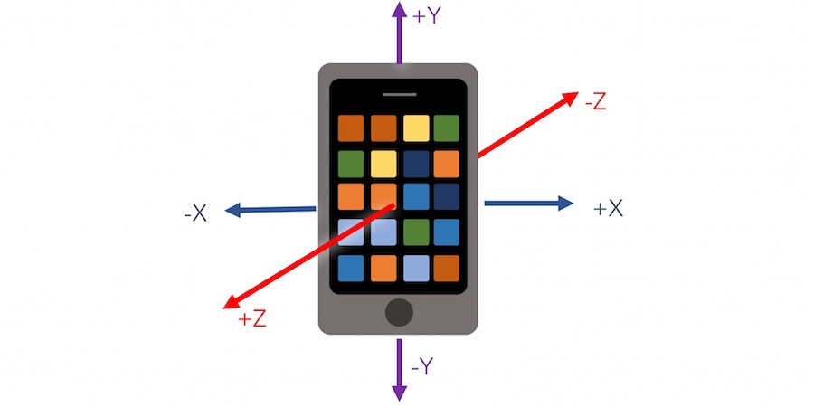

# Decision Tree Learning

Mobile technologies have lowered the bar to using lightweight sensors that measure the physical world and have opened new applications of data in daily life. From a smart phone's accelerometer, it’s possible to track distinct patterns in one’s activity based on the fluctuations in acceleration ($\frac{m}{s^{2}}$). In fact, many of these technologies have become commonly available, enabling physical fitness activity monitoring to characterizing transportation quality. Below is a set of exercise measurements from an smartphone accelerometer that lasted approximately 6.5 minutes and graphed at a frequency of 5 hertz (five readings per second). 

Can you visually identify distinct patterns? What makes those patterns distinct? 


```{r, echo=F, warning=FALSE, message=FALSE, fig.height = 3.5, fig.cap = "Accelerometer data collected from an iPhone."}

  temp <- read.csv("data/exercise.csv")
  temp$accel <- sqrt(temp$user_acc_x.G.^2 + temp$user_acc_y.G.^2 + temp$user_acc_z.G.^2)
  temp <- temp[!is.na(temp$accel) & temp$accel!="",]
  #print(nrow(temp))

  temp$timestamp.unix. <- round(temp$timestamp.unix./0.2,0)*0.2
  temp <- temp[,c("timestamp.unix.","accel")]
  temp_val <- aggregate(x = temp$accel, by=list(temp$timestamp.unix.), FUN=mean, na.rm=TRUE)
  colnames(temp_val) <- c("time","accel")

  temp_val <- temp_val[(nrow(temp_val)-2300):nrow(temp_val),]
  temp_val$time <- temp_val$time - min(temp_val$time) 
  
  temp_val <- temp_val[order(temp_val$time),]
  temp_val[,1] <- as.POSIXct(as.numeric(as.character(temp_val[,1])),origin="2016-01-01")
  
  plot(temp_val$time, temp_val$accel, xlab = "Acceleration", ylab = "Time (Seconds)", type = "l", col = "navy", cex = 0.4)
  
```

It becomes immediately apparent that the methods covered thus far are not suitable for the task at hand. If we manually extract samples from these periods, we can quantify the patterns in terms of their central tendencies. Idle periods have near zero acceleration, walking periods have acceleration around 0.2 with tight dispersion, running periods hover around 0.6 +/- 0.2, and descending stairs vary widely. Using simply the level of acceleration may not accurate as at least two types of motion have overlapping distributions.


```{r, echo=F, warning=FALSE, message=FALSE, fig.height = 3, fig.cap = "Acceleration by type of movement."}

library(gridExtra)

#Cut parts out
  idle <- temp_val[250:350,]
  walk <- temp_val[45:175,]
  run <- temp_val[1135:1200,]
  stairs <- temp_val[1400:1700,]

#Plot Graphs
  p = ggplot(idle,aes(x=time, y= accel  ))  + geom_point(size=1) + geom_line(colour = "navy") + ylim(0, 1) + ggtitle(paste("Idle: mu = ", round(mean(idle[,2]),2),", +/- = ",round(sd(idle[,2])*1.96,2),", max = ",round(max(idle[,2]),2))) + theme(plot.title = element_text(size = 8)) + theme_minimal()
  
  p1 = ggplot(walk,aes(x=time, y= accel  ))  + geom_point(size=1) + geom_line(colour = "navy") + ylim(0, 1) + ggtitle(paste("Walk: mu = ", round(mean(walk[,2]),2),", +/- = ",round(sd(walk[,2])*1.96,2),", max = ",round(max(walk[,2]),2)))+ theme(plot.title = element_text(size = 8))+ theme_minimal()
  
  p2 = ggplot(run,aes(x=time, y= accel  ))  + geom_point(size=1) + geom_line(colour = "navy") + ylim(0, 1) + ggtitle(paste("Run: mu = ", round(mean(run[,2]),2),", +/- = ",round(sd(run[,2])*1.96,2),", max = ",round(max(run[,2]),2)))+ theme(plot.title = element_text(size = 8))+ theme_minimal()
  
  p3 = ggplot(stairs,aes(x=time, y= accel  ))  + geom_point(size=1) + geom_line(colour = "navy") + ylim(0, 1) + ggtitle(paste("Descend Stairs: mu = ", round(mean(stairs[,2]),2),", +/- = ",round(sd(stairs[,2])*1.96,2),", max = ",round(max(stairs[,2]),2)))+ theme(plot.title = element_text(size = 8))+ theme_minimal()
  
  grid.arrange(p,p1,p2,p3, ncol=2)
```

Decision tree learning can help bring clarity. Trees are designed to look at inputs and partition the sample into smaller more homogeneous cells with respect to the target. This recursive partitioning allows a tree to resemble an inverted tree: moving away from the base of the tree, the tree trunk splits into two or more large branches, which then in turn split into even smaller branches, eventually reaching even small twigs with leaves. 

Decision trees use recursive partitioning to learn patterns, doing so using central concepts of _information theory_. There are a number of decision tree algorithms that were invented largely in the 1980s and 1990s, including the ID3 algorithm, C4.5 algorithm, and Classification And Regression Trees for Machine Learning (CART). All these algorithms follow the same framework that includes the following elements: (1) nodes and edges, (2) attribute tests, and (3) termination criteria.


## Under the hood

__Anatomy of a decision tree__. The tree is comprised of nodes and edges. Nodes (circles) contain records. Edges (lines) show dependency between nodes and is the result of an *attribute test* -- or a process that finds the optimal criterion to subset records into more homogeneous groups of the target variable.  The node at the top of the tree is known as the *root* and represents the full population. Each time a node is split, the result is two nodes -- each of which is referred to as a *child node*. A node without any child nodes is known as a *leaf*. The node is labeled using majority voting based on whichever class is most represented.  The goal is to grow a tree from the root node into as many smaller child nodes that contain more of one class than another.

Decision trees split nodes based on finding thresholds along the input variables. There can be seemingly infinite number of potential variable-threshold combinations -- which is best? Drawing from *information theory*, we can apply an *information gain* formula to evaluate all candidate splits and find one that provides the most information. This optimal split yields to more homogeneous child nodes, which in turn can be split even further. The search for the best threshold is known as an *attribute test*.

As we can see in the example decision tree for health care insurance, each node is connected to at least one other node. Starting at the root node, we can see that overall, the population is labeled "no coverage" based on the decimal percentage $0.5$. The 100% indicates the proportion of the sample that is contained at the node. Below is `age >= 64`, which is the most informative  attribute test that is used to split. To the left, the edge leads to another node at the bottom left corner of the diagram, which contains people who are age 64 or older. While the leaf node only contains 12% of the entire sample, it is almost exclusively people who have health care coverage. To the right, the remaining 88% of the sample, which is further split by wage and other variables. Each leaf node is defined as the intersection of multiple binary criteria, giving way to profiles of users that can be easily segmented.


__Growing trees__.   There are a number of decision tree algorithms that were invented largely in the 1980s and 1990s, including the ID3 algorithm, C4.5 algorithm, and Classification And Regression Trees for Machine Learning (CART). The process is fairly clear cut and iterative:

1. __Base Cases__.  The process starts with checking for "base cases" at the root node, the idea being that it might not be worth exerting effort to grow the tree if the data do not support it. The algorithm will first check to see if (a) all values of the target are of one class, and (b) none of the input variables offer any useful information. There are other base cases to consider depending on the algorithm, but any true base case will result in stopping the algorithm and returning only the root node. 

2. __Recursive Partitioning__. If none of the base cases are true, the algorithm proceeds to attribute testing using either  *Information Gain* or *Gini Impurity* as will be covered in the following section. At the root node, if there are 10 variables with each 30 possible thresholds, attribute tests are applied 300 times choosing the candidate threshold that yields the most homogeneous child nodes. Upon splitting, attribute tests are applied to each child node, making this a recursive partitioning procedure.

3. __Stopping Criteria versus Pruning__.  At some point, the algorithm needs to stop. The question is *when*? One way is to grow the tree until some *stopping criteria* are met, such as if a leaf has fewer records than a pre-specific threshold, the purity or information gain falls below a pre-specified level, or if the tree has grown to n-number of levels (e.g. number of rows of splits). While stopping criteria are useful, the results in some studies indicate their performance cap the tree from reaching its full predictive potential.^[] The alternative approach involves growing a tree to its fullest, then comparing the prediction performance given tree complexity (e.g. number of nodes in the tree) using cross-validation.  In the example graph below, model accuracy degrades beyond a certain number of nodes. Thus, optimal number of nodes is defined as when cross-validation samples (e.g. train/test, k-folds) reaches a minimum across samples. Upon finding the optimal number of nodes, the tree is *pruned* to only that number of nodes. 


__Attribute Tests__. Information gain is a form of *entropy* that measures the consistency of information. Based on these distinct states of activity, entropy is defined as: 

$$\text{Entropy} = \sum_{i=1}^{k}{-p_{i} log_2(p_{i})}$$
where $i$ is an index of states, $p$ is the proportion of observations that are in state $i$, and $log_2(p_i)$ is the Base 2 logarithm of the proportion for state $i$. Information Gain (IG) is variant of entropy, which is the entropy of the root node *less* the average entropies of the child nodes.

$$\text{IG} = \text{Entropy}_\text{root} - \text{Avg Child Entropy}$$

How does this work in practice? Starting from the root node, we need to calculate the root entropy, where the classes are based on the classes of the target `usership`.

$\qquad \text{Entropy}_\text{usership} = (-p_{user} log_2(p_{\text{user}})) - (-p_{\text{non-user}} log_2(p_{\text{non-user}}))$

$\qquad \qquad \qquad \qquad \qquad  = (-\frac{6}{12} log_2(\frac{6}{12})) + (-\frac{6}{12} log_2(\frac{6}{12}))$

$\qquad \qquad \qquad \qquad \qquad  = 1.0$

Then, the attribute test is applied to the root node by calculating the weighted entropy for each proposed child node. Using the `income` feature, the calculation is as follows:

- Split the root node into two child nodes using the `income` class. This yields the following subsamples as shown in the table below:

| | < $20k | > $20k|
|--------+---------+----------|
|No | 0 | 6 |
|Yes | 5 | 1 |
|Total | 5 | 7 |

- For each child node (the columns in the table), calculate entropy:

$\qquad \text{Entropy}_\text{income < 20k } = (-p_{user} log_2(p_{\text{user}})) - (-p_{\text{non-user}} log_2(p_{\text{non-user}}))$

$\qquad \qquad \qquad \qquad \qquad  = -\frac{5}{5} log_2(\frac{5}{5}) = 0$


$\qquad \text{Entropy}_\text{income > 20k } = (-p_{user} log_2(p_{\text{user}})) - (-p_{\text{non-user}} log_2(p_{\text{non-user}}))$

$\qquad \qquad \qquad \qquad \qquad = -\frac{6}{7} log_2(\frac{6}{7}) + -\frac{1}{7} log_2(\frac{1}{7}) = 0.5916728$

- Calculate the weighted average entropy of children:

$\qquad \text{Entropy}_\text{income split} = \frac{5}{12}(0) +  \frac{7}{12}(0.5916728) = 0.3451425$

- Then calculate the information gain:

$\qquad \text{IG}_\text{income} = \text{Entropy}_\text{root} -  \text{Entropy}_\text{income split}$

$\qquad \qquad \qquad \qquad \qquad = 1 - 0.3451425 = 0.6548575$

- We then can perform the same calculation on all other features (e.g. employment, part of town) and compare results. The goal is to *maximize* the IG statistic at each decision point. In this case, we see that income is the best attribute to use for splitting. This split is easily interpretable: "The majority of users of health services can be predicted to earn less than $20,000."

| Measure | IG |
|---------+------|
|Employment| 0.00 | 
|Income | 0.6548575 |
|Area of Town|0.027119 |


*Gini Impurity* is closely related to the entropy with a slight modification. 

$$\text{Gini Impurity} = \sum_{i=1}^k{p_{i}(1-p_{i})} = 1 - \sum_{i=1}^k{p_{i}^2}$$

Using Gini Impurity as an attribute test is also similar to Information Gain.

$$\text{Gini Gain} = \text{Gini}_\text{root} - \text{Weighted Gini}_\text{child}$$

## Tips of the trade

Like any technique, decision trees have strengths and weaknesses. Unlike logistic regression and KNN, decision trees can conduct automated variable selection on any type of data type. In addition, the recursive partitioning produce a tangible definition for each subpopulation represented by a node. The splitting mechanism make it possible to capture interactions and non-linearities that are otherwise not easily accounted for in the previous methods. The implications are that two or more input variables can be blended together to find cells of activities that are otherwise overlooked.

There are detractors, however. Trees can be grown so deeply that there are too many subpopulations to articulate. If left unpruned, terminal leafs may give a false impression of accuracy and precision -- the small samples may give a false impression. Nontheless, decision tree learning is an important contribution to classification problems and form the basis of many other algorithms.

```{r, echo = FALSE, message = FALSE, warning = FALSE}
  usescases <- read.csv("data/dt_sw.csv")
  colnames(usescases) <- c("Useful Properties", "Challenges")
  pander::pander(usescases, split.cell = 80, split.table = Inf, caption = "The good and ugly of decision trees.", 
                 justify = "left")

```

## DIY: Predicting activity from phone accelerometers

```{r, warning=FALSE, message=FALSE, echo = FALSE}
#Load data
  load("data/accel_activity.Rda")
```
__Overview__. Accelerometer data may become more common place in the future. In many respects, one's regular movements like walking and running can be viewed as a finger print. Thus, accelerometer data has many uses from measuring and improving health outcomes to multi-factor authentication^[https://ieeexplore.ieee.org/document/8090407] and roadway. quality^[https://www.wired.com/insights/2014/03/potholes-big-data-crowdsourcing-way-better-government/] 

It is quite easy to record and use the data. For this DIY, we use data collected on an iPhone at 20 hertz, or 20 recordings per second and will attempt to build our own activity classification algorithm that are calibrated to a specific person's motions. There are two pre-partitioned data frames -- one for training (`r paste0("n = ",nrow(train))`) that was captured under controlled conditions and an extended test sample taken in non-controlled conditions (`r paste0("n = ",nrow(test))`).

```{r, warning=FALSE, message=FALSE, eval = F}
#Load data
  load("data/accel_activity.Rda")
```

Our primary target is the `activity` variable that includes labels for *idle*, *run*, *stairs*, and *walk*. For a real-world application, the data should be augmented with other activities as algorithms only know what they have previously seen.

```{r}
#Quick summary
  table(train$activity)

```

Smartphone accelerometers captures data along three axes. As the position of the phone can shift, data from any one axis may not be useful without considering measures on orientation. While rotation is captured by the sensors, we simply acceleration into total acceleration $accel = \sqrt{\text{accel x}^2 +\text{accel y}^2 +\text{accel z}^2 }$. But if we recall the acceleration chart, we could deduce that a single value of acceleration does not likely have enough context to make for an informed prediction. We augment this data by engineering a few additional variables, namely the average, maximum, minimum, and standard deviation of total acceleration for the last 2.5 seconds (or 50 measurements). 


 
__Training__. There are a number of R implementations of decision trees, the most popular of which is the `rpart` library:

```{r, message = FALSE, warning=FALSE}
  library(rpart)
```

The main function within the library comes with flexible capabilities to induct decision trees: 

`rpart(formula, method, data, cp, minbucket, minsplit)`

where:

- `formula` is a formula object. This can take on a number of forms such as a symbolic description (e.g. $y = f(x_1, x_2, ...)$ is represented as "`y ~ x1 + x2`). 
- `method` indicates the type of tree, which are commonly either a classification tree "class" or regression tree "anova". Split criteria can also be custom written.
- `data` is the data set in data frame format.
- `cp` is a numeric indicates the complexity of the tree. $cp = 1$ is a tree without branches, whereas $cp = 0$ is the fully grown, unpruned tree. If $cp$ is not specified, `rpart()` defaults to a value of 0.01.
- `minbucket` is a stopping criteria that specifies the minimum number of observations in any terminal leaf.
- `minsplit`  is a stopping criteria that specifies the number of observation in a node to qualify for an attribute test.

As a first pass, we'll run `rpart()` setting `cp = 0`, meaning that the tree will be fully grown without any stopping criteria applied. 

```{r, message = FALSE, warning = FALSE}
fit <- rpart(factor(activity) ~ accel + avg50 + max50 + min50 + sd50, 
             method = "class", data = train,
             cp = 0)
```

The `fit` object captures all of the inner workings of the decision tree. For example, just plotting the fit object will show the full depth of the tree. More importantly is the cross validation results collected at each level of additional complexity. Using the `printcp()` function, we can extract the *CP table*, which contains various accuracy measures associated with each value of the tree complexity value `cp`, including: 

- the number of splits `nsplit`,
- the prediction error in the training data `rel error`,
- the cross-validation error `xerror`, and
- the standard error `xstd`. 


```{r, message = FALSE, echo = FALSE, warning=FALSE}

#Lowest xerror
  best.error <- as.vector(min(fit$cptable[,4]))
  best.splits <- as.vector(fit$cptable[,2][which(fit$cptable[,4]==min(fit$cptable[,4]))])
  best.sd <- as.vector(fit$cptable[,5][which(fit$cptable[,4]==min(fit$cptable[,4]))])

  opt.error <- best.error + best.sd
  opt.select <- as.vector(fit$cptable[,1][which(fit$cptable[,4] <= opt.error)])[1]
  opt.xerror <- as.vector(fit$cptable[,4][which(fit$cptable[,4] <= opt.error)])[1]
  opt.select.split <- as.vector(fit$cptable[,2][which(fit$cptable[,4] <= opt.error)])[1]
  
```


```{r, eval = F}
printcp(fit)
```
```{r, echo = FALSE}
head(fit$cptable)
```

__Tuning__. *How do we find the optimal tree depth?* First, find the lowest cross-validation `xerror`, then find the tree that has the lowest number of splits that is still within one standard deviation `xstd` of the best tree^[@esl2001]. The idea behinds this rule of thumb takes advantage of uncertainty: the true value lies somewhere within a confidence interval, thus any value within a tight confidence interval of the best value is approximately the same. In this first model, the best tree has `r paste0("nsplit = ", best.splits)` and `r paste0("xerror = ", best.error)`. By applying the rule, the upper bound of acceptable error is `r paste0("xerror = ", round(best.error,6)," + ", round(best.sd, 6), " = ", opt.error)`. As it turns out, the tree with `r paste0("nsplit = ", opt.select.split)` is within one standard deviation and is thus the best model. 

In other words, the following function can extract the optimal `cp` value.

```{r}
  bestCP <- function(fit_obj){
    # Returns best CP val within 1 SD of lowest xerror
    #
    # Args:
    #   fit_obj: decision tree object
    #
    
    #Find lowest error and associated xstd
     best.error <- min(fit$cptable[,4])
     best.sd <- fit$cptable[,5][which(fit$cptable[,4]==best.error)]
     
    #Pull CP closest to lower bound
     lower.bound <- best.error + best.sd
     opt.select <- fit$cptable[,1][which(fit$cptable[,4] <= lower.bound)][1]
 
     return(opt.select)
  }
```

Now, we can prune the tree using the optimal `cp` value, then score both the test set. As a comparison point, we will also apply the unpruned model as well.

```{r, message = FALSE, warning = FALSE}
#Get best CP
  best.value <- bestCP(fit)

#Prune tree
  fit.opt <- prune.rpart(fit, cp = best.value)
  
#Score, returning probabilities
  pred.full <- predict(fit, test, type = 'class')
  pred.opt <- predict(fit.opt, test, type = 'class')
```

__Evaluating performance__. One of the fascinating aspect of decision trees is that it is interpretable in a very different way than logistic regression. In lieu of a thorough review of the learned rules, we may rely on a measure of variable importance, that is defined as follows:

__REVISIT AT SOME POINT__

$$\text{Variable Importance}_k = \sum{\text{Goodness of Fit}_\text{split, k} + (\text{Goodness of Fit}_\text{split,k} \times \text{Adj. Agreement}_\text{split})}$$

Where *Variable Importance* for variable $k$ is the sum of *Goodness of Fit* (e.g. Gini Gain or Information Gain) at a given split involving variable $k$. In other words, a variable's importance is the sum of all the contributions variable $k$ makes towards predicting the target. Below, we can see that the measure can be extracted from the `fit.opt` object. As may be expected, `accel` is not the main contributor to predictions, but rather measures of the maximum, mean and variability of acceleration. This also implies that the model could be further tuned by trying different windows for producing the engineered variables -- perhaps shorter or longer windows could be even more important.

```{r}
#Extract variable importance list from fit object
  fit.opt$variable.importance
```

Unlike previous examples, there are four classes to predict, meaning that the AUC measure may be less effective in producing a singular summary. We consider the F1-statistic defined as:

$$F_1 =  2 \times \frac{\text{precision} \times \text{recall}}{\text{precision} +  \text{recall}}$$

where $\text{precision} = \frac{TP}{TP + FP}$ and $\text{recall} = \frac{TP}{TP + FN} = \frac{TP}{Actual (+)}$. The score is out of 1, where a value of 1 is a very well-balanced prediction. To accommodate three or more classes, the Mean F1-Score is the weighted by each activity class $k$ (e.g. run, walk):

$$\text{Mean}F_1 = \sum_{i=1}^{k} (\frac{n_k}{n}F_{1k})$$

These formulae effectively boil down to the following function:

```{r}
meanF1 <- function(actual, predicted){
  # Mean F1 score function
  #
  # Args:
  #   actual = a vector of actual labels
  #   predicted = predicted labels
  #
  
  #Loop through each class and calculate components
  classes <- unique(actual)
  results <- data.frame()
  for(k in classes){
    results <- rbind(results, 
                     data.frame(weight = sum(actual == k, na.rm = T)/length(actual),
                                precision = sum(predicted == k & actual == k)/sum(predicted == k, na.rm = T), 
                                recall = sum(predicted == k & actual == k, na.rm = T)/sum(actual == k, na.rm = T)))
  }
  results$score <- results$weight * 2 * (results$precision * results$recall) / (results$precision + results$recall) 
  return(sum(results$score, na.rm=T))
}
```

When applied to the function to the predictions (`pred.opt` and `pred.full`), we find that the mean F1-statistics reached `r meanF1(test$activity, pred.opt)` and `r meanF1(test$activity, pred.full)` -- not bad for a first cut, but certainly can benefit from extra attention.


## Practice Exercise

Tune the decision tree to increase the mean F1-statistic by testing different windows for the average, maximum and standard deviation of `accel`.


# Random Forests   

How do we know anything for sure? Virtually every aspect of life has some uncertainty tied in. When a hurricane approaches the US Eastern Seaboard, forecasters often map the *cone of uncertainty* that provides the possible range of motion of a storm based on the results of many forecasted simulations. In presidential elections, often times the most polling results are ones that ensemble or average the results of many other similarly conducted polls. The reliance on predictions from a group of models with the same aims may well improve prediction accuracy. In statistical learning, average the results of multiple models is known as *ensemble learning* or *ensembling* for short.

Single models may imposes biases on data and may be well-suited in specific situations. Ensemble methods combine the results of many models to obtain more stable results.  For example, the curve in graph #1 can be approximated using a decision tree algorithm. The result of a single tree only loosely fits the curve in a jagged fashion (#2). That one tree may impose biases on the data, perhaps through how the tree is pruned or the assumption that the jagged approximation is appropriate, which may then translate into greater variance in predictions. One could imagine that the structure of that one tree may have happened by chance, and under different situations, the fit could be better. 

Bootstrapping can help. Recall from elementary statistics that bootstrapping is defined as any statistical process that involves sampling records with replacement. By bootstrapping a sample, we treat a sample like a population, we can expose and characterize the qualities of an estimator under various scenarios already available in the data, which in turn produces an empirical probability distribution for predictions using the estimator. We can bootstrap the decision tree by (1) sampling the data with replacement up to the full size of the sample, then (2) run the decision tree. The result of repeating the process 50 times is (graph #3) produces a result that appears to be more organic and more accurate. This process of _bootstrapping_ and _aggregating_ the results is referred to as _bagging_.

\vspace{12pt} 

```{r, message=FALSE, warning = FALSE, fig.height = 2.5, echo = FALSE, fig.cap = "Comparison of results of applying a single model to fit a curve versus an ensemble of models."}

library(rpart)
library(gridExtra)
library(ggplot2)

set.seed(100)
x <- 1:100
y <- 5 + sin(x/20) + 2*cos(x/10)
df <- data.frame(x, y)

fit <- rpart(y ~ x, data = df)
df$yhat <- predict(fit, df)

base <- ggplot(df) + geom_line(aes(x = x, y = y))  + 
  ggtitle("(1) Actual" ) + 
  theme(plot.title = element_text(size = 10), axis.line=element_blank(),axis.text.x=element_blank(),
        axis.text.y=element_blank(),axis.ticks=element_blank(),
        axis.title.x=element_blank(),
        axis.title.y=element_blank(),legend.position="none",
        panel.background=element_blank(),panel.border=element_blank(),panel.grid.major=element_blank(),
        panel.grid.minor=element_blank(),plot.background=element_blank())

single_tree<- ggplot(df) + geom_line(aes(x = x, y = y)) +
  geom_line(aes(x = x, y = yhat), colour = "orange") + 
  ggtitle("(2) Single Tree" ) + 
  theme(plot.title = element_text(size = 10), axis.line=element_blank(),axis.text.x=element_blank(),
        axis.text.y=element_blank(),axis.ticks=element_blank(),
        axis.title.x=element_blank(),
        axis.title.y=element_blank(),legend.position="none",
        panel.background=element_blank(),panel.border=element_blank(),panel.grid.major=element_blank(),
        panel.grid.minor=element_blank(),plot.background=element_blank())

for(k in 1:50){
  temp <- df[sample(df$x, 100, replace=T),1:2]
  fit <- rpart(y ~ x, data = temp)
  yhat <- predict(fit, df)
  df <- cbind(df, yhat)
}

colnames(df)[4:ncol(df)] <- paste0("yhat",1:50)

many <- ggplot(df) + geom_line(aes(x = x, y = y)) + geom_line(aes(x = x, y = yhat), colour = "orange") +
  geom_line(aes(x = x, y = yhat2), colour = "red") + geom_line(aes(x = x, y = yhat3), colour = "orange") +
  geom_line(aes(x = x, y = yhat4), colour = "red") + geom_line(aes(x = x, y = yhat5), colour = "orange") +
  geom_line(aes(x = x, y = yhat5), colour = "red") + geom_line(aes(x = x, y = yhat6), colour = "orange") +
  geom_line(aes(x = x, y = yhat7), colour = "red") + geom_line(aes(x = x, y = yhat8), colour = "orange") +
  geom_line(aes(x = x, y = yhat9), colour = "red") + geom_line(aes(x = x, y = yhat10), colour = "orange") +
  geom_line(aes(x = x, y = yhat11), colour = "red") + geom_line(aes(x = x, y = yhat12), colour = "orange") + 
  geom_line(aes(x = x, y = yhat13), colour = "red") + geom_line(aes(x = x, y = yhat14), colour = "orange") +
  geom_line(aes(x = x, y = yhat15), colour = "red") + geom_line(aes(x = x, y = yhat16), colour = "orange") +
  geom_line(aes(x = x, y = yhat17), colour = "red") + geom_line(aes(x = x, y = yhat18), colour = "orange") +
  geom_line(aes(x = x, y = yhat19), colour = "red") + geom_line(aes(x = x, y = yhat20), colour = "orange")  + 
  geom_line(aes(x = x, y = yhat21), colour = "red") + geom_line(aes(x = x, y = yhat22), colour = "orange") + 
  geom_line(aes(x = x, y = yhat23), colour = "red") + geom_line(aes(x = x, y = yhat24), colour = "orange") +
  geom_line(aes(x = x, y = yhat25), colour = "red") + geom_line(aes(x = x, y = yhat26), colour = "orange") +
  geom_line(aes(x = x, y = yhat27), colour = "red") + geom_line(aes(x = x, y = yhat28), colour = "orange") +
  geom_line(aes(x = x, y = yhat29), colour = "red") + geom_line(aes(x = x, y = yhat30), colour = "orange") +
  geom_line(aes(x = x, y = yhat31), colour = "red") + geom_line(aes(x = x, y = yhat32), colour = "orange") + 
  geom_line(aes(x = x, y = yhat33), colour = "red") + geom_line(aes(x = x, y = yhat34), colour = "orange") +
  geom_line(aes(x = x, y = yhat35), colour = "red") + geom_line(aes(x = x, y = yhat36), colour = "orange") +
  geom_line(aes(x = x, y = yhat37), colour = "red") + geom_line(aes(x = x, y = yhat38), colour = "orange") +
  geom_line(aes(x = x, y = yhat39), colour = "red") + geom_line(aes(x = x, y = yhat40), colour = "orange")  + 
  geom_line(aes(x = x, y = yhat41), colour = "red") + geom_line(aes(x = x, y = yhat42), colour = "orange") + 
  geom_line(aes(x = x, y = yhat43), colour = "red") + geom_line(aes(x = x, y = yhat44), colour = "orange") +
  geom_line(aes(x = x, y = yhat45), colour = "red") + geom_line(aes(x = x, y = yhat46), colour = "orange") +
  geom_line(aes(x = x, y = yhat47), colour = "red") + geom_line(aes(x = x, y = yhat48), colour = "orange") +
  geom_line(aes(x = x, y = yhat49), colour = "red") + geom_line(aes(x = x, y = yhat50), colour = "orange")  + 
  ggtitle("(3) 50 Models" ) + 
  theme(plot.title = element_text(size = 10), axis.line=element_blank(),axis.text.x=element_blank(),
        axis.text.y=element_blank(),axis.ticks=element_blank(),
        axis.title.x=element_blank(),
        axis.title.y=element_blank(),legend.position="none",
        panel.background=element_blank(),panel.border=element_blank(),panel.grid.major=element_blank(),
        panel.grid.minor=element_blank(),plot.background=element_blank())


df$average <- rowMeans(df[,4:ncol(df)])

avg <- ggplot(df) + geom_line(aes(x = x, y = y)) +
  geom_line(aes(x = x, y = average), colour = "blue") + 
  ggtitle("(4) Ensemble Average" ) + 
  theme(plot.title = element_text(size = 10), axis.line=element_blank(),axis.text.x=element_blank(),
        axis.text.y=element_blank(),axis.ticks=element_blank(),
        axis.title.x=element_blank(),
        axis.title.y=element_blank(),legend.position="none",
        panel.background=element_blank(),panel.border=element_blank(),panel.grid.major=element_blank(),
        panel.grid.minor=element_blank(),plot.background=element_blank())

grid.arrange(base, single_tree,  many, avg, ncol = 2)
```

\vspace{12pt} 


Applying bagging to decision trees may not necessarily be enough to develop a well-balance prediction. In the social sciences and public policy, it is generally assumed that a model's specification is a choice left to the analyst; However, it may also be a source of methodological bias. 

_Random forests_ can help. The technique is an extension of decision trees using a modified form of bootstrapping and ensemble methods to mitigate overfitting and bias issues.^[@breiman2001] Not only are individual records bootstrapped, but input features are bootstrapped such that if $K$ variables are in the training set, then $k$ variables are randomly selected to be considered in a model such that $k < K$. Each bootstrap sample is exhaustively grown using decision tree learning and is left as an unpruned tree. The resulting predictions of hundreds of trees are ensembled. The logic is described below.

__Pseudo-code__
\vspace{12pt} 

```
Let S = training sample, K = number of input features
  1. Randomly sample S cases with replacement from the original data.
  2. Given K features, select k features at random where k < K.
  3. With a sample of s and k features, grow the tree to its fullest complexity.
  4. Predict the outcome for all records.
  5. Out-Of-Bag (OOB). Set aside the predictions for records not in the s cases.
Repeat steps 1 through 5 for a large number of times saving the result after each tree.
Vote and average the results of the tree to obtain predictions. 
Calculate OOB error using the stored OOB predictions. 
```
\vspace{12pt} 

The *Out-Of-Bag* (OOB) sample is a natural artifact of bootstrapping: approximately one-third of observations are naturally left un-selected, which can be used as the basis of calculating each tree's error and the overall model error. Think of it as a convenient built in test sample.

_How about interpretation?_ Unlike decision trees, it is not a simple task to deduce rules or criteria that describe the target variable. Instead, random forests use *variable importance*, which, like for a decision tree, measures the contribution of a feature to the homogeneity of a classifier. Unlike decision trees, variable importance for a Random Forest is calculated as the mean decrease in the Gini coefficient of a split relative to the Gini coefficient of the root node. Gini coefficients measures homogeneity on a scale of 0 to 1, where 0 is perfect homogeneity and 1 is perfect heterogeneity. The Gini changes are summed for each variable and normalized. 

\vspace{12pt} 

```{r, echo = FALSE, warning = FALSE, message = FALSE, fig.cap = "Random Forests construct hundreds of trees sampling from both observations and features, then combine the trees into one prediction through voting.", fig.height = 3}

library(rpart.plot)
library(rpart)

id <- 1:100
y <- 5 + sin(id/20) + 2*cos(id/10)
df <- data.frame(id, y)

for(i in 1:100){
  x <- y + runif(length(id))*10
  df <- cbind(df, x)
  colnames(df)[i+2] <- paste0("X",i)
}


par(mfrow = c(1,5))
for(k in 1:3){
  temp <- df[sample(1:nrow(df), replace=T), 2:ncol(df)]
  sampled.vars <- sample(colnames(temp)[2:ncol(temp)], 3)
  fit <- rpart(y ~ ., data = df[, sampled.vars], cp = 0)
  rpart.plot(fit, shadow.col="gray", nn=TRUE, 
             main = paste0("Tree ", k, "\n uses ", paste(sampled.vars, collapse = ", "),""), cex.main = 1.1)
}

plot(c(0), pch = 19, col = "white", xaxt = "n", yaxt = "n", frame.plot=FALSE, xlab = "", ylab="")
text(1, 0, ". . .", cex = 5)
for(k in 500){
  temp <- df[sample(1:nrow(df), replace=T), 2:ncol(df)]
  sampled.vars <- sample(colnames(temp)[2:ncol(temp)], 3)
  fit <- rpart(y ~ ., data = df[, sampled.vars], cp = 0)
  rpart.plot(fit, shadow.col="gray", nn=TRUE, 
             main = paste0("Tree ", k, "\n uses ", paste(sampled.vars, collapse = ", ","")), cex.main = 1.1)
}
```

\vspace{12pt} 

## Tuning
Whereas methods like regression have a closed form solution, Random Forest require tuning as optimal models need to be searched for under different conditions. The principal tuning parameters include: Number of features and number of trees.

- _Number of input features_. As $k$ number of parameters need to be selected in each sampling round, the value of $k$ needs to minimize the error on the OOB predictions. 
- _Number of trees_ influences the stability the Variable Importance metric that is commonly used to infer variable influence in decision tree learning. More trees help to stabilize the Variable Importance estimate. To determine the number of trees, keep adding trees to a sample until the OOB error for a randomly select set of trees is approximately equal to that of the ensemble.

