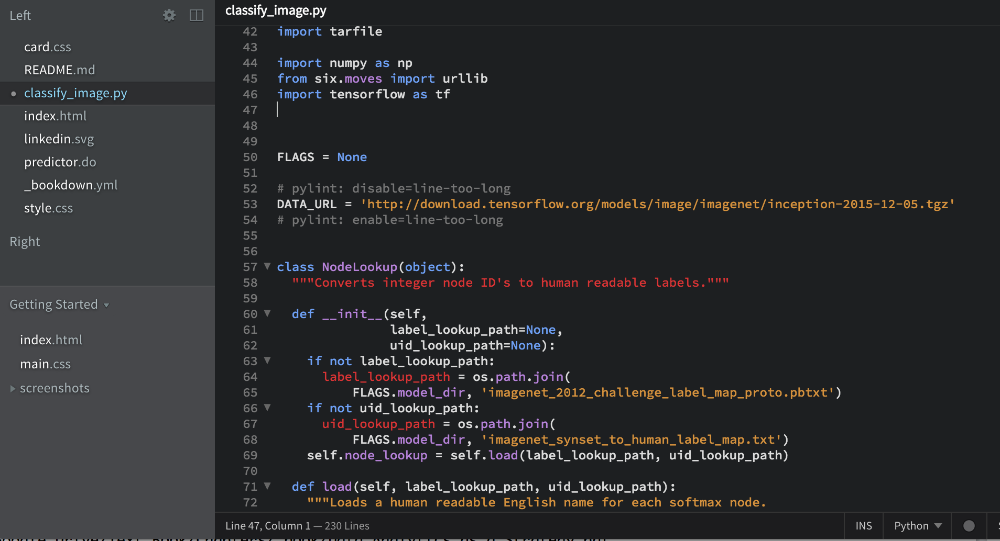
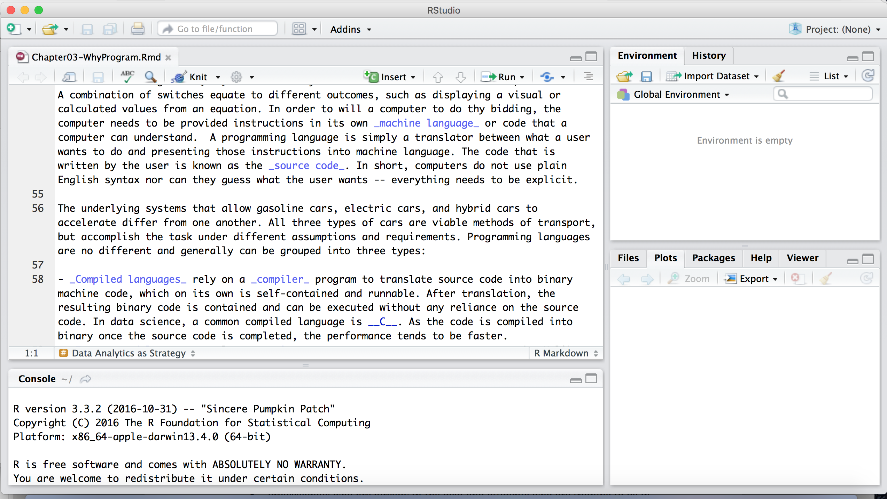
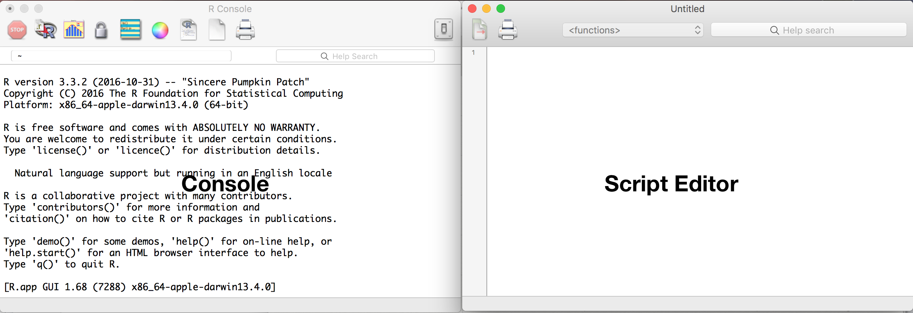
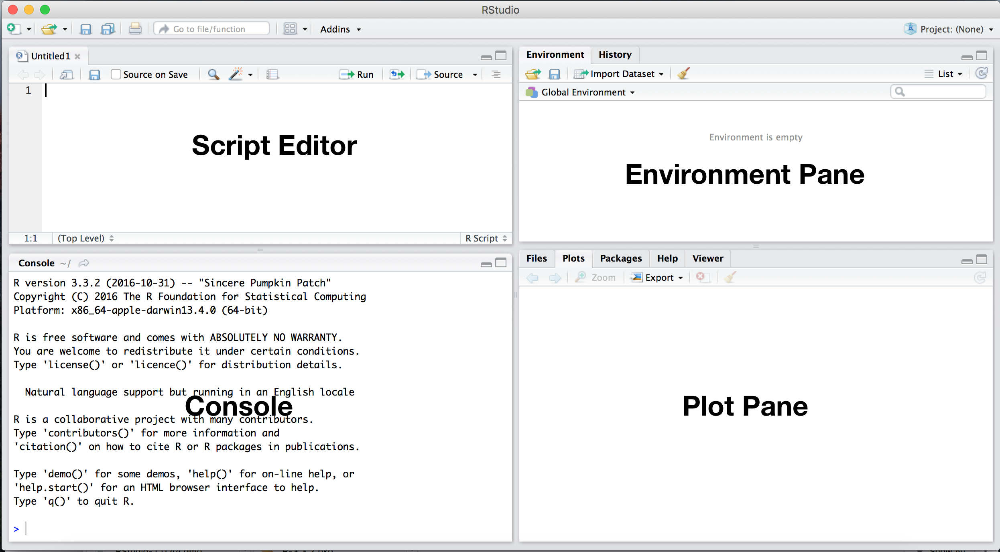
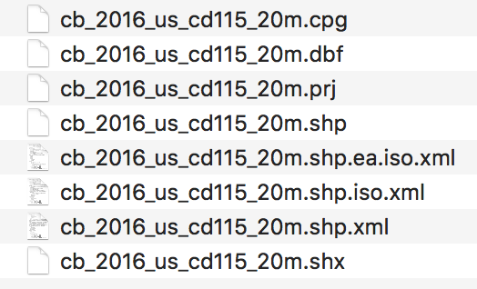

--- 
title: "Data Science + Public Policy (v0.1)"
author: "Jeff Chen - contact@jeffchen.org"
date: '`r Sys.Date()`'
output:
  html_document: default
  pdf_document: default
description: Light Programming
documentclass: book
link-citations: yes
bibliography:
- book.bib
- packages.bib
site: bookdown::bookdown_site
biblio-style: apalike
---
# A Light Introduction To Programming

## Doing visual analytics since 1780's

The modern line chart is something that most people take for granted. Grade school arithmetics class typically requires students to learn to haphazardly draw a two dimensional axis, then plot points at specific coordinates in the Cartesian space, then connect the points using line segments. This simple, routine task was once an innovation. 

In 1786, a Scottish engineer named William Playfair published _Commercial and Political Atlas_, an atlas that described economic and political relationships of the 18th century. The impressive book introduced the first line and pie charts, skillfully hand colored and narrated to help readers see economic patterns Granted, the patterns were correlative and circumstantial rather than proven through statistical means, but it was the beginning of graphical methods of statistics -- gathering information in a common, comparable form in order to visually identify patterns. For example, in a balance of trade time series chart, England's imports and exports to and from Denmark and Norway are plotted for the periods of 1700 to 1780. Many features of the chart are quite striking such as a naturally smooth pair of lines for each imports and exports between which two different colors are used to illustrate trade balances in favor and against England. 


```{r, echo=FALSE, fig.height=3, fig.cap = "Playfair's balance of trade time-series chart as found in the Commercial and Political Atlas, 1786"}
library(png)
library(grid)
library(gridExtra)

img1 <-  rasterGrob(as.raster(readPNG("assets/programming/img/Playfair_TimeSeries-2.png")), interpolate = FALSE)

grid.arrange(img1,
             ncol = 1)
```


In present day, we tend to take the construction of effective statistical visuals for granted. But in Playfair's time, a three field data set with 240 data elements ($\text{80 years x 3 fields}$) was big data. Furthermore, scaling and disseminating this work would have been an arduous process requiring typesetting and colororation by hand -- a significant time investment.

## Programming to democratizing skills

With the advent of computer programming, the manual mastery of drafting charts became democratized to the masses in the form of software.  A new type of engineer emerged -- the software engineer -- leveraging specialized computer programming languages to instruct machines to undertake user specified tasks. Formerly arduous tasks started to become simplified and genericized. In many ways, each programmed task is designed to imitate an expert's abilities: inputs such as data are transformed by a computer following a series of pre-defined steps, returning a specific intended result. Code often requires users to be explicit about assumptions, which may require deeper expertise (e.g. what scale should the chart be, what color palette makes sense). An engineer can set sensible defaults that use best practices to fill the user's knowledge gap, thereby reducing intellectual overhead and allow easier use of software.  This enables even novice analysts with little experience to produce charts in which software automatically applies graphical styles while allowing some degree of customization. In a matter of mere minutes, an analyst can produce a smartly designed chart using the collective knowledge of visualization designers and developers.

Most people will only need user-friendly, click-based software, catering to a common set of tasks that may need to be done with on a daily operations. But for others, programming is a means of exploring new frontiers -- to create and test ideas that may change paradigms or make operations even more efficient. Creating something new and higher level often requires a degree of flexibility that moves beyond common tasks. Imagine the following scenarios:

1. An analyst is responsible for putting together forecasts, but requires five days to click through his software to refresh data and update assumptions. 
2. Every month, an outreach coordinator is responsible for pairing new mentors with mentees. The process of manually matching hundreds of people based on their surveyed interests usually takes two months to complete per cohort.
3. Satellite imagery can be used to support intelligence decisions -- perhaps in the form of counting buildings or vehicles on the ground. With 196.9 million square miles of area on the Earth’s surface, a massive army of image analysts would need to inspect a daily pipeline of images to extract usable information. 

Although proven time and time again, manual tasks may be repetitive and may be streamlined. The forecast analyst could write a script that automates the refresh and model calibration. The outreach coordinator could benefit from a program that recommends matches based on digital survey results. The satellite imagery review could be automated using the latest in computer vision technology. Indeed, programming may give way to new softwares that may bring seemingly esoteric tasks into the mainstream.

## How programming languages work

In this book, there is much reference to Lambourghinis. They are exciting machines (for some) as the possibilities on the road are endless. It is frightening to others as the sheer speed, expense, and responsibilities are too great. To even develop these sentiments, one needs to first understand what cars are, how are vehicles controlled, how they can be used, what is needed to make use of them, the laws that govern the road, etc. 

There are many parallels between driving and programming. For those who are new to programming, it is likely that prior experience with software has largely been through user interfaces (UI). UIs typically involve a graphical representation displayed on a screen allowing a user to interact through touch or mouse -- selecting buttons in order to perform actions. In many respects, this is the same as all the levers, buttons, knobs, and pedals found in a car driver's seat: every control is associated with some function, whether accelerating the car or opening the windows. In both cases, in order to accomplish a specific task (e.g. driving from A to B, processing data from form A into form B), the user needs to be _explicit_. With the exception of self-driving cars, drivers need to regulate the accleration of the car with both gas and brake pedals as well as turn the steering wheel in a coordinated, well-timed series of rotations for some amount of time until the destination is reached. The user actions are translated into signals that a car can understand. For example, when a driver presses down on a gas pedal, a signal is inputted into an eletronic throttle control that interprets the driver's motion into an amount of fuel that is injected into the engine. The result: acceleration. Having the interpretative layer is a necessity. The alternative could be something quite farcical, requiring the driver to haphazardly squeeze a syringe of fuel into the engine.  

Computer programming runs along a parallel. Whereas cars have an engine, a computer's Central Processing Unit (CPU) is essentially a collection of switches that flip on and off. A combination of switches equate to different outcomes, such as displaying a visual or calculated values from an equation. In order to will a computer to do thy bidding, the computer needs to be provided instructions in its own _machine language_ or code that a computer can understand.  A programming language is simply a translator between what a user wants to do and presenting those instructions into machine language. The code that is written by the user is known as the _source code_. In short, computers do not use plain English syntax nor can they guess what the user wants -- everything needs to be explicit. 

The underlying systems that allow gasoline cars, electric cars, and hybrid cars to accelerate differ from one another. All three types of cars are viable methods of transport, but accomplish the task under different assumptions and requirements. Programming languages are no different and generally can be grouped into three types: 

- _Compiled languages_ rely on a _compiler_ program to translate source code into binary machine code, which on its own is self-contained and runnable. After translation, the resulting binary code is contained and can be executed without any reliance on the source code. In data science, a common compiled language is __C__. As the code is compiled into binary once the source code is completed, the performance tends to be faster.
- _Interpreted languages_ rely on an _interpreter_ program to execute source code. Unlike compiled languages, interpreted languages are fully reliant on the interpreter program, meaning that each time a user wants to take an action, the source code needs to be re-run and interpreted through the program. The result is a slower language relative to compiled languages. In data science, a common interpreted language is __R__. 
- _Pseudocode languages_ (p-code langauges) are hybrids between compiled and interpreted languages. The source code is compiled into bytecode -- a compact instruction set that is designed for specialized, efficient interpreters when executed. A common example of a p-code language is __Python__.

#### Where does the code go? {-}
_Code Editors_. All of the above languages follow a paradigm: write code, then execute it. Writing code requires a _code editor_, a simple tool that can be used to store and edit code. An editor can be as simple as Notepad on Windows or TextEdit on Macs. Practitioners tend to use more specialized code editors that make the coding process more efficient and effective, often times including functions like auto completion and improved readability. These include [Sublime Text](https://www.sublimetext.com/), [Brackets](http://brackets.io/), [Notepad++](https://notepad-plus-plus.org/) (Windows Only), [Atom](https://atom.io/), among others. After code is written, it needs to be executed following the type of language. For code written for compiled languages, for example, the code needs to be translated into binary via a compiler, which is not part of the code editor. 



_Integrated Development Environments (IDEs)_. For some languages, IDEs are an all-in-one tool that make software development simpler, containing a source code editor, a compiler or interpreter and a debugging capabilities all in one screen. For example, there are a number of IDEs for Python, such as [PyCharm](https://www.jetbrains.com/pycharm/), [PyDev + Eclipse](https://marketplace.eclipse.org/content/pydev-python-ide-eclipse), [Spyder](https://pythonhosted.org/spyder/), and [Rodeo](https://www.yhat.com/). For the R statistical programming language, [RStudio](https://www.rstudio.com/products/rstudio/) is the most used IDE. 



_What does it mean for data science?_  Data science principally involves handling, well, data. And all of the above types of languages are up to task. Two languages have risen above the rest:  R and Python. Both languages can produce charts that would make Playfair proud, but modern day Playfairs need to be able to have a strong command over the all quantitative techniques that have emerged since the 1780's.  Users of each language can conduct similar tasks, but tend to differ in their aims: 

- _R_ is a common choice language of statisticians and data-intensive researchers as it is flexible for data science and mathematical experimentation.   Whether machine learning or any quantitative task, R is optimized specifically for all things data. Any data task can be easily handled using the language's basic commands and augmented by thousands of _code libraries_ -- openly available sets of functions that facilitate more complicated tasks. The language does not naturally lend itself to the development of web applications, although there have been recently introduced software that are designed to run R code as standalone applications. 
- _Python_ is a great all-around scripting language that is common in software engineering environments -- typically focused on building and deploying web applications such as websites and Application Programming Interfaces (APIs). A key feature of Python is its focus on simplicity and readability. Whereas R is focused on statistics, Python is reliant on a broad range of libraries to handle basic data tasks. 

_Which one language should a beginner choose first?_  The decision rests on the tasks that one wishes to accomplish.  For prototyping and testing statistical ideas, learning R is a sound choice. It is more than enough to draw statistical conclusions, visually communicate insights, and grow a data science practice. If the nature of projects is more ad hoc as is typical of new service-oriented organizations, then start with R.  For cases where deploying software is a necessity -- often times more product-oriented organizations, starting with Python makes more sense. A data scientist can start with one language, then learn the other as well. 

In the field, there is a rather farcical rift between R and Python users. There are many R projects that draw superb insights, but do not garner any support. There are plenty of Python software projects that are put into production, but see no use.  Ultimately in the realm of data science, fundamentally understanding the problem is king and everything else follows.


## Setting up R

As the author is a statistician, all programming herein is illustrated in the R programming language. To get started, the only installation is required to take advantage of R is found on the [Comprehensive R Archive Network website](https://www.r-project.org/). For ease of development, though not necessary to run R code, an IDE known as [Rstudio](https://www.rstudio.com/products/rstudio/download/) should be installed. 


### Installation

Installation is a two step process. First, visit the CRAN website: 

- Visit [R](https://cran.r-project.org/)
- Click on 'Download R' for your computer's operating system or OS (Windows, Linux or Mac)
- Download the latest **.pkg** file that your OS can support
- Open and install the **.pkg** file

Upon installing R, open the software. The software should display the _console_, which is a command-line interpreter (left). Human-written source code can be directly run in the console, which then is interpreted into machine language. In addition, the buttons at the top of the interface provides options to write and edit code in a script editor. 

. 

Secondly, to make life easier when coding in R, install RStudio.  Note that RStudio requires R, but R does not require RStudio. 

- Visit [RStudio](https://www.rstudio.com/products/rstudio/download/)
- Click on the Installer that corresponds to your computer's operating system or OS (Windows, Linux or Mac)
- Open and follow install instructions.

Open RStudio. During the first time, the program will prompt require a version of R to be selected. There should be a four pane layout:

- Like plain vanilla R, RStudio contains a script editor and console. The code can be directly executed from the script editor, passing commands to the console.

- As code is run, there may be inputs and outputs that are temporarily kept in the computing environment. The _environment pane_ provides an inventory of the types of objects that currently exist in the environment.  
- Some outputs of the code may be charts, which are rendered in the _plot pane_. 



### Justifying open source software

If you are working in an organization that is in the nascent stages of using data, it is more than likely that you will need to convince executives, IT managers, your supervisor, co-workers among others that you need access to analytics software. Many will direct the bold and ambitious back to MS Excel as it can indeed cover many fundamental tasks and is inexpensive. But consider this: open source software like R is free and open, and is far more robust, flexible and powerful than any WYSIWIG.

But when considering why new open source software does not usually catch on, consider the following strategies:

- _Cost_. The cost of software is often cited as a barrier to use. Fortunately, open source software such as R and Python tend to be free to use and accessible by anyone. Since there is no cost barrier, there are world-wide communities of practitioners and experts who build new software from open source code bases, which means cost does not prohibit collaboration.
- _New to modern technologies_. Organizations that are newcomers to new open source coding languages  may simply be intimidated by the idea of programming. People do not usually like to admit that they are not well-versed in an area of knowledge. Consider illustrating the capabilities in a non-threatening manner -- build tangible graphs and visuals that illustrate the promise of using a new open source coding language in non-technical terms while de-emphasizing your technical wizardry.
- _Cybersecurity_. Chief Innovation Officers (CIOs) and Chief Information Security Officers (CISOs) will want to know the security of servers will be protected given that an open source software is acquired from the other side of the firewall. With open source software with large robust communities, there are far more people scrutinizing the source code than a single company's proprietary software. Thus, it is reasonable to argue that cyber vulnerabilities have a higher chance of detection with a larger, dedicated user base. 
- _Customer support_. Like life insurance, some will want to buy peace of mind when buying a commercial, closed source software. Thus, open source softwares are not typically furnished with dedicated, reliable technical support. In many respects, open source is a matter of self-reliance and communal reliance. Do not quote Ralph Waldo Emerson, but rather advocate for a pilot period where low-risk projects are conducted using an open source software. If worse comes to worse, there are a variety of enterprise-grade open source softwares available for R and Python.


## A Gentle Introduction to R

Programming turns human thought into well-defined, structured information that can be actted upon.  Let's take the following quote from a August 2017 [CNBC online article about stock performance](https://www.cnbc.com/2017/08/29/us-stocks-north-korea-missile.html): 

>> The Dow Jones industrial average erased earlier losses to end 56.97 points higher at 21,865.37,...

When reading the statement, our brains recognize and hold onto information for future use. Just in a 104 character sentence, we can see that:
- the _Dow Jones industrial average_ is a series of characters or a string  that is associated with a stock market indicator;
- the Dow experienced a rate of change _56.96_ -- a numerical value -- that  is measured relative to a magnitude _21,865.37_ (another numerical value); 
- there was indeed growth in the Dow and can  be recorded simply as `TRUE` 

In programming, each of the above values is a __variable__ -- a storage location for a particular value that is associated with an identifier. In R, we can represent the above information in the following matter:

```{r}

indicator <- "Dow Jones Industrial"
change <- 56.96
close <- 21865.37
growth <- TRUE

```

There are four variables (indicator, change, close, growth) each with different identifiers. Notice that each value is being named or "assigned" using  `<-`. To check that the assignment worked, we'll use `print()` to write `indicator` and `change` to the console output.


```{r}
print(indicator)
print(change)
```

`indicator` is set as a string value (charactes) and change is a numeric. In statistial programming, there are many different data types, including:
- *numeric* (e.g. 1, 3.14, 123)
- *string* or *characters* (e.g. "text goes here")
- *factors* (e.g. unique levels)
- *boolean* (e.g. FALSE, TRUE)
- *dates* (e.g. 12/6/2016, 2014-03-20)

Thus, a variable can hold values of any data type and be overwritten with virtually anything:

```{r}
#string
  people <- "people"
#factor
  people <- factor("people")
#boolean
  people <- FALSE
#dates
  people <- as.Date("12/6/2016","%m/%d/%Y")
  
```

Variables can also hold more than one value. In the example below, we overwrite `people` as a vector, or a sequence of data elements of the same *data type*. 

```{r}
people <- c(134, 542, 324, 102, 402, 383, 853) #set x as a vector
print(people)
```

Let's assume that each element of vector `x` represents a different field office's productivity with serving constituents and we wanted to print out a simple summary. To do this, we'll rely on the `sum()` function to add all values in the vector x, `length()` to count the number of offices, and `paste()` to concatenate all the objects into one string object.

```{r}
tot_people = sum(people) #Sum of x
num_offices = length(people) #count number of elements
units1 <- "satisfied constituents served" #string variable
units2 <- "field offices!" #another string variable

statement <- paste(tot_people, units1, "in", num_offices, units2)
print(statement)
```

#####Quick Exercise
Using the `people` and `units` variables, write a command that lists the number of people people served per office.

### Operators
#### Numerical Operators {-} 
Numerical values can be modified, manipulated, and combined using operations such as addition (`+`), substraction (`-`), multiplication (`*`), division  (`/`), exponent (`**`) and modulus (`%%`). These are the foundations of many analytical operations.

```{r}
4 + 2  #Addition
4 - 2  #Substraction
4 * 2  #Multiplication
4 / 2  #Division
4 ** 2 #Exponent
4 %% 2 #Modulus 
```

These operators are scalable. If we want to find the number of customers if we wanted to double productivity or half productivity, then it's like multiplying a scalar to every row in a given column of a spreadsheet. It's far easier to do this in R using one line of code.

```{r}
##Double
  doubled <- people * 2
  print(doubled)

##Half
  halved <- people / 2
  print(halved)
```

#### Logical operators {-}
Let's say that you need to  flag values based on specific values or specific thresholds. This task would require the use of logical operators, which evaluate a statement and return a boolean that indicates if a statement is `TRUE`. Below, we compare two quantities: `y` and `x`

```{r}
x <- 10
y <- 2

x > y   #4 is greater than 2
x >= y  #4 greater than or equal to 2

x < y   #4 is less than 2 
x <= y  #4 less than or equal to 2

x != y  #4 is not equal to 2
x == y  #4 is equal to 2
```

Using the operators, we can also see how many elements in a vector meet a specific criterion. For example, to flag which records in `people` are over 200, we can do the following:
```{r}
above <- people > 200
print(above)
```

Notice that the logical operator returned a vector that evaluate the statement for each element in `people`. To see the split of `TRUE` vs. `FALSE`, we an use the `table()` function to tabulate the number of records in each unique data value. 
```{r}
table(above)
```

### Data classes 
Data classes are ways to store data in an efficient and usable manner within the R programming environment. These differ from data storage formats (e.g. CSV, JSON), which are widely used regardless of programming language. Each data class is designed with different functions in mind and make certain tasks more efficient. In this section, we'll cover vectors, lists, matrices, and data frames. 

##### Lists {-}

[Add section on lists]

##### Vectors {-}
As mentioned previously, *vectors* are sequences of data elements of the same data type. Below, there are three vectors: `cities` is a string vector whereas `pop` and `area` are numeric vectors.

```{r}
cities <- c("New York","Los Angeles","Chicago","Houston","Philadelphia")
pop <- c(8175133, 3792621, 2695598, 2100263, 1526006)
area <- c(302.6, 468.7, 227.6, 599.6, 134.1)
```

To extract specific values in a vector, we will need call values by their index position in the list of values. Unlike other programming languages, R index values start from 1 rather than 0. Thus, in order to obtain the first value in all three vectors, one could write the following command:

```{r}
cities[1]
pop[1]
area[1]
```

Using the index values to extract values is quite useful and can be combined in many ways:
```{r}
#Obtain first and fourth cities
  cities[c(1,4)]

#Obtain the third through fifth cities
  cities[3:5]
  
#Use criterion to obtain populations greater than 2 million
  pop[pop > 2000000]
  
```

##### Matrices {-}
Vectors can be combined into into a *matrix* using `cbind()`. Matrices are data elements arranged into a `n` row by `m` column rectangular layout that allow for easier multi-dimensional data manipulation. Note that all data elements, regardless of the location in a matrix, are of the same data type (e.g. numeric, string, boolean) and take on the data type of the first column of data unless specified otherwise.

```{r}
mat <- cbind(cities, pop, area)
```

In this case, `pop` and `area` take on the data type of `cities`. This can be limiting if an analysis requires multi-dimensional, multi-data type data. But there benefits over vectors, namely the ability to easily and concisely extract complete multiple variable sets of data.

```{r}
#Extract first row
  mat[1,]

#Extract second column
  mat[,2]
  
#Extract 2nd to 3rd rows and the 1st and 3rd column
  mat[2:3,c(1,3)]
```

##### Data frames  {-}
If a dataset will have more than one data type, consider using data frames. To create a data frame, use the `data.frame()` to put two or more vectors together. 

```{r}
df <- data.frame(city = cities, population = pop, area = area)
```

One of the properties of data frames is the ability to set, manage and use  variable names, which is not available when using matrices.

```{r}
#Being able to call a variable by name using the compact $ operator
  df$cities
  df$population

#Check column names
  colnames(df)
  
#Reassign column names using a vector of 
  colnames(df) <- c("city_name","pop","area")
  
#Create a new boolean variable for populations greater than 2.5m and store into data frame
  df$over_2m <- df$pop > 2500000

#View results
  print(df)
```

If there is a existing matrix object, `as.data.frame()` an be used to convert the objet into a data frame. However, this method will preserve the uniform data type of the matrix, which would require manually setting the data type for each variable.

```{r}
new_df <- as.data.frame(mat)
```


##### Basic Manipulation {-}

[Add section on indices]


##### Tips {-}
We can check the structure of any data object in R using the `str()` method, which returns the following for a given data object:
- the data format if vector, or class if matrix or data frame
- dimensions of the data: number of rows if vector, matrix dimensions [rows, columns], or number of variables and rows if data frames
- the first 5 values of the object along with the data format

```{r}
#vector
  str(cities)
  str(pop)

#matrix
  str(mat)

#data frame
  str(df)
```

Other tools include `dim()`, `class()`, and `typeof()`, which provide the object dimensions, the class of data object and the type of data objet, respectively. These are handy for understanding basic attributes of any data and can inform the architecture of your data science approach.

```{r}
dim(df)
class(df)
typeof(df)
```


### Libraries: Expanded functionality

While R comes with built-in functionality, higher order functions that facilitate more efficient and effective programming may require one to install and load code libraries -- user-contributed functions that extend programming languages and are furnished with standardized documentation to help programmers understand their functionality.  As R is an open source language, anyone can write and contribute code libraries for general public use. In fact, as of Dec 2016, there are 9,749 contributed packages on the [Comprehensive R Archive Network (CRAN)](https://cran.r-project.org). Some of the most used libraries include:

- ggplot2 -- a graphing visualization library
- dplyr -- a data manipulation and processing library
- caret -- a multi-faceted machine learning library
- stringr -- a library for character or string processing
- lubridate -- a library to handle date data 
- sqldf -- a library to write SQL code in R

Libraries are common among programming languages, such as Python, Java, Julia, and JavaScript.

#### Install and load a package
To start, we will install and load *ggplot2*, one of the most used graphing libraries. Installation is simple enough, using the `install.packages()` command:

```{r, eval=FALSE}
install.packages("ggplot2")
```

To use the library, use `library()` to load *ggplot2*.
```{r}
library(ggplot2)
```

Upon doing so, all is needed is the data in the right form and a basic understanding of ggplot2 syntax ([take a look here](http://docs.ggplot2.org/current/)). 


### Input/Output (I/O)

Input/Output or I/O is the process of having a data scientist communicate with a computer to act on some piece of information. This may involve understanding how to input parameters into a function in order to obtain a desired output. More commonly, I/O from a data perspective is import and export of data into a programming environment.

It is important to understand that data is captured in many _data formats_ -- or standardized structures for storing data. In the social sciences, data is often requested in _comma separated values_ (.csv), _tab separated values_ (.tsv) or other tabular flat files. Notice that there is one row per observation where the  _header_ (first line) contains the names of each of the fields, then values come every row thereafter.  Earth science and atmospheric sciences, _HDF_ and _NetCDF_ are commonly used to store highly dimensional (many variables) gridded data. In internet-based technologies, data is often recorded and transmitted in _JavaScript Object Notation_ (JSON) and _Extensible Markup Language_ (XML). Data science is agnostic of formats. The table below provides a selection of common data formats along with an example of how they are rendered and their use. 

| **Abbreviation**  | **Name + Description** | **Type** |**Example** | **Fields of Use ** | 
|-------+---------------------+---------+--------------------------------------+--------------------|-------|
| CSV | Comma Separated Values | Tabular | state, pop_mil <br> California, 38.8 <br> Delaware, 0.936 | Widely used format in most fields|
| TSV | Tab Separated Values | Tabular | state    pop_mil <br> California    38.8 <br> Delaware    0.936 | Widely used format in most fields|
| JSON  | JavaScript Object Notation | Tabular | [{"state": "California", "pop_mil": 38.8},<br>{"state": "Delaware", "pop_mil": 0.936}] | A common format provided from APIs |
| GeoJSON | GeoJSON | Spatial  |  JSON format with additional metadata parameters that allow geographically referenced data to be used. | Common format for web-based GIS |
| XML | Extensible Markup Language | Tabular | \<data><br>&nbsp;&nbsp; \<rec> <br> &nbsp; &nbsp;&nbsp;   \<state>California \</state><br> &nbsp; &nbsp;&nbsp;   \<pop_mil>38.8 \<pop_mil><br> &nbsp;&nbsp;\</rec> <br> &nbsp;&nbsp; \<rec> <br> &nbsp; &nbsp;&nbsp;   \<state>Delaware \</state><br> &nbsp; &nbsp;&nbsp;   \<pop_mil>0.936 \<pop_mil><br> &nbsp;&nbsp;\</rec><br> \<\\data>| Widely used format in most fields|
| SHP | Shapefile | Spatial | Relies on a combination of four files in order to render map objects: .shp, .shx, .sbn, .dbf   | Common format for Geographic Information Systems (GIS) data |
| TIFF | Tagged Image File Format | Spatial + Imagery  |   | Common format for representing grid-based|
| HDF | Hierarchical Data Format | Spatial + Imagery  |   | Common format for representing grid-based|
| NetCDF | Network Common Data Form (NetCDF) for sharing array-oriented scientific data | Spatial + Imagery  |   | Common format for representing grid-based|

It is clear that the formats look quite different and thus each require different libraries to import and export data.For example, Excel files can be opened using the `gdata` and `read_xl` libraries. CSV files can be managed using built-in functions. JSON files can be opened using `jsonlite`, `rjson` among others. 

#### I/O by format

Given the various formats, importing data is reliant on a number of specialized functions. In most programming languages, there will be one or more specific functions that are specially designed to handle a given data format. 

__.csv, .tsv, .xml, .json, .xlsx__
Each of these data formats are often used to store tabular data -- or data that fits into a neat flat table, though noting that _json_ and _xml_ can store complex, nested data. We demonstrate this basic functionality using an abridged list of documents that was released in 2017 relating to the assassination of JFK. The abridged list is hosted at [https://s3.amazonaws.com/dspp/](https://s3.amazonaws.com/dspp/). 

```{r, echo = FALSE, warning = FALSE, message = FALSE}
df <- read.csv("https://s3.amazonaws.com/dspp/jfk.csv")

knitr::kable(df[1:5,1:7], booktabs = TRUE,
  caption = 'Selection of records from the 2017 JFK Assassination Record Release') 
```

##### Built-In Functions for Delimited File {-} 
R has a number of built-in functions for data in character-separated values. The most generalizable are `read.table()` for import and `write.table()` for export. Below, `read.table()` is applied to each .csv and .tsv, importing a new data frame object and assigning it to a data frame named `df`. Without assigning the data frame, the imported data simply is printed to console (e.g. output on a screen, not saved). The first parameter is the path and file to be imported and the `sep` parameter indicates the type of delimiter. 

```{r, eval = FALSE}
df <- read.table("https://s3.amazonaws.com/dspp/jfk.csv", sep = ",")
df <- read.table("https://s3.amazonaws.com/dspp/jfk.tsv", sep = "\t")
```

In the case that the header is not in the first row, the `skip` parameter can be included to indicate how many lines should be skipped until the header is found. In other cases, headers are not available and `header = FALSE` should be specified.

```{r, eval = FALSE}
#skip
  df <- read.table("https://s3.amazonaws.com/dspp/jfk.tsv", sep = "\t", skip = 2)

#no header
  df <- read.table("https://s3.amazonaws.com/dspp/jfk.tsv", sep = "\t", header = FALSE)
```

In order to export a data frame to a delimited file, use the `write.table()` command. Be sure to specify the delimiter `sep` and `row.names = FALSE` as the row index number will otherwise be written to file.

```{r, eval = FALSE}
  write.table(df, "jfk-2.tsv", sep = "\t", row.names = FALSE)
  write.table(df, "jfk-2.txt", 
              sep = "[virtually anything can go here, but keep it short and unique]", 
              row.names = FALSE)
```

CSV-specific functions are commonly used for import -- `read.csv()` -- and export -- `write.csv()`. The difference is that the delimiter is automatically assumed to be a comma.

```{r, eval = FALSE}
  df <- read.csv("https://s3.amazonaws.com/dspp/jfk.csv")
  write.csv(df, "jfk-2.csv", row.names = FALSE)
```

\vspace{12pt}

##### Built-In Functions for Reading Lines {-} 
Not all data will be well-structured. In fact, when considering datasets of vast amounts of text, data often needs to be read line by line without assuming defined delimiters. In some cases, delimiters will be corrupted or misplaced, which may complicate importing data by requiring changes to the data in a raw form. In R, importing raw lines of data can be accomplished using `readLines()` and exporting lines via `writeLines()`. 


```{r, eval = FALSE}
  df <- readLines("https://s3.amazonaws.com/dspp/jfk.csv")
  writeLines(df, "jfk.txt")
```

Upon importing data, any number of manipulations can be applied to the data.
\vspace{12pt}

#####  One Library, Many Formats {-} 
As previously noted, there are many other formats that are commonly used beyond .csv and .tsv, such as .xml, .json, .xlsx, .dta, .fwf, .csv.gz, .mat, .yml, among others. In the past, to import any of the above-enumerated formats required knowledge of multiple libraries, but the process has been simplified for "flat" data sets where there is no hierarchy or nested relationships. We recommend `rio` -- a R library designed for simplified I/O drawing from multiple popular libraries. Rather than learning the syntax specific to an _xml_ library or _xls_ library, `rio` boils I/O to two simple functions: `import()` and `export()`.  

```{r eval = FALSE}
# load library
  library(rio)

# example import
  path <- "https://s3.amazonaws.com/dspp/"
  df <- import(paste0(path,"jfk.json"))
  df <- import(paste0(path,"jfk.xml"))
  df <- import(paste0(path,"jfk.csv"))
  df <- import(paste0(path,"jfk.xlsx"), sheet = 1)
  
# example export
  export(df, paste0(path,"jfk.json"))
  export(df, paste0(path,"jfk.xml"))
  export(df, paste0(path,"jfk.csv"))
  export(df, paste0(path,"jfk.xlsx"))
```

For some formats, additional arguments are required. For example, to import an .xlsx, the user will need to indicate the index number of a worksheet in a workbook (e.g. 1 for first worksheet, 10 for the tenth worksheet, etc.). Throughout the remainder of this book, we will use `read.table()`, `read.csv()` and `import()` interchangeably.


#### Spatial/GIS {-}
The role of spatial data is growing in prominence, thus having some familiarity with spatial data will no doubt become commonplace whether to help transform and process data into a usable form or visualize geographic patterns. This will be covered more extensively later in this book, but here, we provide a cursory overview. Spatial data is generally divided into two types: _rasters_ and _vectors_. Rasters are gridded data -- like satellite image composite of the Earth -- that have measurements taken at regular intervals that correspond to geographic coordinates. Often times, gridded data is commonly recorded in TIFF, JPEG, NetCDF, among other formats.


Vectors on the other hand are geometric representations of geography recorded in the form of points, lines, and polygons. How this information is stored is somewhat more complicated than rasters, stored across three files that work as one. Suppose that a town has a triangular town boundary that is represented using a set of three coordinates: 

- _.shp_: the geometric data -- coordinates -- are recorded as an observation in a geometry file;
- _.shx_: the file that indexes the shape geometries -- useful for sorting and storage;
- _.dbf_: the file that contains all attributes associated with each geometry in the .shp file.


For brevity, we demonstrate how to load a shapefile of US Congressional Districts as published by the US Census Bureau^[https://www.census.gov/geo/maps-data/data/cbf/cbf_cds.html]. To download the 115th Congress' districts shapefile, use this link: [http://www2.census.gov/geo/tiger/GENZ2016/shp/cb_2016_us_cd115_500k.zip](http://www2.census.gov/geo/tiger/GENZ2016/shp/cb_2016_us_cd115_500k.zip) and unzip the file. Upon inspection of the folder contents, notice that all files have the same file name "cb_2016_us_cd115_20m", but different extensions.




Next, install and load the `rgdal` package, then use the `readOGR()` function to read in the shapefile. `readOGR()` requires two parameters: `dsn` is the path to the folder containing the shapefile, and `layer` is the shapefile name without extension. 

```{r,  warning=FALSE, eval = FALSE}
library(rgdal)
shape <- readOGR(dsn = "your/path/goes/here", 
                 layer = "cb_2016_us_cd115_20m")
```

```{r,  warning=FALSE, echo = FALSE, message=FALSE}
library(digIt)
shape <- digIt("us_district")
```

With the data loaded, we can easily view the geometries and begin to manipulate for analytical uses.

```{r}
plot(shape)
```

##### An Efficient R-Specific Format {-}

As files grow large, reading and writing data from a file will consume more time and sometimes make workflows inefficient. Imagine writing a 10 GB file to disk -- a relatively modest data file by data science standards --  then re-reading it into memory each time it is required.  The architects of R have developed a clever format that compresses any R objects, whether data frame or models or other, into a `.Rda` file. This is done using the `save()` function, specifying a series of R objects already in the R environment, then saving to a file. For example, if the current R environment contained a data frame object called `df` and a vector called `vec`, both objects can be saved together in a file named `example.Rda`. The resulting file compresses the data in order to reduce the storage footprint.

```{r eval = FALSE}
save(df, vec, file = "example.Rda")
```

To read the file back into memory, simply use the `load()` command:

```{r, eval = FALSE}
load("example.Rda")
```


##### Download and Unzip {-}
Open data is often times available online and may be in a .zip compressed format. Imagine a scenario where there are hundreds of thousands of files to download. It would be quite tedious to click on each file and save to drive. To solve part of the problem, `R` is built with functions to facilitate downloading and unzipping of files, namely:

- `download.files()` that downloads a file from the internet to a specified directory or temporary directory;
- `tempfile()` that create temporary file placeholder in memory to which downloaded files can be saved;
- `unzip()` to unzip files for loading;
- `tempdir()` that create temporary directories in memory to which files can be decompressed and temporarily stored.


A simple workflow for downloading, unzipping and loading a shapefile from the internet could be as follows. Notice that both `tempfile()` and `tempdir()` are used -- `tempfile()` to hold one downloaded zipfile whereas `tempdir()` is used to hold multiple unzipped files.

```{r, fig.cap = "Process for downnloading, unzipping and loading a shapefile"}
#URL of file location (Census Congressional Districts shapefile)
  url <- "http://www2.census.gov/geo/tiger/GENZ2016/shp/cb_2016_us_cd115_20m.zip"

#Create a temporary file that will be used to hold downloaded file
  temp <- tempfile()
  
#Download zipped file to temp
  download.file(url, temp)
  
#Create temporary directory to hold decompressed files
  tempdir <- tempdir()
  
#Unzip file into temp directory
  unzip(temp, exdir = tempdir)

#Load RGDAL, then open file from temp dir
  library(rgdal)
  shape <- readOGR(dsn = tempdir, 
                   layer = "cb_2016_us_cd115_20m")

```

The process is much simpler for unzipped files in common formats. Using `rio`, we can directly use `import()` to pull and load data directly from a URL. The example below imports data the US Census Bureau's 2014 population projections by sex, race, and Hispanic origin^[https://www.census.gov/data/datasets/2014/demo/popproj/2014-popproj.html].


```{r, eval = FALSE}
  library(rio)
  url <- "https://www2.census.gov/programs-surveys/popproj/datasets/2014/2014-popproj/np2014_d2.csv"
  pop <- import(url)
  head(pop, 5)

```
```{r, warning = FALSE, message=FALSE, echo = FALSE}
  library(rio)
  url <- "https://www2.census.gov/programs-surveys/popproj/datasets/2014/2014-popproj/np2014_d2.csv"
  pop <- import(url)
knitr::kable(head(pop, 5), booktabs = TRUE,
    caption = 'US Census Bureau\'s 2014 population projections by sex, race, and Hispanic origin') 
```


##### DigIt {-}
This book takes advantage of emerging data sources that exemplify the sort of data that one might expect to encounter in the wild. The data is available to the public, but for convenience, a simple R wrapper has been developed to make data more easily accessible and allow users dig into data more seamlessly. This wrapper is available via Github: [https://github.com/SigmaMonstR/digIt](https://github.com/SigmaMonstR/digIt). 

To install the `digIt` wrapper tools, run the following code:
```{r, eval = FALSE}
#Install a special package to install packages from Github
  install.packages("devtools")
  library(devtools)

#Install from the Github repository
  install_github("SigmaMonstR/digIt") 
  
#Load library
  library(digIt)
```

The wrapper was built with two basic functions: `digList()` and `digIt()`. The former is used to obtain a list of available datasets. For more detail in an interactive table, specify `digList(detail = TRUE)`.

```{r, warning=FALSE, message=FALSE}
#Get list of datasets
  digList()
  
```

To obtain a specific dataset, use the `digIt()` function, specifying a minimum of the `dataset` name. 
```{r, warning=FALSE, message=FALSE, eval = FALSE}
#Load actual datasets into environment
  data <- digIt("long_jump_top25")

#Download dataset to working directory
  digIt("long_jump_top25", download = TRUE)
  
#Load file and show read me file
  data <- digIt("long_jump_top25", readme = TRUE)
```

Throughout the book, the `digIt()` wrapper will be used alongside basic I/O commands.

##DIY

