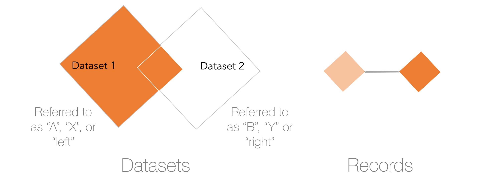
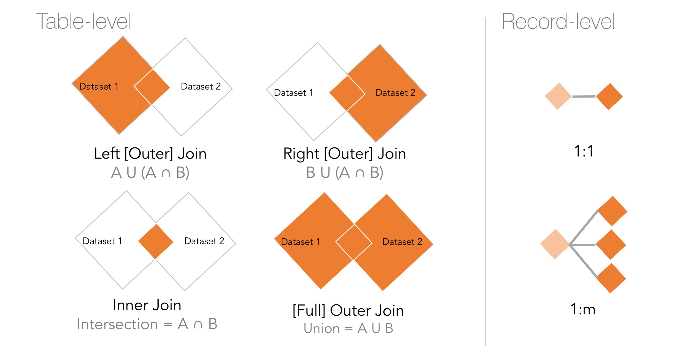

--- 
title: "Data Science + Public Policy"
author: "Jeffrey Chen"
date: '`r Sys.Date()`'
output:
  html_document: default
  latex_engine: xelatex
  pdf_document: null
description: Manipulation - Structure
documentclass: book
link-citations: yes
bibliography:
- book.bib
- packages.bib
site: bookdown::bookdown_site
biblio-style: apalikex
---

## Matrix and Data Frames
Moving onto the macro-scale, individual values of data are often placed within vectors, matrices and data frames. We already know that vectors are a series of values of the same data type (e.g. strings, numerics, booleans) and matrices are vectors but in two dimensions ($n \times m$ dimensions). Data frames are a generalization of matrices that allow for each column of data to hold different data types as well as refer to individual columns by a user-specified name.

_When should each matrices and data frames be used?_ From a pure logistical perspective, data frames are more flexible with respect to its ability to store multiple data types. Some code libraries are built specifically for matrices and others for data frames. Ultimately, it is up to the data scientist to choose.

| | Matrices | Data Frames |
|---------|-------------------------------|----------------------------------|
| Pros | Memory efficient. Good for advanced mathematical operations. |  Store mixed types of data types. Allows user to refer to columns by an explicit name. | 
| Cons | Able to store one data type at a time -- leads to slightly more work required to manage multiple matrices. Columns can only be referred to by index number. | Not as memory efficient. |

In this section, we review among the most powerful functions for data manipulation: `sort`, `reshape`, `collapse`, and `merge`.  A mastery of the logic and operations that guide matrix and data frame processing opens the possibilities to work with virtually any kind of data. To illustrate this, consider a data frame with a list of the top 25 male long jumpers and top 25 female long jumpers as found on [Wikipedia](https://en.wikipedia.org/wiki/Long_jump#All-time_top_25_athletes).  Each row contains information about one athlete such as with their record-setting longest jump, date of jump, location of jump among other features. Imagine the sort of tasks that one could do to munged the data into a usable shape.

Note that data can be obtained directly from this URL (https://s3.amazonaws.com/dspp/long_jump_top25.csv):

```{r, warning = FALSE, message=FALSE, eval = FALSE}
  jumps <- read.csv("https://s3.amazonaws.com/dspp/long_jump_top25.csv")
  print(jumps)
```

or alternatively using the `digIt()` function designed for this textbook.
```{r, warning = FALSE, message=FALSE, eval = FALSE}
  library(digIt)
  jumps <- digIt("long_jump_top25")
  print(jumps)
```

```{r, warning = FALSE, message=FALSE, echo = FALSE}
  library(digIt)
  library(kableExtra)
  jumps <- digIt("long_jump_top25")
  rownames(jumps) <- NULL
  blank <- jumps[1:2,]
  blank$sex <- "."
  blank[,1:6] <- "."
  knitr::kable(rbind(jumps[1:2,], blank,jumps[40:41,]), row.names = FALSE, 
               booktabs = TRUE, caption = "Example records from long jump data set")  %>%
            kable_styling(latex_options = c("hold_position"))
```


### Indices and Subsetting 

In both matrices and data frames, individual and ranges of rows and columns can be extracted by calling their index number. The jumps data contains $n = 51$ rows and $k = 6$ features for a total of $306$ data elements. Each row and each feature has a unique index number that starts from $1$ and increases sequentially. In other programming languages, index numbers start from $0$. 

__*To extract the second row*__ from `jumps`, we simply type the number `2` before the commaa in square brackets. The line below essentially indicates that given a matrix or data frame, extract the second row and all columns.

\vspace{12pt} 
```{r, warning = FALSE, message=FALSE}
  jumps[2,]
```
\vspace{12pt} 

To __*extract multiple records by row index*__ depends on whether the request is sequential or piecemeal. Below, the first line extracts a range of rows from the 2nd through 4th rows in `jumps`, whereas the second extracts two non-overlapping ranges that are included in a vector. 

\vspace{12pt} 
```{r, warning = FALSE, message=FALSE, eval = FALSE}
  jumps[2:4, ] # apply the index range to extract rows
  jumps[c(1:2,10:11), ] # specific indices
```
\vspace{12pt} 

The same notation can be used __*to extract all athlete names for all records*__ by typing the number `3` after the comma in square brackets. The number 3 is the column index that contains `athlete` names. _Keep in mind that extracting one column from a matrix or data frame results in a vector -- the data structure is not retained_.

\vspace{12pt} 

```{r, warning = FALSE, message=FALSE, eval = FALSE}
  jumps[, 3] 
```

\vspace{12pt} 

In addition, data frames provide a few additional methods of extracting the `athlete` column. 
```{r, warning = FALSE, message=FALSE, eval = FALSE}
  jumps[, "athlete"] # extract column with "athlete" label
  jumps[["athlete"]] # list syntax to extract column from data frame
  jumps$athlete #compact version of data column manipulation
```

To __*extract two or more columns*__ follows a familiar pattern, making use of either a range of column indices or a vector of column names.
\vspace{12pt} 
```{r, warning = FALSE, message=FALSE, eval = FALSE}
  jumps[, 3:4] # extract multiple columns
  jumps[, c("athlete", "mark.meters")] # multiple column labels
```
\vspace{12pt} 

To __*extract rows that meet one specific criterion*__ requires the creation of either a vector of booleans than indicate if the criterion is `TRUE` or `FALSE` for each row (logical vector has the same number of rows as the data), or a list of row index numbers that meet the criterion. The example below performs operations on a data frame.
\vspace{12pt}   

__*Example 1*__: Create a vector of booleans over 8.8 meters, then select rows based on whether a row contains a `TRUE` value.
\vspace{12pt} 
```{r, warning = FALSE, message=FALSE, eval = FALSE}
  group1 <- jumps$mark.meters > 8.8 # return vector of booleans for jumps over 8.8 meters
  jumps[group1, ] # select the indices
```
\vspace{12pt} 

__*Example 2*__: Find row indices that contain the place "Eugene", then use the vector of matching row indices to extract rows from `jumps`. 

\vspace{12pt} 
```{r, warning = FALSE, message=FALSE, eval = FALSE}
  group2 <- grep("Eugene", jumps$place)
  jumps[group2, ] 
```
\vspace{12pt} 

__*Example 3*__: Find record setting jumps in Tokyo, Mexico City and New York City using the `%in%` operator.

\vspace{12pt} 
```{r, warning = FALSE, message=FALSE, eval = FALSE}
#Find place in vector of cities
  group3 <- jumps$place %in% c("New York City", "Mexico City", "Tokyo")

#Return matching entries 
  jumps[group3, ]
  
#Return non-matching entries
  jumps[!group3, ]
```
\vspace{12pt} 


__*Extract rows that meet two criteria*__ is as simple as using logical operators. To search for two non-overlapping criteria, the pipe operator `"|"` should be used to represent _OR_, whereas `"&"` represents _AND_.

\vspace{12pt} 
```{r, warning = FALSE, message=FALSE, eval = FALSE}
#Find athletes who jumped beyond 8.9m or below 7.2m
  group2 <- (jumps$mark.meters > 8.8) | (jumps$mark.meters < 7.2)
  jumps[group2, ] # select the indices
```
\vspace{12pt} 


__*Rows and columns can be re-ordered*__ simply by enumerating indices in a specified order. For example, columns can be re-ordered by passing a vector of column indices into a data frame.

\vspace{12pt} 

```{r warning = FALSE, message=FALSE}
#Original order
  colnames(jumps)

#Reorder according vector of column indices
  jumps <- jumps[, c(2, 4, 3, 6, 1, 5)]
  
#Check new order
  colnames(jumps)
```

 
To __*sort a column*__ can be done using `order()`, which returns a vector of row indicies in ascending order.
\vspace{12pt} 
```{r warning = FALSE, message=FALSE}
  order(jumps$mark.meters)
```
\vspace{12pt} 

This simple function can be included in the rows index to sort a entire data frame. To sort descending, add a `"-"` before the feature to be sorted.
\vspace{12pt} 
```{r warning = FALSE, message=FALSE, eval = FALSE}
  jumps[order(jumps$mark.meters), ] # order records by mark.meters
  jumps[order(-jumps$mark.meters), ] # order records by mark.meters, decreasing
  jumps[order(jumps$mark.meters, decreasing=TRUE), ]# order records by mark.meters, decreasing
```
\vspace{12pt} 

To __*sort on multiple columns*__ is a matter of adding additional fields separated by commas.
\vspace{12pt} 
```{r warning = FALSE, message=FALSE, eval = FALSE}
# first by rank, then sex, then place
  jumps[order(jumps$rank, jumps$sex, jumps$place), ] 

 # first desc. by rank, then sex, then place
  jumps[order(-jumps$rank, jumps$sex,  jumps$place), ]
```
\vspace{12pt} 


#### Exercises {-}
  
  1. Extract records with female athletes who are ranked greater than rank #10.
  2. Extract records with jump marks greater than 7.250 meters and less than 8.625 meters.
  
  
### Reshape
  
Data usually takes on two basic _shapes_: **wide** and **long**.  The data frame in the previous section is in **long** format in which each row represents an individual that is ranked among the top 25 within each sex. Each row has a value (`mark.meters`) associated with the characteristics that make that row unique (`athlete`, `place`, `rank`, `sex`, `date`). 
  
We will find that the **wide** form is also useful. For those who have familiarity with spreadsheet software, reshaping data essentially is the functionality behind a pivot table.  Some features can be used to identify rows and others features can be used to stratify the data by discrete bins. The `reshape()` function can be used to convert a data frame such that each row contains values for each rank (1 to 25) placing the distance jumped by each sex in separate columns. 

\vspace{12pt}  
```{r warning = FALSE, message = FALSE, eval = FALSE}
  reshape(<data>, 
          idvar = <ID variables>,
          timevar = <column variables>,
          direction = <direction>)
```
\vspace{12pt}  

- `<data>` is the data set
- `<ID variables>` is a variable or a combination of variables that serves as a unique identifier for each row
- `<column variables>` is a variable that will be used to define multiple measurements per row
- `<direction>` indicates if the data will be converted into long or wide form.

To illustrate `reshape()`, the data is whittled down to a three feature set containing `rank`, `sex` and `mark.meters`. These features are then input into the `reshape()` to convert a long form data set into wide form.

\vspace{12pt}   
```{r warning = FALSE, message=FALSE}
  example <-  jumps[, c("rank", "sex", "mark.meters")]
  wide <- reshape(example, 
          idvar = "rank", timevar = "sex", direction = "wide")
  head(wide, 5)
```
\vspace{12pt} 


There are now 21 rows, where there were previously 51.  Returning to the original **long** format is straightforward; but we aren't left with the exact same data table.  There are artifacts of the change-in-shape for both the column and row names.  Sort of like data manipulation breadcrumbs.  This will be cleaned up in the next subsection.

#### Rename row and column headers {-}
  
The newly assigned column or row names may not match the meaning in the data.  It is good practice to maintain the column headers at each stage of analysis, even if you don't immediately use the intermediate data table.  Otherwise editing code gets confusing, quickly.  The column names are stored in an attribute of the data frame:

\vspace{12pt}   
```{r, warning = FALSE, message=FALSE}
#Two ways of obtaining data frame field names
  names(wide)
  colnames(wide)
```
\vspace{12pt} 

Renaming column headers using the built-in, base functions in `R` looks confusing.  In words, the following code identifies the positions in `names(wide)` where the values are `mark.meters.male` and `mark.meters.female`.  At the specified positions, the values is reassigned with new values `male.mark` and `female.mark`, respectively.

\vspace{12pt}   
```{r, warning = FALSE, message=FALSE}
  names(wide)[names(wide) == "mark.meters.male"] <- "male.mark"
  names(wide)[names(wide) == "mark.meters.female"] <- "female.mark"
  head(wide, 5)
```
\vspace{12pt} 

Alternatively, groups of fields can be renamed based on the index position in the names list. 
\vspace{12pt}  
```{r eval = FALSE}
  colnames(wide)[c(1,3)] <- c("rank.num", "female.mark")
```
\vspace{12pt} 


### Collapse
  
Reshape and collapse are often used in conjunction in order to calculate summary statistics by group.  The `aggregate()` function is the workhorse for summarizing data. It accepts three arguments:

\vspace{12pt}   
```{r warning = FALSE, message = FALSE, eval = FALSE}
  aggregate(<x>, by = list(<groups>), FUN = <function>))
```
\vspace{12pt} 

- `<function>` is the specific function that will be applied to the data. Commonly used functions included `mean`, `sum`, `length` (count), `sd` (standard deviation), among others.
- `<x>` is the R object on which the function will be applied. This generally should be a numerical value.
- `<groups>` is a variable that contains groups for which the mathematical function will be calculated. This needs to be provided as a `list()`.
  
Consider this function to __*estimate the jump distance average by sex*__. To arrive at the answer, we will collapse the data frame by `sex` to create a new data frame with the average jump distance by sex. Notice that the group variable can be named within the list and the number of observations is reduced to only two.

\vspace{12pt}   
```{r warning = FALSE, message = FALSE}
(out <- aggregate(jumps$mark.meters, by = list(athlete.sex = jumps$sex), FUN = mean))
```
\vspace{12pt} 

How about tabulations?  __*count medals by country*__ 

 \vspace{12pt}  
 Note that data can be obtained directly from this URL (https://s3.amazonaws.com/whoa-data/long_jump_olympics.csv):

```{r, warning = FALSE, message=FALSE, eval = FALSE}
  jumps <- read.csv("https://s3.amazonaws.com/whoa-data/long_jump_olympics.csv")
  print(jumps)
```

or alternatively using the `digIt()` function designed for this textbook.
```{r, warning = FALSE, message=FALSE, eval = FALSE}
  olympics <- digIt("long_jump_olympics")
  head(olympics,3)
```


```{r, warning = FALSE, message=FALSE, echo = FALSE}
  olympics <- digIt("long_jump_olympics")
  knitr::kable(head(olympics,3), row.names = FALSE, 
            booktabs = TRUE, format = "latex",
            caption = "Example records from Olympic long jump medalists data set") %>%
            kable_styling(latex_options = c("hold_position"))
```

The USA had won 56 olympic long jump medals through 2017.
 \vspace{12pt}  
```{r, warning = FALSE, message=FALSE}
  cty_medals <- aggregate(olympics$country, by = list(country = olympics$country), FUN = length)
  head(cty_medals[order(-cty_medals$x),], 3)
```
 \vspace{12pt}  

The built-in `R` functions are effective, but new, memory efficient libraries have arisen to augment `R`'s capabilites. 

#### Exercises {-}
  
  1. Load the [`iris`](http://stat.ethz.ch/R-manual/R-devel/library/datasets/html/iris.html) dataset using the `datasets` package. Calculate the average and maximum sepal length for each Iris species. (**Bonus**: Write the commands without error messages.) 
  2. Use the `aggregate()` function to count the number of observations of sepal width for each species.
  3. (*Difficult*) Create a data frame with the 35th observation of sepal width for each species.
  
### Join 
  
Joining is one of the most critical steps in a data analytics project as it allows one data set to be augmented by another. 



 \vspace{12pt}  
 

 
 \vspace{12pt}   
```{r warning = FALSE, message = FALSE, eval = FALSE}
  merge(x, y, by = ids, all.x = TRUE, all.y = TRUE))
```
\vspace{12pt} 

- `x` is the left-hand side data frame;
- `y` is the right-hand side data frame;
- `by = ids` is a string vector of variable names to be joined. Note that this is used when the variable names are identical in both `x` and `y`. If column names are different, use `by.x` to specify `x` column names and `by.y` for `y` column names.
- `all.x` and `all.y` are logical parameters (`TRUE`/`FALSE`) that control the type of join: 
  - _Inner join_: By default, both parameters are set to `FALSE`.
  - _Left outer join_: set `all.x = TRUE`.
  - _Right outer join_: set `all.y = TRUE`.
  - _Outer join_: set `all.x = TRUE` and `all.y = TRUE` .
  
To illustrate the power of joins, we apply basic data manipulation to answer a few exploratory questions.

__*Which of the top 25 athletes hold an Olympic medal?*__ This can be done by a left join.
```{r, warning = FALSE, message=FALSE}
#Aggregate number of medals by athlete
  medals <- aggregate(olympics$country, 
                      by = list(athlete = olympics$athlete), 
                      FUN = length)

#Join jumps with medals
  inner_join <- merge(x = jumps[, c("athlete","mark.meters")], 
                      y = medals, 
                      by = "athlete")
  
#See top 10
  head(inner_join[!is.na(inner_join$x), ], 10)
```
\vspace{12pt}

__*How many of the 51 top long jumpers did not earn an Olympic medal?*__ Left outer join by specifying `all.x = TRUE` to keep all left side values.
```{r, warning = FALSE, message=FALSE}
#Merge
  left_outer <- merge(x = jumps[, c("athlete","mark.meters")], 
                      y = medals, 
                      by = "athlete", 
                      all.x = TRUE)

#Print the number of rows 
  nrow(left_outer[is.na(left_outer$x), ])
```
\vspace{12pt}

__*How many Olympic medalists are not on the top 25 list?*__ Right outer join by specifying `all.y = TRUE` to keep all right side values. 
```{r, warning = FALSE, message=FALSE}
#Merge
  right_outer <- merge(x = jumps[, c("athlete","mark.meters")], 
                       y = medals, 
                       by = "athlete", 
                       all.y = TRUE)

#Print the number of rows 
  nrow(right_outer[is.na(right_outer$mark.meters), ])
```

#### Exercises {-}
  
  1. The `datasets` library is a base package in R that contains a number of data sets for learning and practice. Use the `state` datasets (take a look at the [documentation](http://stat.ethz.ch/R-manual/R-devel/library/datasets/html/state.html)) to calculate identify the state division (e.g. New England) that the state with the highest murder rate.
  2. What was the recorded population by region?
  
__Answers__.

1. _Aggregate, then sort_.
```{r, warning=FALSE, message=FALSE}
#Set data as a data frame
  df <- as.data.frame(state.x77)

#Roll up by division, calculating max
out <- aggregate(df$Murder, 
                 by = list(state.division),
                 FUN = max)

#Re-order
  out <- out[order(-out[,2]), ]
  out[1, ]
```
  
2. _Aggregate_.
```{r, warning=FALSE, message=FALSE}
#Set data as a data frame
  df <- as.data.frame(state.x77)

#Roll up by division, calculating max
out <- aggregate(df$Population, 
                 by = list(state.region),
                 FUN = sum)
out
```