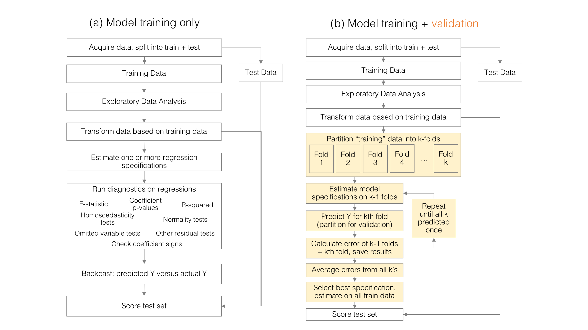
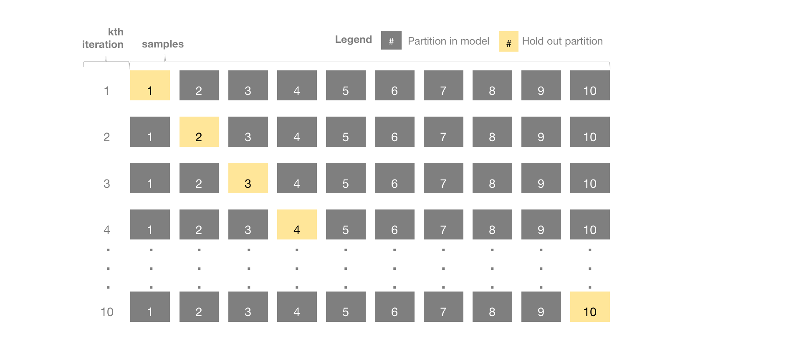

--- 
title: "Data Science and Public Policy"
author: "Jeff Chen"
output: html_document
description: Chapter 8
documentclass: book
link-citations: yes
bibliography:
- book.bib
- packages.bib
site: bookdown::bookdown_site
biblio-style: apalike
---


# Model validation: How do we know what we know? 

## When knowing the answer is not enough

It's the first day of differential equations class and anxiety is in the air. Students chat amongst themselves, trying to play cool as the anticipation of a semester of tedious, grueling problem sets weighs down on them -- the sort that merit all-nighters. As a distant clock tower chimes at the top of the hour, the professor stands up and begins to hand out a stack of packets, with a _final exam_ and _answer key_. The first page is a blurry cover letter that appears to have been photocopied to the $n^{th}$ degree:

> _Dear Student: You will be graded on this final exam and this exam alone. The answer key has been provided -- memorize it. When you're done, copy your answers into this online survey form. Good luck with the rest of your time at the university._ 

As the first student finishes reading the letter, the door slams as the professor makes her getaway. 

So, from an epistemological perspective, what exactly does this final exam score reflect? To answer this question, we would need to first define the objective of a test, which is measuring the degree to which students can retain knowledge of and apply mathematical concepts -- not if students remember the specific sequence of numbers and characters that are on a specific handout or event the use of the `CTRL + C` - `CTRL + V` hot key combination. If the resulting test score were used to assess student performance, we would grossly overstate and overestimate their skill. We shall refer to this as the _final exam as practice_ paradigm -- it is not possible to assess learned ability if a student that has already seen the final exam. From the testing perspective, the goal is to estimate $Pr(\text{Correct | Subject Matter Knowledge})$ -- not $Pr(\text{Correct | Test Question})$, which is biased as $\text{mean(score on practice final exam) ~ mean(score on final test)}$. So, what's a _more correct_ way of testing? 

We all know the answer: teach the material, assign homeworks and provide practice exams before administering the final exam. To keep units consistent, we'll simply focus on practice and final exams. A common experiment design is to provide $k$ number of practice exams for students to study and keep at least one _hold-out_ exam to test their learned abilities. Assuming that the structure of all exams are approximately the same but with different questions, this _train - test design_ is a stronger method for assessing how well knowledge is generalized _out-of-sample_. There, of course, are a couple of issues with this approach:


- A student may actually know the material inside and out, but may stumble during the exam at random. Thus, placing the whole semester's grade on one exam may not provide a true indication of their ability. 

- If there are a maximum of $k$ available tests, then it may be possible to split the tests into more _hold-outs_. This, however, reduces the amount of opportunities for a student to learn the material and may thus increase the variability in the extra testing.

In the classroom, there is not a magic bullet design. Perhaps science fiction could help. Suppose the professor has six possible exams to give to students. She decides to give five exams as practice and reserve a sixth as the actual exam. If the same exact students existed in six different parallel universes with the same behaviors, intelligence, laws of physics, etc (this is the science fiction part) and the professor had some trans-dimensional method of monitoring student performance, then we could do the following: 

- For universe A, use practice exams 1, 2, 3, 4, 5 for studying. _Hold out_ exam 6 as the final test.
- For universe B, use practice exams 1, 2, 3, 4, 6 for studying. _Hold out_  exam 5 as the final test.
- For universe C, use practice exams 1, 2, 3, 6, 5 for studying. _Hold out_  exam 4 as the final test.
- For universe D, use practice exams 1, 2, 6, 4, 5 for studying. _Hold out_  exam 3 as the final test.
- For universe E, use practice exams 1, 6, 3, 4, 5 for studying. _Hold out_  exam 2 as the final test.
- For universe F, use practice exams 6, 2, 3, 4, 5 for studying. _Hold out_  exam 1 as the final test.

At the end of the semester, take the average performance of each student's hold out tests. This assumes that the learned knowledge of each student is independent between universes (e.g. student 1 in Universe A does not know what student 1 in Universe F has seen). This in turn means that the hold out exams are independent of knowledge of the practice exams, therefore, the average of the hold out exams gives an unbiased and lower variance estimate of how a given student has learned. 

This is a rather farcical scenario on so many levels, but unfortunately the _final test as practice_ paradigm happens everyday, but the multi-verse validation approach is also used everyday-- not necessarily in a classroom setting, but in analytical teams in virtually all fields. 

## Converting a farcical scenario into practical knowledge

Suppose an economic analyst at a hedge fund is given bitcoin price data along with a few hundred financial market data series that coincide with bitcoin trading. She is asked to develop a statistical model to predict bitcoin prices using the market indicators, then forecast prices using a real-time input stream. In data science parlance, this is a _supervised learning_ problem: given a _target_ (dependent variable), a model trained to map a set of _input features_ (independent variables or explanatory variables) onto a  target. Supervised learning essentially is a method of teaching an algorithm to see certain patterns, but not in a way that is explicitly programmed by the modeler (e.g. heuristics, rules). 

Our enterprising, endeavoring analyst determines that a linear regression approach makes most sense (see (a) below) and devises a methodology for developing predictions. First, she acquires data, then cleans and explores it as we have illustrated in past chapters. When the data are ready for modeling, she experiments with combinations of a few variables to see which produces desirable results based on a series of diagnostics. More often than not, analysts will rely on subject matter intuition to construct models, then fixate on one or two measures of model fit  (e.g. R-squared, F-test, p-values, etc.) and judge model performance based on those diagnostics alone. Although prediction is not the same as characterization, models are built with the intent to tell a narrative that is rooted in a parsomonious set of variables (e.g. increased social hype increases bitcoin prices). Without realizing it, this equates to the assumption that a phenomenon can be characterized by a few specific features of a data set. A set of candidate models are selected based on some quantitative or qualitative criteria. As a final check, all candidate models are "backcasted", which is a way compare the actual bitcoin prices $y$ and the predicted prices $\hat{y}$ using the data that was used to build the model. A function is a function, so _what could go wrong?_  

Not to be overly dramatic, _many, many things could go wrong_.



The above approach, while seemingly logical, follows the _final exam as practice materials_ paradigm. While diagnostics and backcasts are conducted, the analyst is unable to truly determine if one model's formulation is better than another as the models were all constructed on the final exam set. What are the consequences? Unlike the earlier scenario where students may enjoy grade inflation, failure to incorporate model validation to test assumptions may lead to any number of techical horror stories:

- The input data used to predict bitcoin prices are correlated with prices in early years of a sample, but not in later years. Failing to validate a model's assumptions is a failure in checking if modeled relationships are stable. Unstable, unchecked relationships will invariably lead to erroneous predictions, which in turn lead to large losses at the cryptocurrency hedge fund. Needless to say, the economic analyst would likely be afforded opportunities to consider roles elsewhere.
- With so many variables available, the analyst uses a _kitchen sink_ approach by dumping all available variables into the model. While there are plenty of techniques to efficiently surface the most influential features within high-dimensional data sets (e.g. k is large), ordinary least squares is not one of those techniques. As a result, OLS will attempt to map correlated, but spurious features with bitcoin prices, which-- for all intents and purposes -- is developing a model on noise. This is known as _model overfitting_ -- erroneous relationships sensitive to irrelevant movements in the inputs and investment become highly volatile. This is known as _model overfitting_. While the analyst will not likely be provided opportunities to consider roles elsewhere, her work will likely be scrutinized a bit closer.
- The observed paradigm is not mature in that all types of movement in the data have not been observed. For example, conditions for price growth and decline should be observed in the sample -- not only growth. This ensures that conditions for growth and decline are learned by the model. After all, what goes up must come down, and if that is not reflected in the data, then a model is not needed to predict what will eventually happen.

Inaccurate model assumptions may give way to _overfitting_ in which the patterns that are learned reflect noise rather than true underlying patterns.  Strong model biases may also give rise to _underfitting_ in which models are not sensitive to the patterns in the data, leading to models that do not provide much insight. In both cases, the result are high variance out-of-sample predictions. Let's take a look at the underlying [Bitcoin prices](https://www.worldcoinindex.com/coin/bitcoin). Below are three examples of model conditions:

- __Underfitting__. Starting from the left, an overly simplistic explanation might get the gist of bitcoin prices. Indeed, as of September of 2017, the prices have been increasing, but that is insufficient information to be used for anything other than long term investment.  This idea of _underfit_ is when an empirical model does not capture observed relationships. The variance of predictions in the training set is likely to be high for missing peaks and troughs. That being said, underfit, high bias models tend to tell a digestible story, but have little predictive value.
- __Overfitting__. The middle graph shows a low bias model, which is often a far more complex model with more features and polynomials to improve the model fit. At first glance, it captures much of the variability in the point-spread. While low bias models tend to have low bias in the training step, their predictions in out-of-sample testing tend to have high variance as the model was calibrated to noise and is thus extra sensitive to noise.
- __Goldilocks__. The last graph shows a good balance between the two extremes: Just enough complexity to capture the curvature, but not so much that the model reacts to noise.


```{r, echo = FALSE, message = FALSE, warning = FALSE, fig.height=2.5, fig.cap = "Bitcoin prices and model fits. Data obtained from coindesk."}
  library(ggplot2)
  library(gridExtra)
  library(digIt)
  
  df <- digIt("bitcoin")
  
  df$Date <- as.Date(substr(df$Date,1,10), "%m/%d/%Y")
  df$id <- 1:nrow(df)
  df$value <- df$Close.Price
  for(i in seq(30,nrow(df)-30,1)){
     df$value[i] <- mean(df$Close.Price[(i-30):(i+30)])
  }

  
  df$ypoly2 <- (df$Close.Price + 300*sin(df$id/10)*runif(nrow(df)) - 200*cos(df$id/20)*runif(nrow(df)) + 200*cos(df$id/200)*runif(nrow(df)))
  
  
  proper <- ggplot(df) + geom_point(aes(x = Date, y =  Close.Price), size = 0.1) + geom_line(aes(x = Date, y =  value), size = 0.5, colour="lightblue", span = 0.000001, se = FALSE) + ggtitle("Goldilocks - Balanced") + 
  theme(plot.title = element_text(size = 10,hjust = 0.5), axis.line=element_blank(),axis.text.x=element_blank(),
        axis.text.y=element_blank(),axis.ticks=element_blank(),
        axis.title.x=element_blank(),
        axis.title.y=element_blank(),legend.position="none",
        panel.background=element_blank(),panel.border=element_blank(),panel.grid.major=element_blank(),
        panel.grid.minor=element_blank(),plot.background=element_blank())
  
  simple <- ggplot(df) + geom_point(aes(x = Date, y =  Close.Price), size = 0.1) + geom_smooth(aes(x = Date, y =  Close.Price), size = 0.5, colour="lightblue", method = "lm", se = FALSE) + ggtitle("Underfit (High Bias, Low Variance)") + 
  theme(plot.title = element_text(size = 10,hjust = 0.5), axis.line=element_blank(),axis.text.x=element_blank(),
        axis.text.y=element_blank(),axis.ticks=element_blank(),
        axis.title.x=element_blank(),
        axis.title.y=element_blank(),legend.position="none",
        panel.background=element_blank(),panel.border=element_blank(),panel.grid.major=element_blank(),
        panel.grid.minor=element_blank(),plot.background=element_blank())
 
  complex <- ggplot(df) + geom_point(aes(x = Date, y =  Close.Price), size = 0.1) + geom_line(aes(x = Date, y =  ypoly2), colour="lightblue", size = 0.5) + ggtitle("Overfit (Low Bias, High Variance)") + 
  theme(plot.title = element_text(size = 9,hjust = 0.5), axis.line=element_blank(),axis.text.x=element_blank(),
        axis.text.y=element_blank(),axis.ticks=element_blank(),
        axis.title.x=element_blank(),
        axis.title.y=element_blank(),legend.position="none",
        panel.background=element_blank(),panel.border=element_blank(),panel.grid.major=element_blank(),
        panel.grid.minor=element_blank(),plot.background=element_blank())
   grid.arrange(simple, complex, proper, ncol = 3) 
```


Model validation is crucial to test proposed models in order to find the right balance. Among the many designs are the following: 

- _Train-Test_. A simple design involves a _train-test_ where a training set of 70% of the records is used to built models and a testing set of 30% is used as a final exam. While this is a step in the right direction,  the testing set will eventually be biased. As the analyst builds and tests models, she will predict results for the hold-out 30%, find model deficiencies,  then iterate. In theory, the 30% should be used to validate once one is confident with model performance, but that requires a degree of discipline that is not easy enforceable.  Eventually, the model accuracies of the 30% bias towards to that of the 70%, resembling a less severe version of the _final exam as a practice materials_ problem. 
- _Train-Validate-Test_. An improvement to the _train-test_ design is to add a validation step: _train-validate-test_ in which 70% of the sample is used for model development, 15% of the sample is used for validation and tuning of the model, and 15% is used as a final hold out. While an improvement, the problem with both _train-test_ and _train-validate-test_ designs are that large proportions of the data sample are lost to testing and the variance on the testing accuracies are large. 
- _K-Folds Cross Validation_. A better, but computationally more costly approach is _k-folds cross validation_ (see below). This is equivalent to the multi-verse scenario: Each $k$ is simply a set of observations that are assigned to a group known as a _fold_, which is a convenient way of assigning and keeping track of hold out samples. For a proposed set of models, whether model specification or different types of algorithms, the approach is iterative: to start, for folds $1$ through $k-1$, we develop our models, then predict on the hold out sample $k$, record the scores and diagnostics. Then, we repeat this process until each of the k-folds is used as a hold out sample. All model performance results are averaged across all hold out samples to derive a more accurate estimate of model performance. 



Model validation can become a complex topic. This section is meant to plant the seed. In subsequent chapters, we will put model selection into action.
