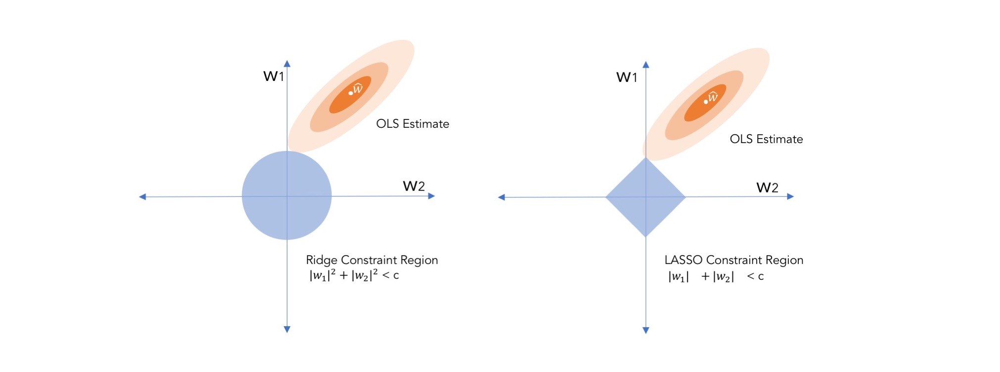

--- 
title: "Data Science + Public Policy"
bibliography:
- book.bib
- packages.bib
description: Chapter 10
output:
  html_document: default
link-citations: yes
documentclass: book
site: bookdown::bookdown_site
biblio-style: apalike
---
#  Continuous Problems: How much should we expect…? 

## An Ordinary Case of Regression
Every year, cities and states across the United States publish measures on the performance and effectiveness of operations and policies. Performance management practitioners typically would like to know the direction and magnitude, as illustrated by a linear trend line. Is crime up? How are medical emergency response times? Are we still on budget? Which voting blocks are drifting?

For example, the monthly number of highway toll transactions in the State of Maryland is plotted over time from 2012 to early 2016. The amount is growing with a degree of seasonality. But to concisely summarize the prevailing direction of toll transactions, we can use a trend line. That trend line is an elegant solution that shows the shape and direction of a linear relationship, taking into account all values of the vertical and horizontal axes to find a line that weaves through and divides point in a symmetric fashion.

```{r, echo=FALSE, fig.height=3, fig.cap = "Total Toll Transactions, Maryland 2012 to 2016"}

  library(ggplot2)
  library(digIt)
  data <- digIt("toll_transactions")
  colnames(data) <- gsub(" ",".", colnames(data))
  val <- aggregate(data$Total.Transactions, by=list(data$Date), FUN=sum)

  colnames(val) <- c("Date","Transactions")
  val$Date <- strptime(as.character(val$Date),"%m/%d/%Y %H:%M")
  val <- val[order(val$Date),]
  val$time <- 1:nrow(val)
  val$Transactions <- val$Transactions / 1000000
  
  a <- coef(lm(Transactions ~ time, data = val))
  ggplot() + 
      geom_line(aes(x = time, y = Transactions),  data = val, colour = "blue") + 
      geom_point(aes(x = time, y = Transactions),  data = val, colour = "blue") +
      geom_abline(intercept = a[1], slope = a[2]) + 
      ylab("Toll Transactions (millions)") + xlab("Time (months)")

```

This trend line can be simply described in using the following formula:

$$\text{transactions} = 10.501 + 0.036 \times \text{months}$$

and every point plays a role. We can infer that the trend grows at approximately 36,000 transactions per month.  Using the observed response $y$ and the independent variable $x$, calculating the intercept and slope is a fairly simple task:

$$\text{slope = } \hat{w_1} = \frac{\sum_{i=1}^{n}{(x_i - \bar{x})(y_i-\bar{y})}}{\sum_{i=1}^{n}(x_i-\bar{x})^2}$$ 
and 

$$\text{intercept = } \hat{w_0} = \bar{y}-\hat{w_1}\bar{x}$$
In a bivariate case such as this one, it's easy to see the interplay. In the slope, the covariance of $X$ and $Y$ ($\sum_{i=1}^{n}{(x_i - \bar{x})(y_i-\bar{y})}$) is tempered by the variance of $x$ ($\sum_{i=1}^{n}(x_i-\bar{x})^2$). If the covariance is greater than the variance, then the absolute value of the slope will be greater than one. The direction of the slope (positive or negative) is determined by the y7 between $x$ and $y$ alone. 

Trend lines are one of many uses of a class of supervised learning algorithms called regression -- in this case _Ordinary Least Squares_ or _Regression to the mean_ -- a method that is specifically formulated for continuous variables.  There are quite a few other types of regression, such as quantile regression, non-linear least squares, partial least squares among others -- each of which handles continuous values with a different spin, some focused on estimating relationships at various points of an empirical distribution and others capture relationships that simply do not fit into a linear trend line.  


OLS regression is the quantitative workhorse in most fields. The technique is a statistical method that estimates unknown parameters by minimizing the sum of squared differences between the observed values and predicted values of the target variable. To better understand arguably the most commonly used supervised learning method, we can start by defining a regression formula:

$$y_i = w_0 x_{i,0} + w_{1} x_{i,1} + ... + w_{k} x_{i,k} + \epsilon_{i}$$

where:

- $y_i$ is the target variable or "observed response"
- $w_{k}$ are coefficients associated with each $x_k$. Each coefficient can be obtained by solving $\hat{w} = (X'X)^{-1}X'Y$. Note that $w$ may be substituted with $\beta$ in some cases. 
- $x_{i,k}$ are input or independent variables 
- subscript $i$ indicates the index of individual observations in the data set
- $k$ is an index of position of a variable in a matrix of $x$
- $\epsilon_{i}$ is an error term that is assumed to have a normal distribution of $\mu = 0$ and constant variance $\sigma^2$

Note that $x_{i,0} = 1$, thus $w_0$ is often times represented on its own. For parsimony, this formula can be rewritten in matrix notation as follows:

$$y = XW + \epsilon$$
such that $y$ is a vector of dimensions $n \times 1$, $X$ is a matrix with dimensions $n \times k$ regressors, and $W$ is a vector of coefficients of length $k$, containing an intercept and a coefficient corresponding to each of $k$ features. $W$ is oftem times represented with $\beta$.

$$TSS = argmin (\sum^n_{i=1}(y_i - \sum^k_{j=1} x_{ij}w_j)^2$$


Given this formula, the objective is to minimize the Total Sum of Squares (also known as Sum of Squared Errors):

$$TSS = \sum_{i=0}^{n}{(y_i - \hat{y}_i)^2} $$
Which can also be written by substituting the prediction formula that yields $\hat{y}$:

$$TSS = \sum^n_{i=1}(y_i - \sum^k_{j=1} x_{ij}w_j)^2$$

where $k$ is the total number of variables and $j \in k$. More commonly, TSS is better contextualized as the Mean Squared Error $$MSE = \frac{1}{n}\sum_{i}^{n}{(y_i - \hat{y_i})^2}$$. The SSE and MSE are measures of uncertainty relative to the observed response. Minimization of least squares can be achieved through a a method known as *gradient descent*.


### Interpretation
There are a number of attributes of a linear squares regression model that are examined, namely the specification, coefficients, R-squared, and error.

__Specification and coefficients__
The specification is the formulation of a model, comprised of the target feature and the input features. It is often times represented loosely as:

$Y = f(x_1, x_2,...,x_n)$


Each of the $w$ values is a coefficient that describes the marginal relationship between each $x$ and the target $y$. Recall the toll road example. 

$$\text{transactions} = 10.501 + 0.036 \times \text{months}$$
 
The $w_0$ (or y-intercept) is equal to 10.501, meaning when months = 0, the expected traffic was 10.5 million (without accounting for seasonality). The $w_1$ or coefficient for month is 36,000, meaning that for each additional month forward, we would expect an average 36,000 traffic increase. As we will see in the the following elaborated example, these coefficients will offer robust insights into the inner quantitative workings of the modeled relationship. As we will see in the practical example at the end of this section, there are countless ways of representing relationships.


__R-squared__
_R-squared_ or $R^2$ is a measure of the proportion of variance of the target variable that can be explained by a estimated regression equation. A few key bits of information are required to calculate the $R^2$, namely:

- $\bar{y}$: the sample mean of $y$;
- $\hat{y_i}$: the predicted value of $y$ for each observation $i$ as produced by the regression equation; and
- $y_i$: the observed value of $y$ for each observation $i$.

Putting these values together is fairly simple:

- Total Sum of Squares or TSS is the variance of $y$: $$\text{TSS} = \sigma^2(y) = \sum_{i=1}^{n}(y_i - \hat{y})^2$$

- Sum of Squared Errors is the squared difference between each observed value of $y$ and its predicted value $\hat{y_i}$:  $$\text{SSE}  = \sum_{i=1}^{n}(y_i - \hat{y_i})^2$$

- Regression Sum of Squares or RSS is the difference between each predicted value $\hat{y_i}$ and the sample mean $\bar{y}$.

Together, $R^2 = 1 - \frac{SSE}{TSS}$. As TSS will always be the largest value, $R^2$ will always be bound between 0 and 1 where a value of $R^2 = 0$ indicates a regression line in which $x$ does not account for variation in the target whereas $R^2 = 1$ indicates a perfect regression model where $x$ accounts for all variation in $y$. 

__Error__

Error can be measured in a number of ways in the OLS context. The most common is the Root Mean Square Error (RMSE), which is essentially the standard error between predictions $\hat{y_i}$ and $y_i$. RMSE is defined as $\text{RMSE} = \sigma =  \sqrt{\frac{\sum_{i=1}^n(\hat{y_i}-y_i)^2}{n}}$. Note that RMSE is interpreted in terms of levels of $y$, which may not necessarily facilitate easy communication of model accuracy. For example, a $\text{RMSE = 0.05}$ in one model might appear to be small relative to a $RMSE = 164$. However, when contextualized, the former may be a larger proportion of its respective sample mean than the latter's, indicating a less accurate fit.

There are other methods of representing error. In time series forecasts, Mean Absolute Percentage Error (MAPE) is used to contextualize prediction accuracy as a percentage of $y$. This measure is defined as $\text{MAPE} = \frac{100}{n}\sum_{i=1}^n|\frac{\hat{y_i}-y_i}{y_i}|$ and can be easily interpretted and communicated. For example, MAPE = 1.1% from one model can be compared against the MAPE = 13.5% of another model. 


### Assumptions matter

All models have properties and assumptions that guide their use, but also help determine which use cases are appropriate. OLS is bound by four basic assumptions that, in general, jive with how most people like to view math problems: in a linear, additive frame of mind where each factor has a distinct and perceivably consistent influence on the outcome. In other words:

> _Giovanni_: How do you think those entrepreneurs made all that money (dependent variable)?

> _Giorgio_: Well, I think it may be due to ...[independent variables go here]...

First, OLS assumes that the target feature's relationship with input features is _linear_ and _additive_. The equation $y_i = w_0 x_{i,0} + w_{1} x_{i,1} + ... + w_{k} x_{i,k} + \epsilon_{i}$ is another way of saying that each of the factors can be weighed and summed up to equate to the outcome.  If we think about the above conversation, it is assumed that earnings can be described by a set of independent factors to which a weight can be definitively assigned to describe its role in earnings. This weighted average of factors is then added together. While this seems reasonable, it also is a strong assumption that two or more quantities have a linear relationship. If there is not a strong correlationship between the target $y$ and inputs $X$, apply transformations such as the natural logarithm (`log()`). In time series models (data captured over equal intervals), data may be non-stationary (e.g. unstable) and may benefit from differencing (e.g. $\Delta(y_t) = y_t -y_{t-1}$ -- try the `diff()` function).  If worse comes to worse, a non-linear or tree-based technique, as will be described later in the book, may be better at capturing the patterns.

```{r, echo=FALSE, fig.cap = "Ways of transforming data to [hopefully] make them appropriate for linear models.", fig.width=8, fig.height = 2.5}
par(mfrow = c(1,3))
n <- 10
x <- 1:n
y <- exp(x)

plot(x, y, cex = 0.2, ylab = "", bty = "n", yaxt="n" , xaxt="n", xlab = "Raw y", cex.lab = 1, col="darkgrey", type = "l")
points(x, y)
lines(rep(0, n))

plot(x,log(y), cex = 0.2, ylab = "", bty = "n", yaxt="n" , xaxt="n", xlab = "Natural Logarithm of y", cex.lab = 1, col="darkgrey", type = "l")
points(x, log(y))
lines(rep(0, n))


plot(diff(log(y)), cex = 0.2, ylab = "", bty = "n", yaxt="n" , xaxt="n", xlab = "Differenced y", cex.lab = 1, col="darkgrey", type = "l")
points(diff(log(y)))
lines(rep(0, n-1))

```

Second, all observations are randomly sampled such that the features $X$ for a given observation $i = 1$ are not dependent on observation $i = 2$. This assumption has many implications across observations and across features. To be able to estimate the specification below, Giovanni and Giorgio would need to first define a universe of entrepreneurs and identify a target that is dependent on input features, but the inputs are not dependent on the target. From that universe of entrepreneurs, obtain a list of people, then randomly select a subset for data collection. 

$$\text{Y(Earnings) = f(Education, Age, Socioeconomic Status, Industry, ...)}$$

The survey needs to frame questions in a way that can roll into input features that are not correlated with one another. For example, education should not perfectly correlate with age, but should correlate with earnings. This matters as the linear specification needs to be able to attribute a part of earnings to each input feature, but has trouble doing in the presence of _multicollinearity_ or when two or more variables are highly correlated. As the number of input features $k$ grows, the chance of multicollinearity grows. The implications 


The regression equation has an error term $\epsilon$ that captures _everything else_ that is not predicted by a model. This error term carries tremendous  information that can be used to make a model more reliable. A number of assumptions are also thus built upon errors:

- The conditional mean should be zero $E(\epsilon|X) = 0$, meaning that the error should not have any relationship to the input features $X$. 


- Errors should have constant variance or be homoscedastic. Given the variance of the error $Var(\epsilon|X) = \sigma^2$, the spread should be constant (middle). Heterscedastic errors may be an indication that the underlying relationship between the target and input features may not be consistent or there are systematic errors with how the data was collected, both of which have an effect on the reliability of predictions. For reliability of estimates, heteroscedastic errors would lead to inaccurate confidence intervals.

```{r, echo=FALSE, fig.cap = "Homoscedasticity vs. Heterscedasticity", fig.width=8, fig.height = 2.5}
par(mfrow = c(1,3))
n <- 1000
x <- 1:n

#Example 1
plot(x, c(rnorm(n/5, 0,0.1),rnorm(n/5, 0,0.5),rnorm(n/5, 0,1),rnorm(n/5, 0,2),rnorm(n/5, 0,3)), cex = 0.2, ylab = "", bty = "n", yaxt="n" , xaxt="n", xlab = "Heteroscedasticity", cex.lab = 1, ylim = c(-3,3), col="darkgrey")
lines(rep(0, n))

#Example 2
plot(x, rnorm(n, 0,2), cex = 0.2, cex.lab = 1, ylab = "Errors", bty = "n", yaxt="n" , xlab="Homoscedasticity", xaxt = "n", ylim = c(-3,3), col="darkgrey")
lines(rep(0, n))

#Example 3
plot(x, c(rnorm(n/5, 0,3),rnorm(n/5, 0,2),rnorm(n/5, 0,1),rnorm(n/5, 0,0.5),rnorm(n/5, 0,0.1)), cex = 0.2, ylab = "", bty = "n", yaxt="n" , xaxt="n", xlab = "Heteroscedasticity", cex.lab = 1, ylim = c(-3,3), col="darkgrey")
lines(rep(0, n))
```


- Errors should be autocorrelated, or correlated amongst each other. Under the ideal scenario, the covariance should be $cov(\epsilon_i\epsilon_j|x) = 0$ where i and j are index values of observations and are not equal to one another. Any data that involves a trend and cyclicality or seasonality will likely suffer from autocorrelation, thus the weather yesterday may be correlated with weather today. Generally, autocorrelation can appear in any context that is spatial (e.g. German cities are likely to have more autocorrelation within country than with outside the country with the US) or more commonly temporal (e.g. yesterday is associated with today). 

- The errors should be normally distributed. This assumption is not necessary when evaluating the validity of a model, but provides a clue as to how well the model operates. 


### In the code

To understand how a function works means to build it from scratch. Below, we illustrate how OLS is constructed using time series data about online searches relating to _human rights" as found on [Google Trends](https://trends.google.com), then compare our model coefficients against the pre-built `lm()` function. Starting off, be sure to install the `gtrendsR`, then execute a request for "Human rights" for the period of January 2011 through January 2017. Note that the number of hits is an index value to the maximum number of searches for the requested topic during the period of interest.

```{r, message = FALSE, warning=FALSE, fig.cap = "Google trends monthly time series for Human Rights searches, Jan. 2011 through Jan. 2017", fig.height=2.5, fig.width=8}
#Load library
  library(gtrendsR)
  library(ggplot2)

#Download human rights for 
  out = gtrends(c("Human rights"), gprop = "web", time =  "2011-01-01 2017-01-01")[[1]]
  
#Monthly line plot
  ggplot(out, aes(date, hits)) + geom_line()
```

The resulting data series exhibits some degree of regularity -- perhaps a combination of monthly seasonality and a slight downward trend. A specification can be represented as:

$$\text{Hits Index} = w_0 + w_1(\text{date index}) + w_2(January) + ... + w_{13}(November) + \epsilon$$

where the _date index_ is a sequential identifier for each month and each month is a represented as a dummy, leaving one month in reserve to avoid collinearity traps. The goal of the regression model is to estimate a weight for each input feature and the intercept. Thus, a matrix `X` needs to include a value for each input $x_k$ including a placeholder for the intercept. Using `model.matrix()`, we can convert a vector of months into a matrix of dummies with the first column representing the y-intercept.

```{r}
#Monthly dummies
month = format(out$date, "%m")
dummies = model.matrix(~ month)
colnames(dummies)
```

Next, we create a simple sequential date index and add it to the dummies matrix to create `X`.
```{r}
#Date Index
date.index <- 1:nrow(out)

#Create matrix
X <- cbind(dummies[, -13], date.index)
head(X)
```

Lastly, extract the `hits` feature from the trends data as a standalone vector $y$.
```{r}
y <- out$hits
```

With the vector $y$ and matrix $X$, we can now estimate each coefficient $w_i$ by solving for the following equation: $W = (X^TX)^{-1}X^Ty$. As R is well-adapted to statisticians' needs, the `%*%` operator is an easy way to conduct matrix multiplication between two matrices. The `solve()` function is used to solve for a system of equations. In this case, `solve()` inverts the result of $X^TX$.


```{r}
a <- t(X) %*% X
w <- solve(a) %*% t(X) %*% y
```

Likewise, we can estimate the same regression using the `lm()` function and extract the coefficients to illustrate that the calculation steps yield identifical results. While the `lm()` function makes the process far simpler and is designed to facilitate analysis with ease, there is something to be said for being able to engineer the underlying steps as it may come in handy when building new classes of algorithms.

```{r, eval = FALSE}
#Run lm()
  lm.obj <- lm(y ~ X[,-1])

#Consolidate and compare model coefficients
  comparison <- data.frame(`From Scratch` = w, 
                           `lm Function` = coef(lm.obj))
  
#Print
  print(comparison)
```
```{r, echo = FALSE}
lm.obj <- lm(y ~ X[,-1])
comparison <- data.frame(`From Scratch` = w, `lm Function` = coef(lm.obj))
knitr::kable(comparison, booktab = TRUE, caption = "Comparison of model built from scratch versus pre-built function")
```

For more in-depth discussion on the derivation of linear models, refer to [Chapter 3 of Introduction to Statistical Learning](http://www-bcf.usc.edu/~gareth/ISL/ISLR%20First%20Printing.pdf).


## More Than Plain Vanilla Regression

### The Ridge and the LASSO

More often than not, the qualities that bound a data set are not ideal. Imagine a scenario in which $n = 1000$, but the number of features $k = 5000$. In an increasingly data-rich world, this is becoming more common. This leads to a number of methodological problems. Generally, analysts and policy makers want a parsimonious explanation as fewer driving factors are easier to interpret.  An analyst may be tempted to use his or her intuition to guide her variable choices using tests such as AIC, BIC, F-Test among others. However, when $k$ is large, a manual strategy may not necessarily be scalable and the strongest predictors may simply be overlooked, whether due to overriding theoretical assumptions (e.g. economic theory, policy theories) or inability to screen and test all variable combinations. From a purely statistical perspective, least squares is dependent on being able to solve for $(X'X)^{-1}$ -- or inverting the matrix in order to calculate each of the coefficients $w$, which is not possible if the matrix were singular (not invertible).

Enter regularized regression methods. 

As we know with linear regression, the goal is to estimate $w$ by minimizing the Total Sum of Squares (TSS):

$$\hat{w} = (X'X)^{-1}X'Y$$

where each $X$ and $Y$ is standardized (mean 0 with unit variance). If we assume that there is a limited amount of TSS, then we can force linear regression to make trade offs between coefficients by introducing a _bias_ term -- a constraint $\lambda I_k$ can be added to the diagonals of $X'X$:

$$\hat{w} = (X'X + \lambda I_k)^{-1}X'Y$$.

$\lambda$ is a tuning parameter -- a value that cannot be solved for and must be uncovered through cross-validation. Depending on how much bias is added into the model determines how much "wiggle room" coefficients have to move. Expanding upon the typical TSS, $\lambda$ is tacked onto the end of the formula as a scalar of the sum of squared coefficients (an _L2-norm_):  


$$TSS_{penalized} = \sum^n_{i=1}(y_i - \sum^k_{j=1} x_{ij}w_j)^2 + \lambda \sum^k_{j=1}|w_j|^2$$

The second part of the penalized TSS can be viewed as a constraint. Given the standard TSS $\sum^n_{i=1}(y_i - \sum^k_{j=1} x_{ij}w_j)^2$, we place a constraint such that $$\sum^k_{j=1}|w_j|^2 < c $$

where $c > 0$. Taken together, the interpretation of $\lambda$ is that it regulates the size of coefficients $w$: As the size $\lambda$ is increased, the magnitude of coefficients are reduced.  The value of $\lambda$ is determined through a _grid search_ in which values of $\lambda$ are tested at equal intervals to identify the value that minimizes some error measure such as MSE. This specific formulation of a regularization is known as a _ridge regression_ and helps to bound coefficients to a "reasonable" range, but does not zero out coefficient values. 

In order to surface the most "influential" features, we may rely on a close cousin of ridge regression known as _Least Absolute Shrinkage and Selection Operator_ or _LASSO_, which relies on an _L1-norm_:
$$\sum^k_{j=1}|w_j| < c$$. By swapping a L2-quadratic constraint with a L1, least squares will behave differently.

To understand the effects on how least squares model behave under regularization, we can use a geometric interpretation. Constraints force the possible OLS esimates to fall along the edge of a constraint region. In the diagram below, the blue are the L1/L2 norm constraints, the concentric ellipses are various possibilities of the Residual Sum of Squares, and two coefficients are considered. The tangent at which a RSS ellipse and a constraint region meets jointly determines the magnitude of a coefficient -- there is a trade off imposed due to the constraints. In the case of Ridge regression, the L2-norm constraint region is circular, meaning that a large coefficient $w_1$ for a feature $x_1$ is possible when minimizing the magnitude of coefficient $w_2$. In LASSO regression, the L1-norm results in a constraint region with "corners".  If the RSS ellipse lands on acorner, a coefficient $w_2$ can be forced to exactly zero while allowing $w1$ take a non-zero value. The significance of this is far reaching:  _LASSO regression can conduct variable selection_.

```{r, fig.cap = "Ridge and LASSO constraint regions and their effect on OLS estimates.", echo = FALSE}

```

There are hurdles in using these methods, however. 

- Uncertainty in the form of standard errors is a mainstay of statistical methods. While standard errors can be derived for Ridge regression as the estimator is linear, the same property is not shared by LASSO due to the L1-constraint. 

- One would expect that collinearity should be a concern, in particular the number of input features exceeds the number of observations. As it turns out, Ridge regression is robust to collinearity, but LASSO is not.

### Why regularized methods matter

In situations where priors are not known and the features are too numerous to individually test, regularized regression methods facilitates analysis and prediction at scale. Perhaps this class of techniques goes against time-honored scientific traditions of starting from a well-defined hypothesis, then systematically proving and disproving arguments for and against the hypothesis. But alternatively, regularized methods may take on the roles of as both an exploratory method and a predictive method. LASSO regression, in particular, can serve as a methodological gut check and surface features that contain predictive value.


Cases where regularization is commonly used:

  - If users of a service provide ratings and written comments that are not in a structured form, the words can be treated as n-gram features on which the ratings can be regressed upon. Using a LASSO, the most important phrases will be surface
  - Geneticists often use DNA microarrays to capture thousands of genes and how they are expressed. LASSO can be used to surface which genes are most associated with a given gene expression.
  - In marketing, a common task is to target advertisements and product offers to customers who wil buy the product. With the plethora of customer-level data from demographic characteristics to purchasing patterns, a data analyst may have hundreds if not thousands of measures on a given person and thus may be challenged with high dimensionality. Regularized regression can be useful in surfacing important factors and predict a customer's propensity to buy a product.
  
For a step-by-step walkthrough of regularized methods, see _What do I do when there are too many features?_ in the DIY section of this chapter.


## K-Nearest Neighbors

### Formulation

Continuous values can also be handed using non-parametric means. K-nearest neighbors (KNN) is a  pattern recognition algorithm that is based on a simple idea: observations that are more similar will likely also be located in the same neighborhood. Given a class label $y$ associated with input features $x$, a given record $i$ in a dataset can be related to all other records using Euclidean distances in terms of $x$: 

$$ \text{distance} = \sqrt{\sum(x_{ij} - x_{0j})^{2} }$$ 

where $j$ is an index of features in $x$ and $i$ is an index of records (observations). For each $i$, a neighborhood of taking the $k$ records with the shortest distance to that point $i$. From that neighborhood, the value of $y$ can be approximated. Given a discrete target variables, $y_i$ is determined using a procedure called *majority voting* where the most prevalent value in the neighborhood around $i$ is assigned. For example, the ten closests points relative to a given point $i$ are provided:

```{r, echo=FALSE}
#Vector of top 10 
  neighbors <- c("a","a","a","c","c","d","a","c","a","e")
```

Choosing a value of $k = 4$ would mean that the subsample is made up of three _a's_ and one _b_. As _a_ makes up the majority, we can approximate $y_i$ as _a_, assuming points that are closer together are more related. For continuous variables, the mean of neighboring records is used to approximate $y_i$.

How does one implement this exactly? To show this process, we will write some pseudocode. It's an informal language to articulate and plan the steps of an algorithm or program, principally using words and text as opposed to formulae. There are different styles of pseudocode, but the general rules are simple: indentation is used to denote a dependency (e.g. control structures). For all techniques, we will provide pseudocode, starting with kNN:

__Pseudocode__
```
kNN( k, set, y, x){
  Pre-Process (optional):
    > Transform or standardize all input features
    
  Loop through each `item` in `set`{
    > Calculate vector of distances in terms of x from `item` to all other items in `set` 
    > Rank distance in ascending order 
    
    if target `y` is continuous:
      > Calculate mean of `y` for items ranked 1 through k
    else if target is discrete:
      > Calculate share of each discrete level for items ranked 1 through k
      > Use majority voting to derive expected value 
  }
}
```

The procedure described above yields the results for just one value of $k$. However, kNNs, like many other algorithms, are an iterative procedure, requiring tuning of *hyperparameters* -- or values that are starting and guiding assumptions of a model. In the case of kNNs, $k$ is a hyperparameter and we do not precisely know the best value of $k$. Often times, tuning of hyperparameters involves a *grid search*, a process whereby a range of possible hyperparameters is determined and the algorithm is tested at equal intervals from the minimum to maximum of that tuning range. 

To illustrate this, a two-dimensional dataset with a target $y$ that takes of values $0$ and $1$ has been plotted below. Graph (1) plots the points, color-coded by their labels. Graph (2), (3), and (4) show the results of a grid search along intervals of a $log_{10}$ scale, where the background is color-coded as the predicted label for the corresponding value of $k$. In addition to $k$, two measures are provided above each graph to help contextualize predictions: the True Positive Rate or $TPR$ and the True Negative Rate or $TNR$. 

The $TPR$ is defined as #$TPR = \frac{\text{Number of values that were correctly predicted}}{\text{Number of actual cases values}}$#. The $TNR$ is similarly defined as #$TNR = \frac{\text{Number negative values that were correctly predicted}}{\text{Number of actual negative values}}$#. Both are measures bound between 0 and 1, where higher values indicate a higher degree of accuracy. A high $TPR$ and low $TNR$ indicates that the algorithm is ineffective in distinguishing between positive and negative cases. The same is true with a low $TPR$ and high $TNR$. This is exactly the case in Graph (4) where all points are classified as $Y = 1$, which is empirically characterized by $TNR = 0.02$ and $TPR = 1$.


```{r, fig.height=4, echo=FALSE, warning=FALSE, message = FALSE, fig.cap = "Comparison of prediction accuracies for various values of k."}

  library(class)
  set.seed(100)
  n <- 150
  df <- data.frame(y = c(rep(1, n/3),rep(0, n/3),rep(1, n/3)),
                 x1 = c(rnorm(n/3, -0.7, 1), rnorm(n/3, 1, 0.7), rnorm(n/3, 0.5, 1)),
                 x2 = c(rnorm(n/3, 0, 1.5), rnorm(n/3, 0, 1), rnorm(n/3, -3.5, 0.8)),
                 sample = round(runif(n)))

  test <- expand.grid(x1 = seq(-3, 3, 0.1), x2 = seq(-5,3, 0.05))
  g0 <- ggplot() +
          geom_point(aes(x = x1, y = x2, colour = factor(y)), data = df, alpha = 1, size = 3, shape = 19) +
      xlim(-3, 3) + ylim(-5, 3)  + ggtitle("(1) Two classes")  + theme(plot.title = element_text(size = 11))
  
  for(i in c(1, 10, 100)){
    res <- knn(df[,2:3], test, df$y, k = i, prob=TRUE)
    test$y <- as.character(res)
    test$prob <- as.numeric(attr(res,"prob"))
   
    res2 <- knn(df[,2:3], df[,2:3], df$y, k = i)
    est <- table(df$y,res2)
    tpr <- est[2,2]/sum(df$y)
    tnr <- est[1,1]/sum(df$y==0)
    
    g <- ggplot() +
          geom_point(aes(x = x1, y = x2, colour = factor(y)), data = test, alpha = 0.15, size = 0.7, shape = 15) +
          geom_point(aes(x = x1, y = x2, colour = factor(y)), data = df, alpha = 1, size = 2, shape = 19) +
          xlim(-3, 3) + ylim(-5, 3) + ggtitle(paste0("(",log10(i)+1,")","k = ", i, "; TPR = ", tpr, "; TNR = ", tnr)) +theme(plot.title = element_text(size = 11))
    assign(paste0("g",i), g)
    test <- test[,c(-3,-4)]
    
  }
  
  library(gridExtra)
  grid.arrange(g0, g1, g10, g100)
    
```

### Which K is the right K?
The accuracy of a KNN model is principally dependent on finding the right value of $k$ directly determines what enters the calculation used to predict the target variable. Thus, to optimize for accuracy, try multiple values of $k$ and compare the resulting accuracy values. It is helpful to first see that when $k = n$, kNNs are simply the sample statistic (e.g. mean or mode) for the whole dataset. Below, the True Positive Rate (TPR, blue) and True Negative Rate (TNR, green) have been plotted for values of $k$ from 1 to $n$. The objective is to ensure that there is a balance between TPR and TNR such that predictions are accurate. Where $k > 20$, the TPR is near perfect. For values of $k < 10$, TPR and TNR are more balanced, thereby yielding more reliable and accurate results.


```{r, fig.height=3, echo=FALSE, warning=FALSE, message = FALSE, fig.cap = "True Positive Rate (TPR = blue) and True Negative Rate (TNR = green) performance for varying values of k"}
  library(ggplot2)
  library(class)
  set.seed(100)

  train <- df[df$sample==0, 1:3] 
  test <- df[df$sample==1, 1:3] 
 
  calc <- data.frame()
  for(i in seq(1,n,1)){
    res <- knn(train[,2:3], test[,2:3], train$y, k = i)
    est <- table(test$y,res)
    tpr <- est[2,2]/sum(test$y)
    tnr <- est[1,1]/sum(test$y==0)
    calc <- rbind(calc, data.frame(k = i, tpr = tpr, tnr = tnr))
  }
  ggplot() + 
    geom_line(aes(x = k, y = tpr), data = calc, colour = "blue") + 
    geom_line(aes(x = k, y = tnr), data = calc, colour = "green") + 
    ylab("Rate") + xlab("K neighbors") 
    
```

There are other factors that influence the selection of $k$:

- _Scale_. kNNs are strongly influenced by the scale and unit of values of $x$ as ranks are dependent on straight Euclidean distances. For example, if a dataset contained  measurements of age in years and wealth in dollars, the units will over emphasize income as the range varies from 0 to billions whereas age is on a range of 0 to 100+. To ensure equal weights, it is common to transform variables into standardized scales such as:
    - Range scaled or $$\frac{x - \min(x)}{\max(x)-\min(x)} $$ yields scaled units between 0 and 1, where 1 is the maximum value
    - Mean-centered or $$ \frac{x - \mu}{\sigma}$$ yield units that are in terms of standard deviations
    
- _Grids_. Similar to the scale issue, KNNs are particularly effective in data that are distributed on a grid -- measurements along a continuous scale at equal incremenets, but may be a poor choice when the data are mixed data formats such as integers and binary.
- _Symmetry_. It's key to remember that neighbors around each point will not likely be uniformly distributed. While kNN does not have any probabilistic assumptions, the position and distance of neighboring points may have a skewing effect. 


### Usage

KNNs are efficient and effective under certain conditions:

- KNNs can handle target values that are either discrete or continuous, making the approach relatively flexible. However, best performance is achieved when the input features should are in the same scale (e.g. color values in a grid).
- They are best used when there are relatively few features as distances to neighbors need to be calculated for each and every record and need to be optimized by searching for the value of $k$ that optimizes for accuracy. In cases where data is randomly or uniformly distributed in fewer dimensions, a trained KNN is an effective solution to filling gaps in data, especially in spatial data. 
- KNNs are not interpretable as it is a nonparametric approach -- it does not produce results that have a causal relationship or illustrate. Furthermore, kNNs are not well-equipped to handle missing values.

For a step-by-step walkthrough of regularized methods, see _What's a good way to fill-in missing data? _ in the DIY section.

## DIY


